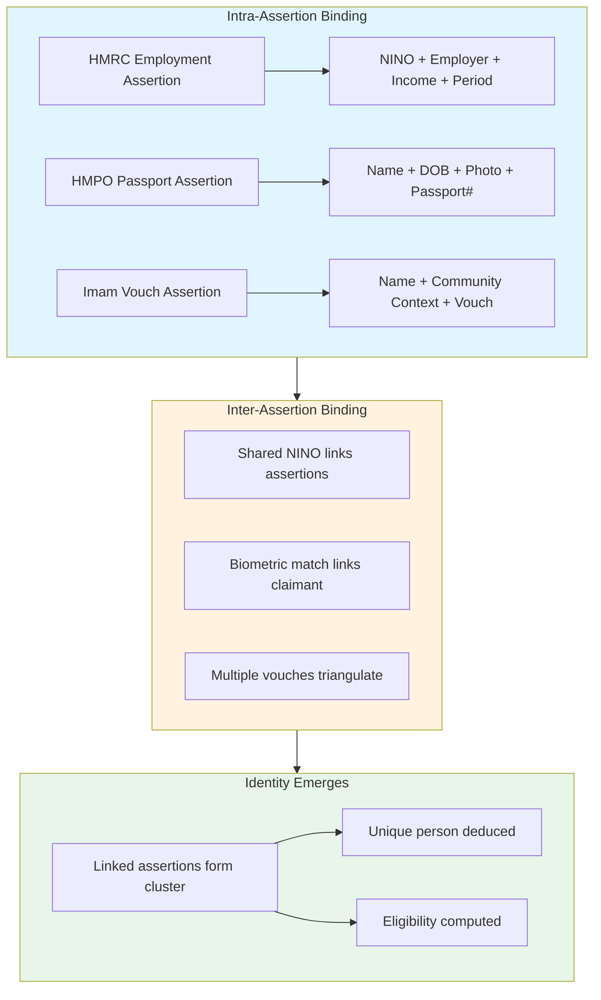
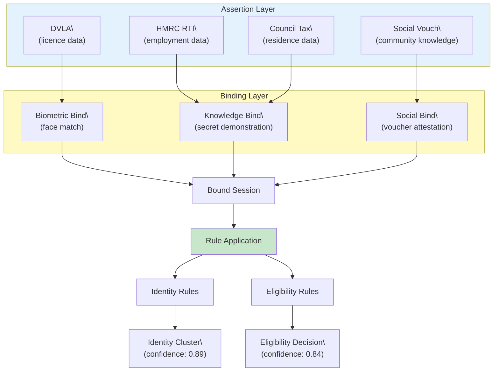
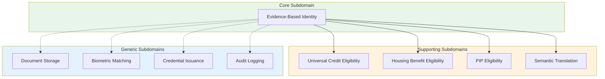
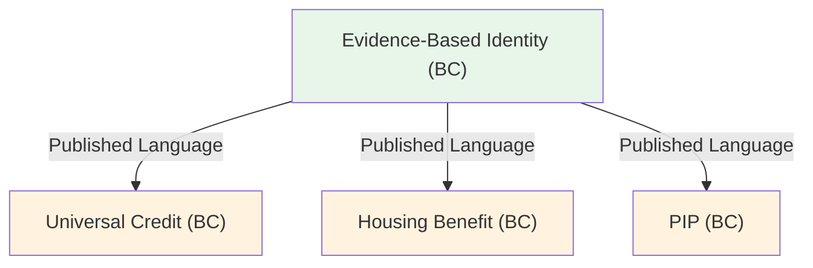
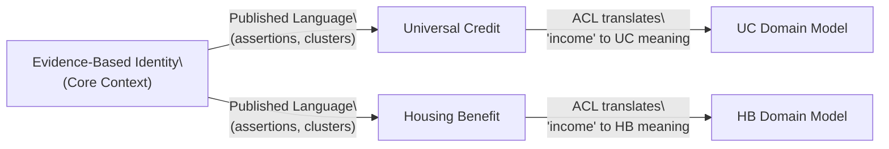

# Evidence-Based Identity: A Semantic Coordination Architecture

**Rethinking Identity from First Principles**

*Part 2 of the Architecting Modern Government Services Series*

*Version 2.0 | March 2026*

---

## Version History

| Version | Date | Changes |
|---------|------|--------|
| 1.0 | Feb 2026 | Initial release |
| 1.1 | Feb 2026 | Added Fellegi-Sunter primer, confidence calibration section, Mermaid diagrams |
| 1.2 | Mar 2026 | Added §1.4 on institutional reality |
| 2.0 | Mar 2026 | Complete rewrite: assertion graph model, binding as first-class concept, identity and eligibility as parallel rule-applications |

---

## Prologue: The Question We've Been Asking Wrong

When someone walks into a job centre and says "I'm Sarah Miller, I need housing benefit," what actually happens?

The traditional answer focuses on verification: check her passport, validate her address, confirm her identity against records. Match the person to a master identity record. Then assess eligibility.

But this answer hides an assumption so deep it becomes invisible: that "Sarah Miller" exists as a discrete thing somewhere, waiting to be verified. That identity is a fact to be discovered rather than a conclusion to be computed.

What if identity doesn't work like that? What if the question "who is this person?" has no answer independent of the question "what do we know about them and how confident are we?"

This paper proposes a radical reframing:

- **Assertions bind attributes together.** HMRC asserts that NINO AB123456C earned £30,000 from employer ABC Ltd in 2024-25. That's one assertion binding four attributes: NINO, income, employer, period. HMPO asserts that someone named Sarah Miller, born 15/3/1985, with this photograph, was issued passport 123456789. That's one assertion binding name, DOB, photo, document number. Each assertion is a bundle of attributes, bound together by the asserter's authority. This is *intra-assertion binding*.

- **Assertions get linked.** When two assertions share an attribute (both cite NINO AB123456C), they're probably about the same person. When a claimant presents a passport and states a NINO, their physical presence links those assertions together. This is *inter-assertion binding*—connecting assertion bundles into larger structures.

- **Identity is assembled.** Each assertion contributes a bundle of bound attributes. Inter-assertion links connect the bundles. Enough linked assertions, and a unique person emerges—not stored anywhere, but deduced from the pattern. Part II calls this "the Frankenstein insight."

The passport doesn't verify Sarah's identity; it's one assertion binding {name, DOB, photo, document number}. HMRC's tax records don't belong to Sarah; they're assertions binding {NINO, income, employer, period}. The question isn't "is this the real Sarah Miller?" The question is: can we link enough assertions, bound to this claimant through biometric or knowledge proofs, to assemble a unique combination of attributes that constitute a distinct person?

This shift changes everything. It dissolves the circular dependency that has paralysed UK government identity initiatives for decades. It explains why attribute standardisation efforts always fail (they're solving the wrong problem). It reveals identity and eligibility as parallel deductions from the same assertion graph. And it points toward an architecture that can actually work.

---

## Executive Summary

UK government efforts to coordinate identity and attributes across departments have repeatedly failed, despite billions in investment. Universal Credit's integration programme. NHS-to-DWP data sharing. Cross-government identity verification. All attempted to create shared data standards, master identity records, or centralised verification systems. All collapsed against the same immovable realities.

**What they tried to solve:** DWP and other departments focused on standardising *attributes*—agreeing on common formats for income, address, employment status. They treated the problem as data interoperability: if we could just agree on schemas, systems could share data.

**What they didn't realise:** The attribute problem is actually an identity problem, and the identity problem is actually an assertion problem. You cannot standardise "income" when HMRC's income assertion and UC's income assertion reference different subjects identified by different attributes. You cannot link records when there's no universal identifier. You cannot determine "Sarah's income" when you first need to determine which assertions are about Sarah—and that requires establishing Sarah's identity from assertions in the first place.

**The conceptual error:** Every initiative treated identity, attributes, and evidence as separate concerns. But these aren't separate things. Evidence *is* assertion. Assertions *bind* attributes (intra-assertion binding). Identity *emerges* from linked assertions (inter-assertion binding). They're all facets of the same underlying reality: a graph of assertions binding attributes.

**This paper's contribution:** The *intra-/inter-assertion binding* model introduced above. Assertions bind attribute bundles (intra). Claimant actions and shared identifiers link assertions together (inter). Identity emerges from the linked structure.

Assertions get linked through shared attributes or through claimant actions—*inter-assertion binding*. When Sarah presents her passport and states her NINO, her physical presence links the HMPO assertion to the HMRC assertion. Asserters themselves are assembled from assertions (HMRC's credibility rests on PKI certificates, statutory instruments, operational history—all assertions).

Identity emerges when linked assertions form a unique attribute cluster. Eligibility emerges when that cluster's attributes meet policy thresholds. Both are deductions from the assertion graph—parallel operations, not a pipeline.

**Why it matters:** The assertion graph model dissolves the circular dependency. You cannot link assertions without identity, but cannot establish identity without assertions—unless you realise that assertions with shared attributes link naturally, and claimant binding actions create more links. Identity assembles from linked assertions; it doesn't need to exist first.

This approach abandons attribute standardisation in favour of semantic translation. It handles the 27% of lowest-income households lacking traditional documents through social vouching (vouches are assertions too). And it aligns with how identity actually works in human communities: you are who the assertions say you are, assembled from what independent sources have claimed about you, linked through your presence and your knowledge.

---

## Part I: The Assumption Archaeology

### 1.1 Three Invisible Assumptions

Every failed UK identity initiative shares three assumptions so embedded in institutional thinking that they resist examination:

**Assumption 1: Identity is something you verify**

The language pervades every programme: "identity verification," "verified credentials," "proof of identity." But stop and ask: what exactly is being verified?

When a caseworker examines a passport, they're not verifying an abstract identity. They're assessing an assertion: does this document appear genuine? Does the photo match the person presenting it? What attributes does it bind together (name, DOB, photo, document number)? The passport is an assertion from HMPO, and the caseworker is evaluating its reliability.

What we call "identity verification" is actually: does this assertion meet our criteria? How confident are we in the asserter (HMPO)? How confident are we in the binding to this claimant (does the photo match)? The assertion doesn't *prove* identity; it *contributes to* identity by adding a bundle of bound attributes to the claimant's cluster.

The distinction matters because downstream systems inherit a binary "verified" token without knowing what assertions supported it, what attributes were bound, or whether those assertions meet their specific decision requirements.

**Assumption 2: Attributes are properties of identity**

We speak of "Sarah's address," "her employment status," "her income." As if these were stable properties of a persistent identity entity. This framing drove decades of failed standardisation efforts: DWP would agree attribute schemas with HMRC, define common data formats, build APIs to exchange "the attributes."

But the framing is backwards. Attributes aren't properties of identity. They're the content of assertions. And identity isn't a thing that has attributes—identity *is* a unique combination of attributes, deduced from corroborating assertions.

**The same word means different things.** Consider "residential address." What does it mean to *reside* somewhere?

| Organisation | What "residential address" means | How they verify it |
|-------------|----------------------------------|-------------------|
| **HMRC** | Where you say you live for tax purposes | They don't. You declare it. They care that you pay tax, not where you sleep. |
| **Council Tax** | The property you're liable for | Checked against property register; occupancy assumed from liability |
| **DWP Housing Benefit** | Where you actually sleep most nights | May require proof; 3+ nights/week matters for household composition |
| **NHS GP** | Catchment area for primary care | Self-declared at registration; rarely verified |
| **Electoral Roll** | Where you're eligible to vote | Self-declared; cross-checked against other registers |

If Sarah spends four nights a week at her partner's flat and three at her own, where does she "reside"? The answer depends on which organisation is asking and why. HMRC doesn't care. Housing Benefit cares intensely—it affects whether she's a single claimant or part of a couple, which changes her entitlement by thousands of pounds.

**Verification levels vary wildly.** HMRC's "address" assertion is unverified self-declaration—they have no operational reason to check where you sleep. Council Tax's "address" is verified against property records but says nothing about actual occupancy. DWP's "address" may be investigated if fraud is suspected. These aren't the same attribute with the same schema. They're different assertions, with different semantics, different verification levels, and different confidence.

Standardising the schema ("address is a string with postcode") achieves nothing. The assertions still mean different things. A downstream system receiving "address" from HMRC cannot know it's unverified self-declaration. A system receiving "address" from Council Tax cannot know it means "liable property" not "place of residence."

**Temporal fragmentation compounds it.** Three assertions say someone lives at Flat 3: council tax records, a bank statement, GP registration. A fourth shows Flat 2: a recent DBS check. There is no single "correct" address. There are four assertions claiming address attributes, telling a coherent story about a recent move. Systems built around "identity attributes" cannot represent this story. They can only store one address at a time, forcing arbitrary choices or generating errors.

Consider employment. HMRC asserts employed (based on employer RTI submissions). Universal Credit asserts unemployed (based on Sarah's self-declaration two weeks ago). Both assertions are true: they happened. Sarah started work last Monday, so the assertions reflect different points in time. The employment attribute doesn't exist independent of the assertions that claim it.

**The deeper confusion:** DWP treated attributes as a *data* problem—standardise the schemas, agree the formats—without realising they had three problems underneath:

1. **Identity:** Which assertions are about Sarah? How do we know these address assertions reference the same person?
2. **Semantics:** What does each assertion actually mean? What definition of "address" was used? What verification was applied?
3. **Confidence:** How much should we trust each assertion given its provenance and verification level?

Standardising schemas without addressing semantics and confidence just moves the problem. You exchange "addresses" successfully, but you still don't know what they mean or how much to trust them.

**Assumption 3: Integration means making systems talk**

When coordination fails, the obvious solution appears: build APIs, define data exchange formats, implement message queues, establish service contracts. Technical integration. Billions later, systems exchange messages successfully, yet coordination still doesn't work.

Why? Because integration solves the wrong problem. When DWP asks HMRC "Is John Smith employed?", they're not asking for a database field. They're asking: what assertions exist about this person's employment, what's the provenance of those assertions, how recent are they, and do they meet DWP's specific criteria for this specific benefit decision?

But before any of that: *which* assertions? "John Smith" isn't a unique identifier. HMRC has employment assertions referencing NINOs. DWP needs to know which NINO is John Smith—which requires establishing John Smith's identity—which requires clustering assertions by corroborating attributes—which brings us back to the same fundamental problem.

No API specification captures this. Technical integration assumes shared identifiers (there are none) and shared semantics (there aren't). DWP and HMRC define "income" differently because their governing legislation requires different definitions. Even if they agreed on schemas, they'd still be exchanging assertions about subjects they cannot reliably link. Integration connects systems. Coordination requires *identity resolution at query time*, semantic translation between vocabularies, and propagation of uncertainty through calculations.

### 1.2 The Circular Dependency

The UK lacks a universal citizen identifier. Estonia has the isikukood, assigned at birth, linking all government records. The UK has NINOs that many people lack, NHS numbers that changed historically, and passport numbers that expire and renew.

Without a universal identifier, coordination demands answering "is this the same person?" across services. Relational databases answer this through foreign keys requiring deterministic identity records.

The traditional solution: create a master identity record first, then link assertions to it.

But here's the trap: you cannot create the identity record without assertions about the person. And you cannot link assertions without knowing which ones refer to the same person. You need the identity to find the assertions. You need the assertions to establish the identity.

This circular dependency has paralysed UK government for decades. Every attempt to solve it within the traditional paradigm fails, because the paradigm itself creates the problem.

**The dissolution:** Part II shows we don't need a master identity record. Assertions with shared attributes link naturally. Claimant actions (presenting documents, authenticating) create more links. Enough linked assertions, and a unique person emerges—assembled from the graph, not required before we can process it.

### 1.3 What Estonia Actually Proves (and Doesn't)

Estonia is the standard example of successful government identity coordination. Twenty years of X-Road infrastructure connecting government systems. 95% digital adoption. Real-time employment data flowing to benefit calculations.

But Estonia solved a different problem. They have a universal identifier. Every citizen receives an isikukood at birth. When HMRC-equivalent queries tax data, they pass an isikukood and get a deterministic answer. No probabilistic matching required.

And crucially, Estonia did not standardise semantics. X-Road follows what Paper 1 calls the **Open Host Service (OHS)** pattern: each service provider defines their own schema and exposes a stable API; consumers adapt to the provider's format. If a consuming department needs to translate provider data into their local model, they build their own **Anti-Corruption Layer (ACL)**, but that's the consumer's problem, not an infrastructure concern. Estonia solved the *transport* problem—secure, audited data exchange between organisations—not the *semantic* problem.

**What Estonia proves:**
- Federated government queries can work at national scale
- Citizens trust transparent data sharing
- Standardised transport infrastructure (with OHS pattern) beats point-to-point integration
- Universal identifiers eliminate the matching problem entirely

**What Estonia didn't need to solve:**
- Probabilistic identity matching (universal ID eliminates it)
- Centralised semantic translation (OHS pushes adaptation to consumers)
- Confidence scoring when evidence conflicts

**What we cannot extrapolate:**
- 50× population scale (1.3M vs 67M)
- 3× organisation count (30-50 vs 100+ departments)
- Absence of universal identifier

Estonia is a success story. It is not a proxy for the UK. The probabilistic identity and semantic translation capabilities this paper proposes must be proven independently.

### 1.4 Why Most Organisations Don't Have This Problem

Before diving into the solution, it's worth asking: why is this so hard for government when banks, retailers, and tech companies seem to manage identity fine?

The answer: they're solving a different problem.

**Most businesses need account ownership.** When you sign up for Amazon, you create an account. Amazon doesn't care whether you're "really" Sarah Miller. You could be anyone. The only question is: "Is this the same person who created account #12345?" That's a simple cryptographic problem—passwords, session tokens, device fingerprints. The user controls the account; the business controls what they can do with it.

**Government needs proof that a real person exists.** DWP doesn't create your identity when you sign up. You existed before you applied for Universal Credit. The question isn't "is this the account holder?" It's: "Is there a real person named Sarah Miller, born on this date, resident at this address, with these dependents—and is the claimant sitting in front of us that person?"

This difference cascades into everything:

| Private Sector | Government |
|---------------|------------|
| User self-declares identity attributes | Attributes must come from authoritative assertions |
| Account is the unit of identity | Person is the unit of identity (accounts are just sessions) |
| "Wrong" identity means account fraud | "Wrong" identity means public money to the wrong recipient |
| Resolution: ban the account | Resolution: legal prosecution, debt recovery, possible prison |
| One organisation's assertions | Assertions scattered across dozens of autonomous departments |
| User incentivised to maintain accurate info | Claimant may be incentivised to misrepresent |

**The population compounds it.** As Paper 1 notes, DWP's cohorts often lack the assertions that typical identity systems rely on. Many claimants do not have passports, driving licences, or credit histories. GOV.UK Verify demonstrated this gap: populations with the greatest need for government services had the fewest institutional assertions about them. Amazon can require a credit card to sign up; DWP cannot refuse benefits to people without bank accounts.

**Attributes and relationships matter, not just "who."** Eligibility depends on *asserted* attributes (age, residency, household composition) and *asserted* relationships (partner, dependents, carers)—not just identity. "Is this Sarah Miller?" is insufficient. "Do the assertions linked to this claimant include: residence alone, income below £X, UK residency for Y years, dependent child under Z?" That's the eligibility question.

And here's the insight that dissolves the boundary: identity and eligibility are both deductions from assertions. Identity asks: do linked assertions form a unique person? Eligibility asks: do linked assertions meet policy thresholds? Same assertions, parallel operations. They're not separate problems.

This is why commodity identity solutions fail for government. The problem isn't authentication—it's assembling enough assertions, from enough sources, linked through binding events, to deduce both identity and eligibility for people who may lack the documentation that private-sector systems assume.

---

## Part II: The Paradigm Shift

### 2.1 Assertions Bind Attributes

Here is the fundamental insight: **an assertion binds attributes together.**

Not to an identity. Not to a person. To each other.

When HMRC submits RTI data, they're asserting: "NINO AB123456C earned £30,000 from employer ABC Ltd in tax year 2024-25." That's four attributes bound together by one assertion:
- NINO: AB123456C
- Income: £30,000
- Employer: ABC Ltd
- Period: 2024-25

HMRC isn't saying "Sarah Miller earned £30,000." HMRC doesn't know who Sarah Miller is. They know a NINO submitted returns. The assertion binds NINO to income to employer to period. That's all.

When HMPO issues a passport, they're asserting: "Someone named Sarah Jane Miller, born 15 March 1985, with this photograph, is a British citizen, and we issued document number 123456789 to them." That's multiple attributes bound together:
- Name: Sarah Jane Miller
- DOB: 15 March 1985
- Photo: [biometric template]
- Citizenship: British
- Document number: 123456789

HMPO isn't pointing to a global identity record. They're binding attributes. This document, with this photo, was issued to someone with this name and DOB.

**Why this matters:** The assertions don't reference identity—they *constitute the raw material from which identity is deduced*. If we can link the HMRC assertion (NINO AB123456C) to the HMPO assertion (Sarah Jane Miller, DOB 15/3/1985), we start building an identity cluster. But the link isn't inherent in the assertions. We have to establish it.

**Two types of binding:**

| Type | What It Does | Example |
|------|-------------|---------|
| **Intra-assertion binding** | Binds attributes *within* a single assertion | HMPO binds {name, DOB, photo, passport number} together in one assertion |
| **Inter-assertion binding** | Links *between* assertions | Claimant's biometric matches passport photo, linking HMPO assertion to HMRC assertion via the claimant |

**Intra-assertion binding** happens when the asserter makes the assertion. HMPO binds name + DOB + photo + passport number together. HMRC binds NINO + income + employer + tax year together. Each assertion is a bundle of attributes, bound by the asserter's authority.

**Inter-assertion binding** happens when assertions get linked—either through shared attributes or through binding events:

| Linking Method | How It Works | Example |
|---------------|--------------|---------|
| **Shared unique attribute** | Assertions reference the same rare attribute | Two assertions both cite NINO AB123456C → probably same person |
| **Corroborating attributes** | Multiple attributes match across assertions | Same name + same DOB + similar address → probably same person |
| **Binding event** | Claimant links assertions through their presence | Claimant presents passport AND provides NINO; biometric match links them |

**The Frankenstein insight:** An identity is assembled from parts. Each assertion contributes a bundle of bound attributes (intra-assertion binding). When assertions are linked together (inter-assertion binding), their attribute bundles connect. Enough linked assertions, and a unique person emerges—like Frankenstein's monster assembled from components, but the components are attribute bundles, and the stitching is inter-assertion links.

And here's the recursive bit: *asserters are assembled the same way*. HMRC's identity is assertions about HMRC (PKI certificates, statutory instruments, operational history) stitched together. A vouching person's identity is assertions about them (employment records, council tax, NHS registration) stitched together. It's monsters all the way down.

The binding event is crucial for making this operational. When Sarah walks into the job centre, presents her passport (HMPO's assertion), and states her NINO (which links to HMRC's assertions), she's creating inter-assertion bindings. Her physical presence, matched to the passport photo, links the assertions together. Now we can say: the HMRC assertions about NINO AB123456C are about the same person as the HMPO assertion in this passport.

**The structure of an assertion:**

```
Asserter → binds attributes together → with confidence
```

- **Asserter:** Who makes the claim. HMRC. DVLA. A bank. A vouching individual. Asserters are themselves assembled from assertions (more below).

- **Bound attributes:** The content—not a single claim, but a *binding* of multiple attributes. This NINO had this income. This name+DOB was issued this document. This address is registered to this name.

- **Confidence:** How much to trust this binding. Product of source reliability and verification strength.

**Evidence is assertion. Assertion is attribute-binding. This is really important.**

When we say "evidence," we mean: an assertion that binds attributes. A passport is evidence because it binds name + DOB + photo + document number, asserted by HMPO. A payslip is evidence because it binds NINO + employer + pay amount + pay date, asserted by the employer. A utility bill is evidence because it binds name + address + account number + date, asserted by the utility company.

**There is no separate concept of "evidence" apart from "assertion."** They're the same thing. Evidence is just what we call assertions when we're evaluating them for a decision.

### 2.2 How Asserters Are Established

The asserter in "HMRC asserts NINO AB123456C earned £30,000" is itself established through assertions—the same way people are.

**How do we know this assertion came from HMRC?**

It's assertions all the way down:

- **Government PKI** asserts that this public key belongs to HMRC
- **Cabinet Office** asserts that HMRC is a statutory authority with these responsibilities  
- **Twenty years of operational history** constitutes implicit assertions about HMRC's reliability

When HMRC sends employment data via API, the cryptographic signature binds the assertion to HMRC's established identity. We verify the signature using HMRC's public key, which itself was asserted by the Government PKI infrastructure.

**Digital vs. physical channels—same model, different binding:**

Consider how HMPO assertions reach us through different channels:

| Channel | How Assertion Arrives | How Asserter Is Verified |
|---------|----------------------|----------------------------|
| **API integration** | Structured data via secure connection | Mutual TLS + cryptographic signature; signature binds data to HMPO's PKI-established identity |
| **Paper passport** | Physical document presented by claimant | Holographic security features, paper stock, MRZ format—characteristics only HMPO could produce |
| **Chip passport (NFC)** | Cryptographically signed data read from chip | Digital signature verifiable against HMPO's certificate in ICAO PKD |

The paper passport is still an assertion from HMPO—it's just that the binding to HMPO happens through physical security features rather than cryptographic signatures. When a caseworker examines a passport, they're implicitly asking: "Does this physical object bear the characteristics that only HMPO could have produced?" The answer is probabilistic (forgeries exist), which is why chip verification has higher confidence than visual inspection.

**The recursive insight:** There is no foundation of "self-evident" identity. Every asserter's credibility rests on assertions from other asserters. HMRC is credible because Government PKI asserts its key. Government PKI is credible because Cabinet Office established it. The chain eventually grounds in institutional trust built over decades—but it's assertions binding attributes all the way down.

### 2.3 Assertions Are Immutable

An assertion is an event that happened: HMRC stated on this date that this NINO earned this income. You cannot change what HMRC said; you can only record what they said next.

If HMRC later corrects the income figure, that's a new assertion—not an update to the original. Both assertions persist. The original was true (HMRC did say that), even if the content was wrong.

This applies equally to our deductions. When the system concludes "these assertions cluster into identity X with 0.89 confidence" or "this claimant is eligible for housing benefit," that conclusion is an event. Record it. If new evidence arrives and the conclusion changes, that's a new conclusion superseding the old one. The original happened; deleting it destroys the audit trail.

**Why immutability matters:**

| Mutable approach | Immutable approach |
|-----------------|-------------------|
| Update assertion when source corrects | New assertion supersedes; original preserved |
| Delete assertion when retracted | Retraction assertion recorded; original preserved |
| Change decision when evidence changes | New decision references new evidence; original preserved |
| Fraud audit asks "what did you know when?" | Complete history answers precisely |

The graph becomes a complete history of everything asserted and concluded. Fraud investigation can reconstruct exactly what assertions existed at decision time. Appeals can examine whether the original conclusion was reasonable given what was known.

### 2.4 The Semantic Graph

Here's how an assertion looks in RDF:

```turtle
:emp_001 a :EmploymentAssertion ;
    :assertedBy :HMRC_RTI ;
    :bindsAttributes [
        :nino "AB123456C" ;
        :employer "ABC Ltd" ;
        :annualIncome 30000 ;
        :taxYear "2024-25"
    ] ;
    :verificationMethod :CryptographicSignature ;
    :confidence 0.94 ;
    :assertionTimestamp "2025-03-27T14:23:00Z"^^xsd:dateTime .
```

What does this preserve that a relational table destroys?

| Context | How It's Preserved |
|---------|-------------------|
| Who made the claim | `:assertedBy :HMRC_RTI` distinguishes statutory authority from self-report |
| How it was verified | `:verificationMethod :CryptographicSignature` vs `:ManualReview` |
| When the assertion was made | Timestamp enables currency assessment |
| How confident we should be | Quantified reliability score for risk-based processing |
| What attributes are bound | `:bindsAttributes` shows NINO + employer + income + period as a unit |

### 2.5 Asserters as Identity Clusters

Individual asserters—people who vouch, witnesses, references—are themselves identity clusters established the same way:

- Institutional assertions (HMRC employment records, council tax, NHS registration)
- Documentary assertions (passport, driving licence)
- Social assertions (other community members who vouch for them)
- Vouching history (accuracy of their previous vouches, tracked over time)

Why does HMRC's assertion carry weight? Because HMRC's identity cluster is dense with high-confidence corroborating assertions—PKI certificates, statutory authority, operational history. Why does a random email carry little weight? Because the asserter has no established identity—no corroborating assertions about who they are.

Why does a community leader's vouch carry weight? Because that person has fifteen years of high-confidence institutional evidence plus a vouching history showing consistent accuracy. Their identity cluster is well-established, which gives their assertions credibility.

The graph is recursive. Assertions about Sarah's employment are made by HMRC. HMRC's credibility rests on assertions from Government PKI. The vouching community leader's credibility rests on assertions from HMRC, councils, NHS. Trust propagates through the network of assertions binding attributes.

### 2.6 Binding: The Central Operation

Assertions bind attributes. But when Sarah walks into a job centre, she needs to connect those assertions to herself, present now.

This is **binding**: connecting assertions (which bind attributes) to a physical claimant.

Consider: HMRC has an assertion binding NINO AB123456C to income £30,000. HMPO has an assertion binding name "Sarah Miller" + DOB 15/3/1985 to passport photo. How do we know these assertions are about the person standing in front of us?

**Biometric binding:** Face recognition, fingerprint, voice recognition with liveness detection. The passport photo matches the face of the person presenting it. This is a new assertion: "the person present at this session matches the biometric in the HMPO assertion." Now we've linked the claimant to the HMPO assertion.

**Knowledge binding:** Demonstrating secrets that only the assertee would know. "What's the last four digits of your NINO?" "What employer is on your most recent P60?" Correct answers create a new assertion: "the person present knows secrets from the HMRC assertion." Weaker than biometric (secrets can be shared or stolen) but widely available.

**Documentary binding:** Possession of physical tokens. A passport. A driving licence. An NFC bank card. The assumption: if you have the document containing attributes, you're probably the person those attributes describe. Weakened by document theft; strengthened when combined with other binding types.

**Social binding:** Vouches from established identity clusters. When the Imam asserts "I have known Amara Hassan for three years, she is the person standing here," that's a binding assertion—it links Amara's physical presence to the attributes the Imam knows about her.

**Binding creates linking assertions.** Without binding, we have assertions about attributes floating in the graph. With binding, we have assertions that say "the claimant present in this session is linked to these other assertions." Now we can build an identity cluster for this claimant.

### 2.7 Identity Emerges from Linked Assertions

Now we can dissolve the circular dependency.

The question isn't "match this person to their identity record." The question is: given the assertions linked to this claimant through binding, do they cluster into a unique combination of attributes?

**How identity emerges:**

1. **Claimant binds** — Sarah presents her passport (biometric binding) and states her NINO (knowledge binding). These binding events create linking assertions.

2. **Attributes cluster** — The passport assertion binds {name, DOB, photo}. The HMRC assertion (linked via NINO) binds {NINO, income, employer}. Via the binding events, these assertions are now linked to the same claimant. Their attributes cluster together.

3. **Uniqueness check** — Is this combination of attributes already associated with another cluster? If NINO AB123456C is already linked to a cluster, Sarah merges with that cluster. If not, a new cluster emerges.

4. **Contradiction detection** — Do assertions conflict in ways suggesting fraud or error? Same NINO but different dates of birth? Employment assertions that overlap impossibly? These trigger manual review.

5. **Confidence calculation** — How confident are we that these assertions correctly identify a unique person? Product of assertion confidence × binding confidence × cluster coherence. High-confidence biometric binding to high-confidence HMRC assertions yields high-confidence identity. Low-confidence knowledge binding to low-confidence self-reported assertions yields low-confidence identity requiring additional evidence.

**The chicken-and-egg dissolves:** We don't need an identity record to correlate assertions. We cluster assertions by attribute similarity and linking events. Assertions citing NINO AB123456C cluster together. Assertions linked via the same binding session cluster together. Clusters that share multiple attributes merge. The identity emerges from this correlation; we don't need it to exist beforehand.

### 2.8 Eligibility Is Just Another Rule-Application

Here's the final insight that completes the paradigm shift: identity and eligibility are parallel operations on the same assertion graph.

**Identity rules ask:** Do bound assertions constitute a unique person?

**Eligibility rules ask:** Do assertions bound to this cluster meet policy thresholds for this benefit?

Both operate on assertions. Both produce confidence-scored conclusions. Neither is ontologically prior to the other.

When Sarah applies for housing benefit:

1. **Binding:** Sarah authenticates (knowledge binding via login credentials). She presents her passport (documentary binding with biometric match). Her session now has bound assertions.

2. **Identity rules:** Do Sarah's bound assertions match an existing cluster? Yes—her NINO links to prior HMRC employment data, her address matches council tax records. Identity confidence: 0.91.

3. **Eligibility rules:** Do Sarah's bound assertions meet housing benefit criteria? Income below threshold (HMRC assertion at 0.94 confidence). Residency established (council tax assertion at 0.89 confidence). Eligibility confidence: 0.87.

The only reason identity appears to come first is practical: eligibility rules reference "this person's income," requiring us to first determine which assertions constitute "this person." But conceptually, both identity and eligibility are conclusions computed from the assertion graph.

### 2.9 The Complete Picture

Everything in Part II:



**The Frankenstein insight:** Identity is assembled from parts—each assertion a bundle of attributes, stitched together by inter-assertion links. It's not stored anywhere. It emerges from the graph.

---

## Part III: How This Changes Everything

*Part II established the model: assertions bind attributes (intra), get linked (inter), and identity emerges from the graph. What does this mean in practice?*

### 3.1 No More Master Identity Records

Stop trying to create authoritative identity records. There is no master file. There are only assertions, bindings, and clusters.

An identity cluster is a working hypothesis: these assertions probably refer to the same person. The hypothesis strengthens with corroborating evidence. It weakens with contradictions. It can merge with other clusters when new assertions link them. It can split when fraud reveals that assertions were incorrectly grouped.

**What this abandons:**
- The illusion that identity is a fixed fact
- The requirement to decide identity before processing evidence
- The single point of failure of a master identity database

**What this enables:**
- Processing evidence without knowing identity
- Graceful handling of ambiguity
- Fraud detection through contradiction analysis
- Evolution of understanding as evidence accumulates

### 3.2 Semantic Translation, Not Standardisation

HMRC defines income as annual gross employment income including bonuses. Universal Credit defines income as monthly net assessment income excluding one-off bonuses. These aren't arbitrary technical choices; they reflect policy requirements written into legislation.

Standardisation asks departments to abandon definitions their governing law requires. It will never succeed.

Semantic translation asks: given HMRC's definition, how do we map to Universal Credit's definition, and what confidence penalty applies for the translation uncertainty?

```turtle
:hmrc_to_uc_income_mapping a :SemanticMapping ;
    :sourceVocab :HMRC ;
    :sourceConcept :AnnualGrossIncome ;
    :targetVocab :UniversalCredit ;
    :targetConcept :MonthlyNetIncome ;
    :translationLogic "((annual - bonuses) / 12) * 0.87" ;
    :confidencePenalty 0.03 ;
    :validFrom "2025-01-01"^^xsd:date ;
    :approvedBy :JointGovernanceBoard .
```

Each organisation keeps its vocabulary. Translation happens at boundaries. Uncertainty propagates through confidence scores. No one is forced to change their definitions.

### 3.3 Social Evidence for the Excluded

27% of lowest-income households lack passports. 32% lack driving licences. Asylum seekers granted refugee status cannot obtain digital ID for employment because traditional verification assumes stable residential histories and institutional documentation.

The assertion graph handles this naturally: social vouching is just another assertion type.

When Imam vouches for Amara Hassan:

```turtle
:vouch_001 a :SocialAssertion ;
    :assertedBy :person_imam_mohammed ;
    :bindsAttributes [
        :name "Amara Hassan" ;
        :knownContext "Community member, 3 years" ;
        :identityVouch true ;
        :relationshipBasis "Community leader, regular interaction"
    ] ;
    :confidence 0.82 ;
    :verificationMethod :InPersonInterview ;
    :legalBasis :ImmigrationAct2024 .
```

The Imam's vouch carries weight because the Imam's identity is established through fifteen years of institutional assertions (employment, council tax, NHS records). His vouching history shows accuracy when cross-checked against later evidence. Trust propagates through the graph.

Multiple independent vouches triangulate. When three community members who don't know each other all vouch for Amara, combined confidence may exceed a single passport verification—especially when the passport itself is difficult to verify through international channels during conflict.

Fraud detection comes naturally: graph analysis catches circular vouching (A vouches for B, B for C, C for A), temporal clustering (60 vouches from one address in 48 hours), and symmetric relationships (fraud rings lack natural community hierarchy).

### 3.4 The Flow: From Assertion to Decision



1. **Assertions exist** in the graph, made by asserters about assertees referenced by attributes.

2. **Claimant authenticates** and establishes a binding session through biometric, knowledge, or social proof.

3. **Binding connects** the claimant to relevant assertions—those whose assertee attributes match the claimant's demonstrated attributes.

4. **Rules apply** to bound assertions. Identity rules determine: is this a unique, coherent person? Eligibility rules determine: does this person meet policy criteria?

5. **Decisions emerge** with confidence scores reflecting the compounded uncertainty of assertions, bindings, and translations.

---

## Part IV: The Domain Model

*This section applies Domain-Driven Design concepts from Paper 1 to the assertion graph architecture.*

### 4.1 The Domain and Subdomains

**The problem space:** Government needs to deliver benefits and services to people it cannot directly identify. Unlike private companies that create accounts, government must establish that a real person exists and meets eligibility criteria—using only indirect evidence from other organisations and individuals.

**The core domain:** Evidence-based identity. Assembling assertions into identity clusters, determining when clusters represent unique persons, and providing that identity foundation to benefit systems. This is differentiating work that no commodity software can do.

**Supporting subdomains:**
- **Benefit eligibility** (one per benefit type): Applying policy rules to identity clusters. Important but largely codifying existing regulations.
- **Semantic translation:** Mapping between organisational vocabularies. Necessary plumbing with well-understood patterns.

**Generic subdomains** (buy or use commodity solutions):
- **Document storage:** S3-style storage with retention policies.
- **Biometric matching:** Vendor SDK for face/fingerprint/voice.
- **Credential issuance:** W3C Verifiable Credentials library.
- **Audit logging:** Append-only compliance logging.



**Reading this subdomain map:**
- **Green (Core):** Evidence-Based Identity — differentiating capability, build in-house
- **Orange (Supporting):** Benefit eligibility contexts consume the core; semantic translation enables cross-context communication
- **Blue (Generic):** Commodity capabilities the core uses — buy or use existing solutions
- **Solid arrows:** Domain dependency (supporting subdomains use core)
- **Dashed arrows:** Technical dependency (core uses generic subdomains)

**Subdomain → Implementation:**

| Subdomain | Type | Implementation |
|-----------|------|----------------|
| Evidence-Based Identity | Core | Build as BC (§4.2) |
| UC / HB / PIP Eligibility | Supporting | Build as separate BCs (§4.2) |
| Semantic Translation | Supporting | ACL pattern within each BC |
| Document Storage | Generic | AWS S3 or equivalent |
| Biometric Matching | Generic | Vendor SDK |
| Credential Issuance | Generic | W3C VC library |
| Audit Logging | Generic | Append-only log service |

### 4.2 Bounded Contexts

Subdomains are the problem space. Bounded contexts are the solution space. Here's how we implement the core and supporting subdomains as BCs:

**Strategic vs Tactical:** This section covers strategic design (bounded contexts, context relationships). Tactical design (aggregates, entities, value objects) appears below under "Tactical Design."



**Reading this context map:**

| Color | Subdomain type | Bounded contexts |
|-------|---------------|------------------|
| Green | Core | Evidence-Based Identity |
| Orange | Supporting | UC, HB, PIP—each has its own meaning for "income" |

Arrows show BC-to-BC integration via Published Language. Generic subdomains don't appear here—see the implementation table in §4.1.

#### Evidence-Based Identity (BC)

This is **one bounded context**. The language is unified: caseworkers and domain experts talk about "checking documents," "matching the face," "proving who someone is," and "linking records together." These are different operations but share a ubiquitous language.

**Why one context, not many:**
- "Assertion" means the same thing whether from HMRC or from a vouch
- "Binding" means the same thing whether biometric or knowledge-based
- "Cluster" means the same thing to everyone working on identity
- One team owns this; one deployment; one model

**The language domain experts use:**

| What they say | What the model calls it |
|--------------|------------------------|
| "Check their documents" | Receive and validate assertions |
| "Match the face to the passport" | Biometric binding event |
| "Link their tax records" | Cluster enrichment via shared NINO |
| "They proved who they are" | Cluster confidence threshold met |
| "Something doesn't add up" | Contradiction detected, review flagged |

**Tactical Design (Aggregates):**

**IdentityCluster** (Aggregate Root)
The central aggregate. An identity cluster is the working hypothesis that a set of assertions refer to the same person.

```
IdentityCluster
├── clusterId: ClusterId
├── assertions: List<BoundAssertion>
├── confidence: ConfidenceScore
├── status: Active | Flagged | Merged | Split
└── invariants:
    - No two assertions with contradictory unique identifiers (e.g., different NINOs) 
      without status = Flagged
    - Confidence recalculates whenever assertions added/removed
    - Merged clusters retain provenance to original cluster IDs
```

**BindingSession** (Aggregate Root)
A live interaction where a claimant links themselves to assertions. The session is the transactional boundary.

```
BindingSession
├── sessionId: SessionId
├── startedAt: Timestamp
├── claimantBindings: List<BindingEvent>
├── gatheredAssertions: List<Assertion>
├── resultingClusterLink: ClusterId?
└── invariants:
    - Session expires after 30 minutes without activity
    - At least one binding event required before cluster linking
    - Binding strength degrades calculation based on event types
```

**Assertion** (Entity within BindingSession, or received from external source)
An assertion is immutable once recorded. It's not an aggregate root because it has no independent lifecycle—it exists in context of the session that gathered it or the external feed that provided it.

```
Assertion
├── assertionId: AssertionId
├── asserter: AsserterReference
├── boundAttributes: AttributeBundle
├── confidence: ConfidenceScore
├── verificationMethod: VerificationMethod
├── receivedAt: Timestamp
└── invariants:
    - Immutable after creation
    - Asserter must be resolvable (institution or person cluster)
```

**Value Objects:**
- `ConfidenceScore`: 0.0–1.0 with composition rules
- `AttributeBundle`: The bound attributes within an assertion
- `BindingEvent`: Biometric match, knowledge proof, or social vouch
- `AsserterReference`: Pointer to institutional config or person cluster

#### Benefit Contexts (Linguistic Boundaries)

Here's where contexts actually diverge: each benefit uses different words for the same underlying data.

**Universal Credit Context:**
- "Income" = gross taxable earnings per HMRC RTI
- "Household" = benefit unit (complex cohabitation rules)
- "Residence" = where you normally live (distinct from tenancy)

**Housing Benefit Context:**
- "Income" = take-home plus child maintenance plus in-kind support
- "Household" = who sleeps there 4+ nights per week
- "Residence" = the tenancy address

**PIP Context:**
- "Income" = irrelevant (not means-tested)
- "Condition" = functional impact, not diagnosis
- "Residence" = UK ordinarily resident test

Each benefit context has its own ubiquitous language. When UC asks the core context for "income," it needs **semantic translation**—the core context provides HMRC assertions, and UC's Anti-Corruption Layer translates to UC's income definition.

**This is a real context boundary:** different teams (UC policy team vs. Housing Benefit policy team), different domain experts, different meanings for the same words.

### 4.3 Context Relationships



**Core → Benefits:** The Evidence-Based Identity context publishes a stable API (its Published Language). It exposes identity clusters and bound assertions. It does NOT interpret what those assertions mean for eligibility.

**Benefits consume via ACL:** Each benefit context wraps the core API in an Anti-Corruption Layer that translates the generic assertions into benefit-specific domain concepts. UC's ACL knows that HMRC employment assertions map to UC's income definition. Housing Benefit's ACL applies different mapping rules.

**Why this matters:** When UC policy changes (e.g., capital disregards), only UC's ACL changes. The core context remains stable. When the core context improves cluster matching, all benefits get better identity without changing their eligibility logic.

### 4.4 The Read Model: Customer360

Customer360 is not a bounded context—it's a **read model** (CQRS projection) built from the core context's events.

**What it provides:**
- Current state of identity clusters
- All bound assertions with confidence scores
- Relationship assertions (household composition, dependents)
- Query-optimized for benefit contexts to consume

**What it doesn't do:**
- Make eligibility decisions (that's the benefit contexts' job)
- Store additional data (it's a projection, not a source of truth)
- Enforce business rules (those live in the core aggregates)

**Implementation:** Event-sourced projection from IdentityCluster and BindingSession events. Updated asynchronously. Benefit contexts query it but never write to it.

---

## Part V: The Three-Layer Confidence Model

*Every assertion carries a confidence score. But where does that number come from? Three independent layers, each measuring something different.*

Confidence is not a single number. It composes from three independent assessments:

### Layer 1: Assertion Quality

How reliable is this assertion independent of who it's about?

| Factor | Question | Example |
|--------|----------|---------|
| Source Reliability | How trustworthy is the asserter? | HMRC statutory authority: 0.94 |
| Verification Strength | How was the claim verified? | Cryptographic signature: 0.95 |
| Transmission Integrity | How securely did it arrive? | Mutual TLS: 0.99 |

Layer 1 = Source × Verification × Transmission

HMRC RTI: 0.94 × 0.95 × 0.99 = **0.88**

Citizen self-report via HTTP: 0.40 × 0.55 × 0.60 = **0.13**

### Layer 2: Identifier Binding

How precisely does this assertion identify its subject? Entirely separate from quality.

| Evidence | Binding Strength | Reason |
|----------|-----------------|--------|
| NINO reference | 0.98 | Unique national identifier |
| Driving licence | 0.96 | Photo + DOB + name + address |
| Utility bill "C Hughes" | 0.45 | Chris, Christine, Charles? |
| Anonymous tip | 0.10 | No identifier at all |

### Layer 3: Cluster Match

Our system's inference: how well does this assertion match the existing cluster?

Uses Fellegi-Sunter probabilistic record linkage considering name similarity, DOB match, address correlation, NINO agreement, temporal consistency.

### Overall Confidence

**Overall = Layer 1 × Layer 2 × Layer 3**

Example: 0.88 (HMRC quality) × 0.98 (NINO binding) × 0.91 (cluster match) = **0.78**

Multiplying is deliberate: uncertainty compounds. A system that papers over this produces false confidence and incorrect decisions.

---

## Part VI: The Three Coordination Patterns

*The assertion graph can deploy at three scales—each with different trust boundaries and governance requirements.*

### Pattern 1: Internal Organisational Coordination

**Scope:** Within single organisation (e.g., DWP coordinating Universal Credit, Housing Benefit, Pension Credit)

Pattern 1 deploys the full architecture within one organisation's boundary. A single RDF triple store holds assertions. Internal services share the binding and rules infrastructure. Semantic translation handles vocabulary differences between internal benefits (each has slightly different income definitions).

**Why it matters:** Highest-confidence deployment. Single governance authority. No cross-organisational trust boundaries. This is where to pilot before extending to Pattern 2.

### Pattern 2: Cross-Government Coordination

**Scope:** Between autonomous organisations (DWP, HMRC, NHS, Councils)

Pattern 2 adds federated query infrastructure. Each organisation runs its own assertion store. X-Road-style security servers handle mutual authentication and encrypted communication. Semantic translation mappings are negotiated bilaterally between organisation pairs.

**Why it's hard:** Governance across autonomous organisations. Distributed SPARQL optimisation at 100+ endpoints is unproven. Estonia works with 30-50; UK needs 100+.

### Pattern 3: Business Interactions (Verifiable Credentials)

**Scope:** Government → Citizen → Business verification

Pattern 3 uses W3C Verifiable Credentials. Government issues digital credentials to citizen wallets. Citizens present credentials to businesses. Cryptographic verification without government involvement; offline-capable; citizen-controlled.

**Why it matters:** Stateless verification scales to 400M+ (EU Digital Identity Wallet already proves this). Citizen controls sharing. Privacy by architecture.

---

## Part VII: Why This Matters

*The assertion graph model isn't academic theory. It changes how government delivers services.*

### For Citizens

No more uploading the same documents six times. Evidence gathered once, bound to your identity cluster, reusable across benefits with your consent. Clear audit trail showing which assertions influenced which decisions. The ability to challenge both the assertions and the reasoning.

For the 27% lacking traditional documents: a path to verified identity through community vouching, breaking the exclusion that current systems create.

### For Caseworkers

Confidence scores that expose when human judgment is needed. Automatic processing of clear cases (95%+), freeing capacity for genuinely complex decisions. Full provenance chains supporting defensible decisions. Fraud patterns visible through graph analysis rather than intuition.

### For Architects

A model that matches reality. Evidence is uncertain; the architecture represents uncertainty. Identity is emergent; the architecture lets it emerge. Organisational vocabularies differ; the architecture translates rather than standardises. The gap between model and reality that creates system failures is closed.

### For Government

Integration programmes that might actually work, because they don't require the impossible (standardisation across autonomous departments). Fraud detection through graph analysis that organised criminals cannot game without detection. An incremental path: prove Pattern 1 internally before attempting Pattern 2 federation.

---

## Conclusion: The Paradigm Shift

The old paradigm treats identity as a thing to verify. It assumes attributes are properties of identity. It attempts standardisation across organisations that cannot standardise. It builds integration when the problem is coordination. It fails, repeatedly, for the same fundamental reasons.

The new paradigm treats identity as a conclusion to compute. Assertions from multiple sources, bound to claimants through verifiable proofs, corroborate or contradict. Identity clusters emerge from this evidence. Eligibility is another rule-application on the same evidence. Semantic translation preserves organisational autonomy. Uncertainty propagates through confidence scores.

This is not merely a technical architecture. It is a different answer to the question: what is identity?

Identity is not a fact stored in a database. Identity is what emerges when independent assertions about someone, bound to that someone through verifiable means, form a coherent pattern distinguishable from all other patterns.

Once you see it this way, the architecture follows necessarily. The surprising thing is that we've been trying to build identity systems any other way.

---

## Appendix A: Glossary

| Term | Definition |
|------|------------|
| **Assertion** | A claim made by an asserter about an assertee, with provenance and confidence |
| **Asserter** | Who makes a claim (institution or person); asserters are themselves identity nodes |
| **Assertee** | Who the claim is about, referenced by attributes not by pre-existing identity |
| **Binding** | Connecting assertions to physical presence: biometric, knowledge, documentary, social |
| **Identity Cluster** | Bound assertions passing identity rules; the pattern that constitutes identity |
| **Identity Rules** | Rules determining whether bound assertions constitute a unique person |
| **Eligibility Rules** | Policy rules determining whether bound assertions meet benefit thresholds |
| **Confidence** | Quantified reliability (0.0-1.0), product of source trust, verification, and binding |
| **Semantic Translation** | Mapping between organisational vocabularies with confidence penalty |
| **Binding Session** | Authenticated session where assertions are gathered and binding established |
| **Customer360** | Read model of stable identity clusters with bound assertions |

---

## Appendix B: References

- Fellegi, I.P. and Sunter, A.B. (1969). "A Theory for Record Linkage"
- W3C Verifiable Credentials: https://www.w3.org/TR/vc-data-model/
- RDF 1.1 Primer: https://www.w3.org/TR/rdf11-primer/
- Estonia X-Road documentation: https://x-road.global/
- EU Digital Identity Wallet: https://digital-strategy.ec.europa.eu/en/policies/eudi-wallet-toolbox

---

*Paper 2 of 6 in the Architecting Modern Government Services series*

**Prerequisites:** Paper 1 — Domain-Driven Design &amp; Clean Architecture for Enterprise Systems  
**Next:** Paper 3 — LLM-Assisted Development with RAG and Guardrails  
**See also:** Paper 4 — Automated LLM-Driven Development · Paper 5 — Getting Started · Paper 6 — DWP Case Study
