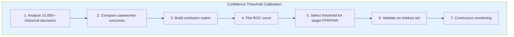
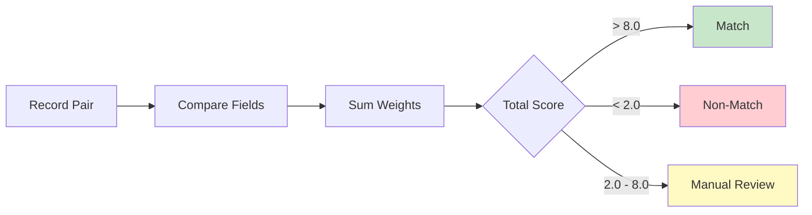
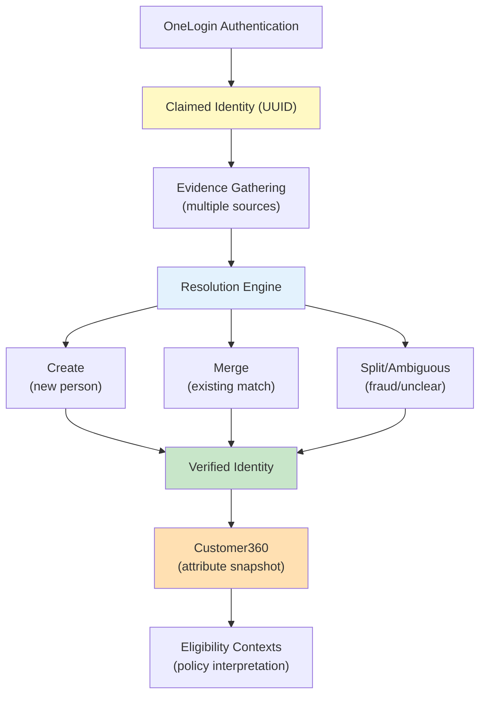
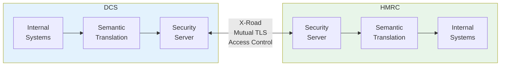
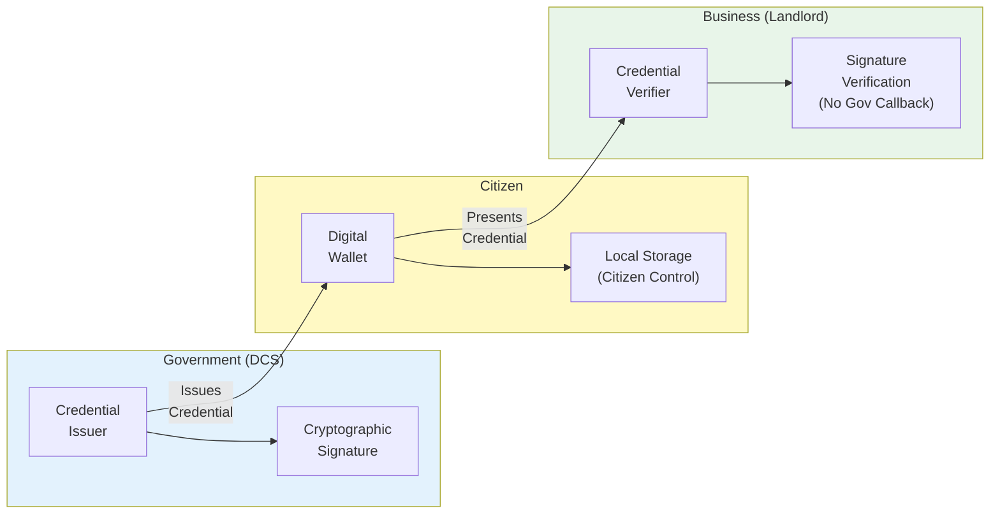

# Evidence-Based Identity: A Semantic Coordination Architecture

**Applying Domain-Driven Design to Identity Coordination**

*Part 2 of the Architecting Modern Government Services Series*

*Version 1.2 | March 2026*

---

## Version History

| Version | Date | Changes |
|---------|------|--------|
| 1.0 | Feb 2026 | Initial release |
| 1.1 | Feb 2026 | Added Fellegi-Sunter primer, confidence calibration section, Mermaid diagrams |
| 1.2 | Mar 2026 | Added §1.4 "The Institutional Reality" — why metadata stripping persists despite known costs; the perverse equilibrium of bad data vs no data |

---

## Executive Summary

UK government efforts to align identity and attributes across departments have repeatedly failed, despite major investments. The core challenge is coordination: enabling different systems and organisations to work together so that evidence about a person or circumstance can be reused, trusted, and interpreted correctly wherever it is needed.

When coordination fails, the result is costly duplication, increased fraud and error, and a frustrating experience for citizens who must repeatedly provide the same information. Many initiatives have focused on standardising data formats and identifiers, but these efforts have not solved the underlying problem.

**True coordination requires the ability to translate meaning between different organisational contexts, track the provenance and confidence of evidence, and manage uncertainty—tasks that demand semantic translation and probabilistic reasoning, not just technical integration.**

### Core Technical Argument

Evidence-based coordination using RDF triples, semantic translation, and probabilistic identity clustering solves coordination problems that relational databases cannot address. Estonia's X-Road demonstrates that federated cross-government queries and bilateral semantic agreements work at national scale over 20+ years; probabilistic identity and semantic technologies are this paper's proposed extension for contexts without universal identifiers.

### The DDD Foundation

This paper applies Domain-Driven Design principles from Paper 1 to the identity coordination problem:

| DDD Concept | Identity Application |
|-------------|---------------------|
| Bounded Contexts | Identity, Evidence, Trust, Resolution, Eligibility |
| Shared Kernel | Customer360 (verified attributes) |
| Semantic Translation | Bilateral vocabulary mappings with confidence penalties |
| Aggregates | Identity Cluster, Evidence Item, Resolution Decision |
| Anti-Corruption Layer | Policy-specific interpretation of shared attributes |

### Implementation Reality

The solution assembles mature technologies (RDF triple stores, microservices, event streams, verifiable credentials) into an architecture that models coordination reality accurately.

**Why previous approaches failed:** Standardisation attempts asked departments to abandon policy-driven semantic differences that their governing legislation requires. They treated identity as a shared fact to be standardised rather than a conclusion drawn from evidence requiring coordination.

**The solution in one sentence:** Evidence-based coordination preserves organisational autonomy by treating every piece of information as a structured assertion with provenance and confidence, enabling semantic translation between contexts rather than forcing shared schemas.

---

> **How to Read This Paper**
>
> **Strategic readers (CTO, Programme Director, Head of Architecture):** Parts I and IV provide the complete argument. Part I diagnoses why existing approaches fail; Part IV maps the solution onto the domain model you will need to govern. Forty minutes here gives you enough to commission a proof of concept or challenge a vendor proposal confidently. Section 1.5 provides a single-table summary of root causes and solutions before you reach the technical detail.
>
> **Technical architects:** Read all parts in sequence. Part II covers the core data model and probabilistic reasoning; Part III addresses social evidence edge cases; Parts V–VI cover coordination patterns and security at scale.
>
> **Engineers new to semantic web notation:** Section 2.1 includes a Turtle notation primer. Section 2.3 contains a Fellegi-Sunter primer. Read these before the notation appears in later examples — they demystify both in under five minutes.

---

## Prerequisites

This paper assumes familiarity with Domain-Driven Design concepts including bounded contexts, aggregates, and context relationships. For a complete treatment, see **Paper 1: Domain-Driven Design & Clean Architecture for Enterprise Systems**.

Key terms are summarised inline where they first appear.

---

## Part I: The Systematic Failure Pattern

### 1.1 Why Shared Schema Approaches Fail

**The Repeated Mistake:**

Every major UK government identity initiative has attempted to create shared data standards that all departments will adopt. Universal Credit integration, NHS-to-DWP data sharing, cross-government identity verification—all have tried to force departments into common schemas.

**Why It Fails:**

The failure stems from a fundamental misunderstanding of organisational reality. Semantic diversity isn't a bug to be fixed—it's a feature reflecting legitimate policy differences.

When HMRC defines "income" for tax purposes, they include bonuses and benefits-in-kind calculated annually. When Universal Credit defines "income" for benefit assessment, they exclude certain bonuses and calculate monthly net amounts. These aren't arbitrary technical choices; they're policy distinctions written into law.

Departments resist standardisation precisely because it breaks their ability to implement their policy mandates. There's no forcing function compelling them to abandon interpretations that their governing legislation requires. Central governance teams quickly discover they cannot adjudicate thousands of semantic conflicts when each conflict represents a genuine policy question requiring ministerial authority.

What emerges from these standardisation efforts isn't the intended unified system but rather sophisticated facades. "Common services" evolve into modernised silos with REST APIs delivering the same fragmented data that caused the original problems.

**From a DDD perspective:** This is the "god-model" antipattern. Forcing Benefits, Pensions, HMRC, and NHS into one shared model destroys the linguistic precision that each bounded context requires. Different ubiquitous languages exist for good reasons—they reflect different business authorities, different change drivers, and different invariants (see Paper 1, Section 1.3).

### 1.2 The Three Fatal Assumptions

Standardisation failures stem from three conceptual errors so fundamental they remain invisible to practitioners:

**Assumption 1: Identity is something you can "verify"**

The language pervades every programme: "identity verification," "verified credentials," "proof of identity." But HMRC doesn't verify an abstract identity—they verify that specific evidence (passport, utility bill, P60) meets specific criteria for specific purposes.

What we call "identity verification" is actually **evidence assessment for adequacy against decision criteria**. Systems produce binary "verified" tokens and pass them around, but receiving departments have no idea what evidence supports the token or whether that evidence meets their decision requirements.

**Assumption 2: Attributes are properties of identity**

We say "the identity has an address attribute" or "employment status attribute." But addresses and employment aren't properties of identity—they're **conclusions drawn from evidence**.

When three pieces of evidence say you live at Flat 3 (council tax, bank statement, GP registration) but a fourth shows Flat 2 (recent DBS check), there's no single "correct" address attribute. There are four pieces of evidence telling a coherent story about a recent move. Systems built around identity attributes cannot represent this story—they can only show one address at a time, forcing arbitrary choices or generating errors.

**Assumption 3: Integration means making systems talk to each other**

When coordination fails, the obvious solution appears to be: build APIs, define data exchange formats, implement message queues, establish service contracts. Billions later, systems can technically communicate and exchange messages successfully, yet coordination still doesn't work.

Why? Because **integration isn't a technical problem—it's a semantic problem**.

When DWP asks HMRC "Is John Smith employed?" they're not asking for a database field. They're asking: "What evidence exists about this person's employment status, what's the provenance of that evidence, how recent is it, and does it meet DWP's specific criteria for this specific benefit decision?"

No API specification captures that without shared semantic understanding of what "employment evidence" means, how confidence is calculated, and how to map from HMRC's evidence schema to DWP's decision requirements.

**From a DDD perspective:** These assumptions conflate multiple bounded contexts into one. Identity (who is this person?), Evidence (what do we know?), Trust (how reliable is the source?), and Eligibility (do they qualify?) are separate contexts with different invariants. Treating them as one creates the semantic confusion that causes coordination failure.

### 1.3 Identity Without Universal Identifier

**The Circular Dependency:**

The UK lacks a universal citizen identifier. Evidence coordination demands answering "is this the same person?" across services—a question relational databases answer through foreign keys requiring deterministic identity records.

The traditional solution creates a master identity record with a unique identifier linking all evidence. Reality reveals the circular dependency: **you cannot create the identity record without coordinating evidence, yet you cannot correlate evidence without the identity record.**

This architectural trap has paralysed coordination attempts for decades.

**Current State:**

- Citizens upload the same documents 6+ times because departments cannot share evidence effectively
- Each department maintains separate identity verification systems with incompatible data models
- No cross-department evidence reuse exists because vocabulary differences and technical silos prevent interoperability
- Manual correlation becomes necessary when coordination proves unavoidable, operating at massive cost and introducing weeks of latency

**From a DDD perspective:** The foreign key problem is a symptom of treating Identity as a single aggregate when it's actually an emergent property of correlated evidence. The solution is probabilistic identity clustering (see Section 2.3)—modelling the uncertainty explicitly rather than forcing deterministic decisions.

### 1.4 Evidence Processing Without Context

**Information Loss in Traditional Systems:**

Consider what happens when rich evidence arrives at a government system. HMRC Real Time Information sends a cryptographically signed message stating:

> "Sarah Miller employed by ABC Ltd earning £30,000 annually"

This arrives with full verification metadata: transmission date, cryptographic signatures, employer submission confirmation.

When traditional relational databases store this information, they typically extract only the bare facts:

```
| person_id | employer | income  | as_of_date |
|-----------|----------|---------|------------|
| 12345     | ABC Ltd  | 30000   | 2025-03-27 |
```

**What's Lost:**

The database has stripped away everything that makes evidence usable:

| Lost Context | Why It Matters |
|--------------|----------------|
| WHO made the assertion | HMRC statutory authority vs citizen self-report |
| HOW it was verified | Cryptographic proof vs manual review |
| WHEN the assertion was made | Currency assessment for decisions |
| What CONFIDENCE it deserves | 0.94 vs 0.40 |
| Semantic context | Annual pre-tax vs monthly post-tax |

Every downstream system must perform fresh verification because provenance is destroyed.

**From a DDD perspective:** This is a modelling failure. Evidence isn't a fact to be stored—it's an assertion with context. The aggregate boundary is wrong: we need an `Evidence` aggregate that preserves the complete assertion, not just extracted data fields.

#### The Institutional Reality

This is not ignorance. Many government departments know exactly what they are losing when metadata is stripped. The problem is structural:

1. **Legacy systems were never built to hold provenance.** A database schema designed in 1998 has columns for `income` and `employer`. It does not have columns for `assertion_source`, `verification_method`, `cryptographic_signature`, or `confidence_score`. Adding them is not a schema migration — it is a fundamental redesign of the data model, the APIs that consume it, and every downstream system that assumes the old shape.

2. **Updating those systems costs millions.** For a large department, modernising one core system can run into eight or nine figures. Multiply that across dozens of legacy estates, each with decades of accumulated integrations, and the total cost is politically undeliverable. Leadership knows the data quality problem exists. They do not have the budget to fix it.

3. **Receiving bad data is often better than receiving no data.** This is the uncomfortable trade-off. If DWP stopped accepting data feeds that lack provenance, it would lose visibility into employment, pensions, tax status, and dozens of other signals used to detect fraud and verify eligibility. The resulting increase in fraud and error would likely exceed the damage caused by processing unverified data. Departments continue receiving dubious data because the alternative is worse.

4. **Metadata is often stripped at receipt, not transmission.** Even when the sending department provides rich context, the receiving system may discard it because there is nowhere to put it. The problem compounds: after a few hops through intermediary systems, the original provenance is irrecoverable.

This creates a perverse equilibrium: everyone knows the data is unreliable, but no single actor can fix it unilaterally, and stopping the flow would cause more harm than continuing. The architecture described in this paper is designed to break that equilibrium — by making provenance preservation the *default* rather than an optional add-on, and by allowing incremental adoption without requiring every system to modernise simultaneously.

### 1.5 Summary: Three Root Causes and Their Solutions

| Root Cause | Symptom | What This Architecture Replaces It With |
|-----------|---------|----------------------------------------|
| Treating identity as a shared fact | Standardisation failures; departments resist adoption; "common services" become silos | Evidence-based coordination: each organisation keeps its own model; assertions are translated bilaterally via negotiated mappings |
| Treating attributes as properties of identity | Binary answers to probabilistic questions; forced choices about conflicting evidence; 6+ document uploads | Probabilistic identity clusters: confidence scores propagate through every decision; uncertainty is represented, not hidden |
| Treating integration as a technical problem | Systems that "talk to each other" but don't coordinate meaning; successful API calls, failed coordination | Semantic translation: the vocabulary mapping becomes an explicit, versionable, testable artefact governed bilaterally |

These three substitutions form the complete architecture described in what follows.

> **This is the strategic cut-off.** If your goal is programme decision-making rather than implementation, read Part IV next (the domain model) then stop. Everything from Part II onward is implementation depth for architects and engineers.

---

## Part II: The Technical Breakthrough

> **Domain context:** The mechanisms in this part implement two of the bounded contexts from Part IV—*Evidence* (stores assertions with provenance) and *Identity* (resolves probabilistic clusters). The technical choices here—RDF triples, confidence scores, Fellegi-Sunter matching—are *consequences* of the domain model, not arbitrary technology decisions. Part IV provides the "why"; this part provides the "how." If you prefer to understand the conceptual model before the implementation, read Part IV first then return here.

### The Core Insight

These failures share a common root—treating evidence as facts to extract rather than assertions to preserve. Relational databases optimise for fact storage but destroy the context that makes evidence usable across organisational boundaries.

**The solution requires a fundamentally different data model that treats provenance, confidence, and semantic meaning as first-class concerns.**

### 2.1 Model Assertions, Not Facts

**Philosophical Shift:**

| Traditional | Evidence-Based |
|-------------|----------------|
| Evidence records **facts** about people | Evidence records **assertions**—claims organisations believe true |

**The X-Y-Z Model:**

Every piece of information modelled as: **X (organisation) asserts Y (claim) about Z (subject)**

> **A note on Turtle notation:** The examples below use Turtle, a compact syntax for writing RDF (Resource Description Framework) graphs. It reads like structured sentences. A few things to know before you encounter it:
> - Lines starting with `:name` define a resource (the subject)
> - `a :ClassName` means "is a"—it declares the type
> - `:`-prefixed words are named concepts from a defined vocabulary
> - `;` continues describing the same subject on the next line
> - The block describes an assertion much like a sentence: *who said it*, *what they claimed*, *about whom*, *with what confidence*
>
> You do not need to know RDF to follow these examples. Read them as structured sentences about facts with metadata attached.

The semantic graph model stores employment information completely differently from relational tables:

```turtle
:emp_001 a :EmploymentEvidence ;
    :assertedBy :HMRC_RTI ;
    :aboutSubject :NINO_AB123456C ;
    :employer "ABC Ltd" ;
    :annualIncome 30000 ;
    :verificationMethod :CryptographicSignature ;
    :confidence 0.94 ;
    :assertionTimestamp "2025-03-27T14:23:00Z"^^xsd:dateTime .
```

**What This Preserves:**

| Context | How It's Preserved |
|---------|-------------------|
| Source authority | `:assertedBy :HMRC_RTI` distinguishes statutory authority from self-report |
| Verification strength | `:verificationMethod :CryptographicSignature` vs `:ManualReview` |
| Temporal validity | `:assertionTimestamp` enables currency assessment and time-decay |
| Confidence quantification | `:confidence 0.94` enables risk-based processing |
| Semantic interpretation | Explicit `:annualIncome` vs ambiguous "income" field |

### 2.2 Three-Layer Confidence Model

Confidence in evidence is not a single number — it is the product of three independent assessments, each answering a different question. The first asks how reliable the source organisation is and how rigorous the verification was. The second asks how precisely the evidence identifies its subject — a National Insurance Number uniquely identifies a person in a way that "C Hughes" on a utility bill does not. The third asks how well this evidence matches the existing knowledge in this identity cluster.

Multiplying these three scores is deliberate: uncertainty compounds. A system that papers over compounding uncertainty produces false confidence and, eventually, incorrect decisions. The illustrations below use DWP evidence examples.

**Layer 1: Evidence Quality = Source × Verification × Transmission**

| Evidence Type | Source | Verification | Transmission | Overall |
|--------------|--------|--------------|--------------|---------|
| HMRC Real Time Information | 0.94 (statutory authority) | 0.95 (crypto signatures) | 0.99 (mutual TLS) | **0.88** |
| Utility bill | 0.90 (commercial reputation) | 0.95 (document features) | 0.99 (secure upload) | **0.85** |
| Citizen self-report (plain HTTP) | 0.40 (self-interested) | 0.55 (no verification) | 0.60 (insecure) | **0.13** |

**Layer 2: Evidence-Identifier Binding**

This layer assesses how tightly the evidence identifies its subject—entirely separate from evidence quality.

| Evidence | Binding Strength | Reason |
|----------|-----------------|--------|
| HMRC with NINO | 0.98 | Unique national identifier |
| Driving licence | 0.96 | Photo + DOB + name + address |
| Utility bill ("C Hughes") | 0.45 | Ambiguous—Chris, Christine, Charles? |
| Anonymous tip | 0.10 | No identifier at all |

**Layer 3: Cluster Matching (Our System's Work)**

The third layer represents the system's inference work—using Fellegi-Sunter probabilistic record linkage to match evidence against existing identity clusters. This confidence ranges from 0.10 to 0.98 depending on:

- Name similarity (exact, abbreviation, typo)
- Date of birth agreement
- Address correlation (accounting for moves)
- National Insurance number matches
- Temporal consistency

**Overall Confidence = Layer 1 × Layer 2 × Layer 3**

Example: 0.88 (HMRC quality) × 0.98 (NINO binding) × 0.91 (cluster match) = **0.78 overall**

**Critical Distinction:** Layer 2 (identifier binding) is a property of evidence. Layer 3 (cluster matching) is our system's inference work. These must remain separate and multiplicative.

#### Confidence Calibration and Threshold Tuning

**The Calibration Problem:**

Multiplying three probabilities produces low overall scores—a feature, not a bug. A 0.78 confidence score correctly reflects that uncertainty compounds. However, thresholds must be calibrated to operational reality.

**Calibration Methodology:**



| Use Case | Threshold | False Positive Rate | False Negative Rate | Rationale |
|----------|-----------|---------------------|---------------------|------------|
| Auto-approve benefit | 0.75 | <2% | ~15% | Minimise fraud, accept delays |
| Flag for review | 0.50 | ~10% | <5% | Catch edge cases |
| Identity merge | 0.85 | <0.5% | ~20% | Avoid wrongful merges |

**Dynamic Threshold Adjustment:**

Thresholds aren’t static. The system adjusts based on:

1. **Fraud pressure:** If fraud detection spikes → raise auto-approve threshold temporarily
2. **Appeal rates:** If appeals on auto-decisions exceed 8% → raise threshold
3. **Evidence source changes:** New evidence types start at conservative thresholds until calibrated

**Monthly Calibration Review:**

```
Calibration Report - January 2026
────────────────────────────────
- Auto-processed: 847,291 (89.3%)
- Manual review: 98,442 (10.4%)
- Appeals filed: 2,847 (0.3%)
- Appeals upheld: 891 (31% of appeals)
- Threshold drift: +0.02 recommended
- Action: Raise Housing Benefit threshold from 0.75 → 0.77
```

### 2.3 Probabilistic Identity Clustering

#### Understanding Fellegi-Sunter: A Brief Primer

The Fellegi-Sunter model (1969) is the foundational algorithm for probabilistic record linkage—determining whether two records refer to the same real-world entity when you can’t be certain.

**The Core Idea:**

For each pair of records, compare individual fields (name, DOB, address, NINO) and calculate:

- **m-probability:** Given records *are* a match, what’s the probability this field agrees?
- **u-probability:** Given records *aren’t* a match, what’s the probability this field agrees by chance?

The ratio m/u gives a **weight** for each field comparison:

| Field | m-probability | u-probability | Weight (log₂ m/u) | Interpretation |
|-------|---------------|---------------|-------------------|----------------|
| NINO exact match | 0.98 | 0.0001 | +13.3 | Very strong evidence of match |
| DOB exact match | 0.95 | 0.003 | +8.3 | Strong evidence |
| Name exact match | 0.90 | 0.02 | +5.5 | Moderate evidence |
| Name similar | 0.85 | 0.15 | +2.5 | Weak evidence |
| Address mismatch | 0.15 | 0.70 | -2.2 | Evidence against (people move) |

**Decision Rule:**

Sum the weights across all field comparisons. If total > upper threshold → **match**. If total < lower threshold → **non-match**. Between thresholds → **manual review**.



**Why This Matters for Identity:**

Fellegi-Sunter gives us a principled, calibratable way to answer "is this the same person?" without requiring deterministic identifiers. The thresholds can be adjusted based on the cost of false positives vs false negatives for different use cases.

**No Master Identity Record:**

Traditional identity systems create a master citizens table:

```sql
CREATE TABLE citizens (
    id UUID PRIMARY KEY,
    nino VARCHAR(9),
    name VARCHAR(100),
    dob DATE
);
```

This deterministic approach assumes we can always confidently assign evidence to the correct person.

**The evidence-based approach instead builds probabilistic identity clusters:**

```turtle
:cluster_AB123456C a :IdentityCluster ;
    :primaryIdentifier "AB123456C" ;
    :hasEvidence :emp_001, :housing_047, :council_tax_112 ;
    :clusterConfidence 0.89 ;
    :lastUpdated "2025-03-27T15:00:00Z"^^xsd:dateTime .

:match_emp_001_AB123456C a :ClusterMatch ;
    :evidence :emp_001 ;
    :cluster :cluster_AB123456C ;
    :matchConfidence 0.91 ;
    :matchFactors "NINO exact, name exact, address consistent" .
```

**Key Properties:**

| Property | Explanation |
|----------|-------------|
| Clusters are inferences | No external organisation asserts cluster membership—the system infers it |
| Confidence evolves | Early evidence provides tentative clustering; later evidence strengthens or refutes |
| Multiple matches supported | Ambiguity represented explicitly, not forced to premature decision |
| External orgs never see cluster IDs | They cite their own identifiers; clustering is internal |

**Two-Track Processing:**

| Track | Coverage | Description |
|-------|----------|-------------|
| Fast Track | ~95% | Evidence arrives pre-bound to authenticated registration points (LoA3+). Immediate processing, no probabilistic matching needed. |
| Full Resolution | ~5% | Evidence without binding context (anonymous tips, batch imports). Full Fellegi-Sunter matching; 0.75 threshold for automation; below that → caseworker. |

### 2.4 Semantic Translation Without Standardisation

The deepest challenge in cross-government coordination is semantic: the same word means different things in different departments because different legislation created different obligations. Any integration architecture that demands semantic agreement will fail when it meets the immovable object of legislative authority.

The alternative is semantic translation: model the vocabulary differences explicitly, negotiate bilateral mappings between specific pairs of organisations, and propagate the translation uncertainty through confidence scores. No department changes its definitions; the coordination layer speaks everyone's language.

**The Problem:**

| Organisation | "Income" Definition |
|--------------|---------------------|
| HMRC | Annual gross employment income, including bonuses, excluding benefits-in-kind |
| Universal Credit | Monthly net assessment income, excluding bonuses, including benefits-in-kind |

The traditional approach attempts to force agreement on a single definition. This fails because it denies organisational autonomy and breaks legitimate policy distinctions.

**The evidence-based approach creates bilateral semantic mappings:**

```turtle
:mapping_HMRC_to_UC a :SemanticMapping ;
    :sourceContext :HMRC_Income ;
    :targetContext :UC_AssessmentIncome ;
    :transformation [
        a :IncomeTransformation ;
        :operation "subtract bonuses, divide by 12, multiply by 0.87" ;
        :confidencePenalty 0.03 ;
        :validFrom "2025-01-01"^^xsd:date ;
        :approvedBy :JointGovernanceBoard
    ] .
```

**Governance Model:**

| Aspect | Approach |
|--------|----------|
| Negotiation | Bilateral between source and destination organisations |
| Version control | Git with instant rollback |
| Validation | Statistical testing against 1000+ historical cases |
| Monitoring | Appeal rate triggers automatic review when spikes occur |

**Mapping Counts by Pattern:**

| Pattern | Mapping Count | Reason |
|---------|--------------|--------|
| Pattern 1 (Internal) | 100-500 | Manageable—single organisation |
| Pattern 2 (Cross-Gov) | Thousands | Challenging but necessary—bilateral model scales |
| Pattern 3 (Credentials) | Minimal | Standardised W3C claims vocabulary |

---

## Part III: Social Evidence — Community Vouching

*Parts I and II have focused on institutional evidence—HMRC RTI data, cryptographic credentials, formal documents. This part addresses a different and important class: social evidence. The architecture would be incomplete without it. Government cannot exclude the 27% of lowest-income households who lack passports from the services they most need.*

### 3.1 The Inclusion Problem

Traditional identity verification creates systematic exclusion:

| Population | Challenge |
|------------|-----------|
| Lowest-income households | 27% lack passports, 32% lack driving licences (2024 ONS) |
| Asylum seekers | Granted refugee status but can't obtain digital ID for employment |
| Elderly without documents | Stable identities but missing modern verification requirements |
| Displaced workers | Lacking stable residential histories |

The 2025 digital ID employment requirement makes this critical—people granted the legal right to work cannot exercise that right because verification systems fail.

### 3.2 Vouching as Structured Evidence

UK passport applications already require professional countersignatures where teachers, doctors, or solicitors vouch "I have known this person for at least two years." This treats personal knowledge as sufficient evidence for establishing identity.

**Evidence-based coordination formalises and extends this:**

```turtle
:vouch_001 a :SocialEvidence ;
    :assertedBy :person_imam_mohammed ;
    :aboutSubject :person_amara_hassan ;
    :assertionType :IdentityVouch ;
    :relationshipContext "Community leader, known 3 years" ;
    :confidence 0.82 ;  # Layer 1: source 0.85, verification 0.78
    :verificationMethod :InPersonInterview ;
    :legalBasis :ImmigrationAct2024_Section47 .
```

**Multiple independent vouches create triangulation** that can exceed single institutional assertions. When Amara receives vouches from mosque leader, refugee centre staff, and community families who all independently attest to her identity, combined confidence may surpass a single passport verification—especially when the passport itself proves difficult to verify through international channels during conflict.

### 3.3 Fraud Prevention: Five-Layer Detection

Organised fraud becomes detectable through graph analysis that honest vouching patterns cannot mimic:

| Detection Layer | What It Catches |
|-----------------|-----------------|
| Geographic/temporal clustering | 60 vouches from same address in 48 hours |
| Circular vouching | A vouches for B, B for C, C for A |
| Behavioural tracking | Fraud networks form rapidly; real communities grow gradually |
| Cross-reference validation | Vouch claims employment that HMRC contradicts |
| Asymmetry analysis | Real communities have hierarchy; fraud rings are symmetric |

**Real-world example:** System detected a 15-person fraud ring. Graph analysis flagged:
- Synchronised timing (all vouches within 3-day window)
- Circular network structure
- Low voucher confidence scores (all vouchers themselves recently verified)
- No institutional cross-references
- Symmetric relationships (no natural community hierarchy)

The entire network was flagged before any identity reached auto-processing threshold.

### 3.4 Trust Propagation

Vouching reliability builds through network effects:

When the Imam has 15 years of high-confidence institutional evidence (employment, council tax, NHS records) plus a vouching history showing consistent accuracy, his vouches carry higher source reliability than vouches from newly-arrived community members.

This creates virtuous cycles where well-verified community members become anchor points for expanding verification networks. The system tracks vouch accuracy over time—if vouches consistently prove accurate, future vouches receive higher weights.

---

## Part IV: The Domain Model — DDD Applied to Identity

*This section explicitly frames the architecture using DDD concepts from Paper 1.*

### 4.1 The Identity Domain Landscape

Identity coordination is not one domain—it's a **federation of bounded contexts**, each with its own model, language, and rules.

```mermaid
flowchart TB
    subgraph Domain[\"Identity Coordination Domain\"]
        subgraph Platform[\"Platform Services (Generic)\"]
            IdBC[\"Identity\\nBC\"]
            EvBC[\"Evidence\\nBC\"]
            TrustBC[\"Trust\\nBC\"]
            ResBC[\"Resolution\\nBC\"]
        end
        
        IdBC --> C360
        EvBC --> C360
        TrustBC --> C360
        ResBC --> C360
        
        C360[\"Customer360\\n(Shared Kernel)\\nRead Model of Verified Attrs\"]
        
        C360 --> UCBC
        C360 --> PensionBC
        C360 --> HousingBC
        
        subgraph Business[\"Business Subdomains (Core)\"]
            UCBC[\"UC Eligibility\\nBC (Benefits)\"]
            PensionBC[\"Pension Eligibility\\nBC (Pensions)\"]
            HousingBC[\"Housing Eligibility\\nBC (Housing)\"]
        end
    end
    
    style Platform fill:#e3f2fd
    style Business fill:#e8f5e9
    style C360 fill:#fff9c4
```

### 4.2 Key Bounded Contexts

#### Identity Bounded Context (Platform Service — Generic Subdomain)

This context models citizen identity as it relates to government services.

**Core Aggregates:**

| Aggregate | Description | States |
|-----------|-------------|--------|
| Identity Profile | Verified attributes with confidence scores | ClaimedOnly → PartiallyVerified → FullyVerified → Ambiguous → Fraudulent |
| Claimed Identity | Unverified assertions with evidence links | Created at first authentication |
| Verification Session | The resolution process | Active → Resolved → Expired |

**Microservices:** `identity-resolution-service`

**Key Invariant:** One verified identity per real-world person, with all evidence binding preserved in audit trails.

**Resolution Operations:** Create (new person), Merge (matches existing), Split (fraud detected), Enrich (additional evidence strengthens existing).

#### Evidence Bounded Context (Platform Service — Generic Subdomain)

This context models evidence ingestion, classification, and storage.

**Core Aggregates:**

| Aggregate | Description |
|-----------|-------------|
| Evidence Item | Type, source, collection metadata, raw content |
| Extracted Attributes | OCR/AI-processed data from evidence |
| Authenticity Score | Validation results and confidence |

**Microservices:** `evidence-ingestion-service`, `evidence-validation-service`

**Key Invariants:**
- Evidence is immutable once ingested (add metadata, never alter original)
- Evidence is independent of identity—linked, not owned

**Why this separation matters:** Evidence arrives from multiple channels, needs OCR and AI processing, and operates at high volume. Keeping evidence independent means that when fraud is detected and an identity splits, the evidence remains intact and can be relinked to the correct identity.

#### Trust & Provenance Bounded Context (Platform Service)

This context models issuer trust, credential validation, and verification methods.

**Core Aggregates:**

| Aggregate | Description |
|-----------|-------------|
| Issuer | Trusted organisations (HMRC, banks, utilities) |
| Trust Tier | Issuer classification and reliability scores |
| Verification Capability | What an issuer can verify |
| Cryptographic Key | For digital credential validation |

**Microservices:** `issuer-trust-service`

**Key Invariants:**
- Issuers must be validated before their evidence is trusted
- Trust tiers are immutable for evidence already issued

**Why this matters:** This forms a security boundary with centralised trust policy reusable across all subdomains.

#### Resolution & Corroboration Bounded Context

This context models the complex reasoning that matches evidence to identities.

**Core Aggregates:**

| Aggregate | Description |
|-----------|-------------|
| Evidence Link | Connecting evidence to identities with match confidence |
| Resolution Decision | Create/Merge/Split/Enrich with full audit trails |
| Identity Graph | Network of evidence, attributes, identities, relationships |

**Microservices:** `identity-resolution-service`

**Trust Computation:** match_confidence × issuer_trust × authenticity × freshness × independence

**Critical insight:** Evidence is never "owned by" an identity—it's linked with confidence scores. This enables detection of fraud patterns when evidence suggests identities should be split, merged, or flagged.

#### Customer360 (Shared Kernel)

A special bounded context providing read models of verified customer attributes—snapshots of identity, relationships, and evidence trails with confidence levels.

**Core Aggregates:** Customer Profile (read-only, populated from Identity, Evidence, and Resolution contexts)

**Governance:** Co-owned by all consuming subdomains; changes require cross-domain approval.

**Critical Limitation:** Customer360 provides verified relationships with confidence scores but does NOT define what those relationships mean for policy purposes. It answers:
- ✓ "What verified relationships exist with what confidence?"
- ✗ "What does this mean for eligibility?"

The second question belongs in Eligibility contexts.

**What Customer360 Contains:**

| Category | Content |
|----------|---------|
| Identity Profile | Verified name, DOB, NINO |
| Place Relationships | Person-to-location associations (owned, rented, care home, registered) |
| Person Relationships | Parent/child, spouse, household member |
| Contact Preferences | Communication channels |
| Evidence History | Complete provenance chain |

#### Eligibility Bounded Contexts (Core Subdomains — One Per Benefit)

Each benefit has its own Eligibility bounded context modelling policy rules.

**Core Aggregates:**

| Aggregate | Description |
|-----------|-------------|
| Eligibility Request | Application with claimed circumstances |
| Policy Rule Set | Versioned eligibility rules |
| Decision Result | Approved/denied with reasoning |
| Decision Audit Trail | Complete history |

**Microservices:** `universal-credit-eligibility-service`, `pension-credit-eligibility-service`, etc.

**Key Invariant:** Decisions can only be based on verified attributes meeting confidence thresholds.

**Why separate contexts:** Different benefits have different rules, different change cycles, and different policy ownership. Universal Credit eligibility rules change at a different pace than State Pension rules.

> **See also:** Paper 6, Part Four presents the complete bounded context catalogue with team ownership assignments, aggregate-to-microservice mappings, and inter-service API contracts. The descriptions above establish the domain model foundations; Paper 6 covers the implementation specifics.

### 4.3 The Chicken-and-Egg Problem Solved

**The Naive Approach (Why It Fails):**

1. User claims to be "John Smith, born 1980-03-15"
2. System tries to find existing identity matching those attributes
3. User uploads evidence
4. System tries to link evidence to found identity

**Problem:** What if there are three John Smiths born in March 1980? What if this is a new person? What if evidence contradicts claimed attributes?

**The Correct Architecture: Claimed Identity as the Anchor**



**The Separation:**

1. **Claimed Identity** is created when a user first authenticates—a digital anchor point for "this authentication session and all evidence gathered during it." Attributes are claimed but unverified.

2. **Evidence is bound to the Claimed Identity**, not a verified person. This avoids the circular dependency.

3. **Resolution determines what this Claimed Identity represents:** Merge (matches existing), Split (fraud), Create (new person), or Ambiguous (more evidence needed).

4. **Verification establishes uniqueness** within the identity domain with confidence scores.

**Evidence Preservation:** When a Claimed Identity resolves, the evidence trail is preserved in full. If merged, all evidence joins the existing identity's history. If split, evidence is partitioned based on attribute correlation.

### 4.4 Customer360: The "360 View" Challenge

Different benefits define "customer" differently:

| Benefit | What Matters |
|---------|--------------|
| Universal Credit | Household composition |
| Pension Credit | Retirement age |
| Child Maintenance | Parental relationships |

Even "address" is policy-dependent:
- Is a care home your address during a brief stay?
- If you work away 3 nights/week, which address counts?
- Does "address" mean registered, main residence, or current stay?

**The Solution: Verified Place Relationships, Not "Addresses"**

Customer360 stores verified relationships to locations:

```turtle
:person_sarah a :Person ;
    :hasPlaceRelationship [
        :location :12_oak_road ;
        :relationshipType :RentedAccommodation ;
        :confidence 0.91 ;
        :verifiedDate "2025-03-15"^^xsd:date
    ] ;
    :hasPlaceRelationship [
        :location :care_home_sunrise ;
        :relationshipType :CareHomeResidence ;
        :confidence 0.95 ;
        :verifiedDate "2025-03-20"^^xsd:date
    ] .
```

**Each Eligibility context interprets which places count:**
- Universal Credit sees "rented accommodation" and decides it's her main residence
- Pension Credit sees "care home residence" and applies the 6-week rule

Same verified relationships, different policy lenses.

### 4.5 Context Relationships in the Identity Domain

**Identity → Evidence:** Anti-Corruption Layer. Evidence doesn't know Identity exists; Identity translates evidence into its model.

**Eligibility → Customer360:** Shared Kernel (read-only consumption). All eligibility contexts agree on Customer360 schema.

**Business Subdomains → Platform Services:** Open Host Service with API contracts. Business contexts call platform APIs but don't see implementation.

---

## Part V: The Three Coordination Patterns

### 5.1 Pattern 1: Internal Organisational Coordination

**Scope:** Within single organisation (e.g., DCS coordinating Universal Credit, Housing Benefit, Pension Credit)

Pattern 1 is the highest-confidence deployment. A single organisation controls all services, all service-to-service calls are internal, and there are no cross-organisational trust boundaries to cross. For DWP, this covers coordination between Universal Credit, Housing Benefit, and Pension Credit — all under Secretary of State authority. The semantic translation challenge remains (each benefit uses slightly different income definitions) but governance is far simpler, and the distributed systems complexity is lower than cross-government patterns. This is the right place to pilot the architecture before extending to Pattern 2.

**Technical Architecture:**

```mermaid
flowchart TB
    subgraph Org["Single Organisation"]
        subgraph Store["Apache Jena Fuseki"]
            RDF["RDF Triple Store\n500M - 2B triples"]
        end
        
        subgraph Services["10 Core Microservices"]
            EI["Evidence\nIngestion"]
            IR["Identity\nResolution"]
            ST["Semantic\nTranslation"]
            FD["Fraud\nDetection"]
            AC["Award\nCalculation"]
        end
        
        subgraph Services2[" "]
            IQ["Investigation\nQueue"]
            NT["Notification"]
            AU["Audit"]
            EG["External\nGateway"]
            DR["Data\nRetention"]
        end
        
        subgraph Kafka["Apache Kafka"]
            Events["Event-Driven Coordination"]
        end
        
        RDF --- Services
        Services --- Services2
        Services2 --- Kafka
    end
    
    style Store fill:#e3f2fd
    style Services fill:#e8f5e9
    style Services2 fill:#e8f5e9
    style Kafka fill:#fff3e0
```



**Scaling:**

60 million citizens × 5-10 evidence pieces × 3-5 years retention = 500M-2B triples. A single Apache Jena node handles 50B triples—generous headroom.

**Key Services:**

| Service | Responsibility |
|---------|----------------|
| Evidence Ingestion | Routes incoming evidence to registration points |
| Identity Resolution | Fellegi-Sunter matching, cluster lifecycle |
| Semantic Translation | Bilateral vocabulary mappings, confidence adjustments |
| Fraud Detection | Pattern analysis, cross-evidence correlation |
| Award Calculation | Policy rule engines for eligibility |
| Investigation Queue | Manual review escalation |
| Notification | Decision explanations with provenance |
| Audit Service | Immutable log for appeals |
| External Gateway | X-Road endpoints for Pattern 2 |
| Data Retention | GDPR compliance, right-to-erasure |

**Example Flow (Sarah's Housing Benefit):**

1. Sarah authenticates at LoA3+ → registration point established
2. Uploads payslip → Evidence Ingestion binds to authenticated session
3. Identity Resolution takes fast track (pre-bound) → 0.98 cluster confidence
4. Fraud Detection runs consistency checks
5. Semantic Translation converts employer's income ontology → Housing Benefit ontology
6. Award Calculation applies policy rules → 0.89 overall confidence
7. Notification generates decision with full provenance
8. Audit creates immutable record

**Total time: ~6 seconds**

### 5.2 Pattern 2: Cross-Government Coordination

**Scope:** Between autonomous organisations (DCS ↔ HMRC, NHS, Councils)

**Technical Challenge:** Organisations control their own systems, no central database

**Solution:** X-Road federated query infrastructure (Estonian model)

X-Road solves the fundamental problem of cross-government queries: how do you retrieve evidence from another organisation without exposing their internal systems, without creating a central data store that becomes a honeypot, and without writing bespoke integration for every organisational pair? The answer is a standardised security envelope — mutual TLS, cryptographic audit trail — that all organisations attach to their existing APIs. Estonia has operated this architecture for 20+ years across public and private sectors. The following shows how a DWP housing benefit decision triggers a HMRC employment data query across this infrastructure.



**Query Flow:**

1. DCS requests HMRC employment data for NINO AB123456C
2. SPARQL query originates in DCS's semantic context
3. X-Road authenticates request via mutual TLS
4. X-Road checks authorisation against data sharing agreements
5. HMRC receives query translated to their semantic context
6. HMRC returns evidence with their confidence (0.91)
7. DCS's semantic layer translates to internal ontology
8. Confidence penalty applied (0.02 for translation)
9. Final confidence for Housing Benefit: 0.89

**Scaling Uncertainty:**

Estonia operates with 30–50 organisations. UK Pattern 2 targets 100+ departments — a significant extrapolation. Estonia has never run X-Road at this scale, and the governance burden (semantic mappings, legal basis management, dispute resolution) grows non-linearly with participant count.

**Recommendation:** Treat 100+ organisations as an architectural risk requiring validation. Before committing to the pattern at scale, run a 6-month three-organisation proof of concept (DWP ↔ HMRC ↔ one local authority) specifically to validate governance burden and query performance under realistic conditions. The technical pattern is proven; the governance pattern at this scale is an assumption.

**Key Governance:**

| Requirement | Implementation |
|-------------|----------------|
| Legal basis | Every query requires explicit legal basis and purpose |
| Citizen visibility | Dashboards show all cross-gov data sharing |
| Challenge rights | Citizens can challenge both authorisation and accuracy |

### 5.3 Pattern 3: Business Interactions (Verifiable Credentials)

**Scope:** Government → Citizen → Business verification

**Technical Foundation:** W3C Verifiable Credentials + Decentralised Identifiers (DIDs)

The citizen identity challenge extends beyond government-to-government coordination. Landlords checking right-to-rent status, employers verifying right-to-work, banks confirming proof of address — all require businesses to accept a government assertion about a person. Today they do this through document sharing: slow, expensive, prone to fraud, and impossible to revoke once shared.

Verifiable credentials change the dynamic. Government issues a cryptographically signed statement that citizens hold in a digital wallet. When a citizen needs to prove something to a business, they present the credential from their wallet. The business verifies the cryptographic signature mathematically — no API call to government, no government visibility into the transaction, no surveillance. The citizen decides what to share and can revoke future presentations at any time.

**Flow:**



**1. Government Issues Credential:**

```json
{
  "@context": ["https://www.w3.org/2018/credentials/v1"],
  "type": ["VerifiableCredential", "HousingSupportCredential"],
  "issuer": "did:uk:gov:dcs",
  "issuanceDate": "2025-03-27T14:23:00Z",
  "credentialSubject": {
    "id": "did:citizen:sarah_miller",
    "housingSupportStatus": "recipient",
    "validFrom": "2025-03-01",
    "validUntil": "2025-12-31"
  },
  "proof": {
    "type": "Ed25519Signature2020",
    "verificationMethod": "did:uk:gov:dcs#key-1",
    "proofValue": "z3FXQjecWufY..."
  }
}
```

**2. Citizen Stores in Wallet:**

- EU Digital Identity Wallet (mobile app)
- Biometric authentication
- Citizen decides what to share with whom
- Government has no visibility into sharing decisions

**3. Business Verifies:**

- Landlord scans QR code
- Cryptographic signature verification (no government callback)
- Sees only what credential explicitly states
- Doesn't see benefit amounts, reasons, other benefits

**Zero-Knowledge Proofs (Advanced):**

Prove properties without revealing data:
- "Income exceeds £25,000" without revealing £30,000 actual
- "Over 18" without revealing exact birthdate

**Scaling:** Pattern 3 proven at 400+ million citizen scale (EU Digital Identity Wallet). Stateless verification—no central database required.

**Key Properties:**

| Property | Explanation |
|----------|-------------|
| Citizen control | Sarah decides what to share; can revoke anytime |
| Privacy by architecture | Businesses see only what's presented |
| Offline verification | Cryptographic signatures work without network |
| Selective disclosure | Share predicates, not raw data |

---

## Part VI: Security & Operational Resilience

### 6.1 Novel Security Threats

#### Threat 1: Semantic Manipulation

**Attack:** Insider modifies HMRC-to-UC income mapping, changing "divide by 12" to "divide by 10"—systematic benefit overpayments that traditional security never detects.

**Defence:**

| Control | Implementation |
|---------|----------------|
| Multi-party approval | Source org + destination org + standards board |
| Statistical validation | Test against 1000 historical cases; flag 5%+ distribution shift |
| Appeal rate monitoring | 2× spike triggers automatic rollback |
| A/B testing | 5% → 25% → 100% rollout with monitoring |

#### Threat 2: Confidence Threshold Gaming

**Attack:** Adversary submits 20 borderline applications, learns 0.75 threshold through pattern observation, calibrates forged evidence to score 0.76.

**Defence:**

| Control | Implementation |
|---------|----------------|
| Variable thresholds | Base 0.75 + 0.05 first-time + 0.03 high-value + 0.10 fraud pattern + random ±0.02 |
| Evidence diversity | Require 3+ independent sources across 2+ orgs |
| Continuous calibration | Monthly sampling; recalibrate if 5%+ divergence |

#### Threat 3: Privacy Inference

**Attack:** Analyst queries "all citizens with HMRC employment but NO disability claims"—reveals disability status through absence.

**Defence:**

| Control | Implementation |
|---------|----------------|
| Purpose-bound access | Queries must declare purpose; monitored against actual use |
| Pattern detection | Flag high inference-potential queries |
| Differential privacy | Statistical noise on aggregates |

#### Threat 4: Query DoS

**Attack:** Craft query like "find all citizens with surname similar to 'Smith'"—O(n²) traversal exhausts resources.

**Defence:**

| Control | Implementation |
|---------|----------------|
| Computational budgets | 1M graph comparisons/user/day |
| Query timeouts | 5-second maximum |
| Rate limiting | 100 queries/minute |
| Adversarial input detection | Common names, generic postcodes → manual review |

### 6.2 Failure Modes & Degradation

#### Triple Store Unavailability

| Phase | Action | Recovery Time |
|-------|--------|---------------|
| Immediate | Failover to hot standby | <5 seconds |
| Standby fails | Redis cache serves 90% of queries | Degraded |
| All RDF fails | PostgreSQL fallback (reduced confidence) | Minutes |
| Event queuing | Kafka buffers; no evidence lost | Until restoration |

**Targets:** 4-hour RTO, 1-hour RPO

#### Ambiguous Identity Clustering

When confidence < 0.75:
- Manual review queue with all candidates
- Request additional evidence from citizen
- Caseworker decisions feed back into algorithm improvement

#### Semantic Translation Errors

| Detection | Response |
|-----------|----------|
| Appeal rate monitoring | Mapping-specific tracking |
| Caseworker feedback | "Report translation problem" functionality |
| Automated sanity checks | Flag 10× increases, unit conversion errors |
| Version control | Instant git rollback |

#### Contradictory Evidence

| Priority | Rule |
|----------|------|
| Confidence | Higher confidence wins (0.92 HMRC > 0.68 self-report) |
| Recency | Newer evidence weighted appropriately |
| Source hierarchy | Statutory > self-reported; crypto > manual |
| Ambiguity | Confidence within 0.1 → caseworker escalation |

#### Cascade Failures

Circuit breakers isolate patterns:
- Pattern 2 (cross-gov) failing doesn't destroy Pattern 1 (internal)
- Pattern 3 (credentials) continues on last-known-good state
- Cached fallbacks accept stale data over total failure

---

## Part VII: Implementation Strategy

### 7.1 Phased Delivery

#### Phase 0: Proof of Concept (4-6 months)

**Scope:** Single use case (housing benefit) with mocked external data

**Delivers:**
- Evidence ingestion
- Identity clustering (Fellegi-Sunter)
- Semantic translation
- Award calculation with confidence thresholds
- Provenance-showing decision notices

**Success Criteria:**
- End-to-end flow working
- Sub-10-second processing
- Confidence model validated against historical caseworker decisions

#### Phase 1: MVP Pilot (12-18 months)

**Scope:** Single benefit (housing support) with 2-3 real integrations (HMRC RTI, Council Tax, DVLA)

**Adds:**
- Pattern 2 X-Road endpoints
- Fraud detection
- Caseworker review queues
- Citizen-accessible audit trails

**Scale:** 2-3 local authorities, 50,000-100,000 citizens, parallel run with existing systems

**Targets:**
- 80% auto-processing
- 15% fewer document uploads
- Appeals under 10%

#### Phase 2: Production Scale (18-24 months)

**Scope:** Multiple benefits (all UC products, housing, pension credit) with 10+ integrations

**Adds:**
- Verifiable credentials (EUDI)
- ML fraud detection
- Citizen dashboards
- Complete appeal workflows

**Scale:** 60M citizens, 100M+ evidence pieces, 10M+ decisions annually

**Targets:**
- 85%+ auto-processing
- 50%+ fewer document uploads
- Appeals below 5%

### 7.2 Risk Mitigation

**Technical Risks:**

| Risk | Mitigation |
|------|-----------|
| RDF performance at scale | Prototype validates 2B triples on single node (Phase 0) |
| Fellegi-Sunter accuracy | Caseworker validation loop, continuous calibration |
| Pattern 2 distributed queries | Estonia consultation, incremental federation |
| Semantic mapping governance | Bilateral model, statistical validation |

**Organisational Risks:**

| Risk | Mitigation |
|------|-----------|
| Department resistance | Start internal (DCS only), prove value before federation |
| Capability gaps | Hire semantic web engineers, RDF training |
| Governance conflicts | Clear escalation paths, binding arbitration |

---

## Part VIII: Key Technical Decisions

### 8.1 Why RDF Over Relational?

**Relational Databases Cannot:**

| Limitation | Consequence |
|------------|-------------|
| Store provenance chains | Exponential schema complexity |
| Represent confidence as constraints | SQL enforces boolean, not probability |
| Model probabilistic identity | Foreign keys require determinism |
| Perform semantic translation | Vocabularies embedded in code, not queryable |

**RDF Triple Stores Enable:**

| Capability | Mechanism |
|------------|-----------|
| First-class provenance | Reification (assertions about assertions) |
| Confidence as property | Every assertion carries quantified confidence |
| Flexible identity | Multiple possible matches with explicit uncertainty |
| Semantic reasoning | SPARQL queries leverage ontological relationships |

**Trade-offs:**

| Challenge | Mitigation |
|-----------|-----------|
| Slower than SQL | Caching + selective denormalisation |
| Scarce expertise | Training + consultants |
| Less mature tooling | Apache Jena (20+ years production-proven) |

### 8.2 Why Probabilistic Identity Over Master Record?

**Master Record Fails When:**

| Condition | UK Reality |
|-----------|-----------|
| No universal identifier | UK has no birth-to-death ID like Estonia |
| Identity requires evidence | Circular dependency problem |
| People change | Marriage, divorce, relocation continuous |
| Evidence arrives incomplete | Must act before certainty |

**NINO Cannot Serve as Universal ID:**

Internal documents describe NINO data quality as "unbelievable"—duplicate issuance, administrative errors, gaps for pre-1975 births. NINO was never designed for identity coordination.

### 8.3 Why Semantic Translation Over Standardisation?

**Standardisation Fails Because:**

| Reason | Reality |
|--------|---------|
| No forcing function | Departments won't abandon their systems |
| Legitimate diversity | Policy differences require semantic differences |
| Governance doesn't scale | Thousands of conflicts, no central authority |
| Implementation degrades | "Common services" become silos |

**Semantic Translation Enables:**

| Benefit | Mechanism |
|---------|-----------|
| Organisational autonomy | Each department keeps own vocabulary |
| Bilateral agreements | Only negotiate with orgs you actually share with |
| Versioned evolution | Support old mappings during transition |
| Confidence tracking | Translation uncertainty propagates through calculations |

### 8.4 What Estonia Proved (and Didn't)

**Proved:**
- X-Road secure distributed transport (20+ years)
- Bilateral semantic agreements are manageable
- Citizen trust from transparency (95% digital adoption)

**Didn't Prove:**
- Probabilistic identity (Estonia has universal ID)
- 50× scale (1.3M vs 67M citizens)
- 100+ organisations (Estonia has 30-50)
- Automated semantic translation at scale

UK must solve additional challenges Estonia never faced.

---

## Conclusion

### What This Architecture Solves

**Problems Relational Databases Cannot Address:**
- Provenance tracking with who-when-how context
- Confidence quantification through probabilistic reasoning
- Semantic diversity requiring vocabulary translation
- Identity without universal identifier

**Problems Standardisation Cannot Address:**
- Organisational autonomy requirements
- Legitimate semantic differences from policy
- Governance scaling for thousands of conflicts
- Implementation degradation over time

**Problems Manual Coordination Cannot Address:**
- Citizen burden (6+ document uploads)
- Processing latency (weeks vs seconds)
- Error rates from inconsistent interpretation
- Unsustainable cost at 10M+ annual decisions

### The Realistic Assessment

**What's Proven:**
- RDF at scale (50B triples per node demonstrated)
- Bilateral semantic agreements operationally (Estonia X-Road 20+ years)
- Probabilistic identity (Fellegi-Sunter academic standard)
- Verifiable credentials (400M+ EU users)

**What's Uncertain:**
- Distributed SPARQL at 100+ organisations
- Governance for 1,000+ semantic mappings
- Citizen adoption of credential wallets

**What's Required:**
- Phased delivery proving each capability
- Continuous validation through statistical testing
- Department buy-in demonstrated through pilot value
- Political commitment sustaining multi-year implementation

### The Alternative

Continuing current approaches means persisting with demonstrated failure: citizens uploading documents six times, no evidence reuse, no provenance tracking, manual coordination at unsustainable cost.

**Verdict:** Evidence-based coordination proves architecturally sound through international precedents. Implementation appears realistic with phased validation. Alternatives remain unacceptable given current system failures.

Sarah Miller's six document uploads aren't a UI problem—they're an architecture problem. This architecture solves it.

---

## Appendix A: Glossary

| Term | Definition |
|------|------------|
| **Assertion** | A claim made by an organisation about a subject (X asserts Y about Z) |
| **Evidence** | Structured assertion with provenance, confidence, and semantic context |
| **Triple** | Subject-Predicate-Object statement in RDF |
| **Identity Cluster** | Probabilistic grouping of evidence about a person |
| **Confidence** | Quantified reliability score (0.0-1.0) |
| **Semantic Translation** | Mapping concepts between different vocabularies |
| **Bilateral Mapping** | Agreement between two organisations on concept translation |
| **Fellegi-Sunter** | Probabilistic record linkage algorithm |
| **X-Road** | Estonian federated query infrastructure |
| **Verifiable Credential** | W3C standard for cryptographically-signed claims |
| **DID** | Decentralised Identifier |
| **Registration Point** | Authenticated session binding evidence to claimed identity |
| **Customer360** | Shared kernel of verified attributes |

---

## Appendix B: References

- Estonia X-Road documentation: https://x-road.global/
- W3C Verifiable Credentials: https://www.w3.org/TR/vc-data-model/
- RDF 1.1 Primer: https://www.w3.org/TR/rdf11-primer/
- OWL 2 Web Ontology Language: https://www.w3.org/TR/owl2-overview/
- Fellegi-Sunter Model: Fellegi, I.P. and Sunter, A.B. (1969). "A Theory for Record Linkage"
- EU Digital Identity Wallet: https://digital-strategy.ec.europa.eu/en/policies/eudi-wallet-toolbox

---

*Paper 2 of 6 in the Architecting Modern Government Services series*

**Prerequisites:** Paper 1 — Domain-Driven Design & Clean Architecture for Enterprise Systems  
**Next:** Paper 3 — LLM-Assisted Development with RAG and Guardrails  
**See also:** Paper 4 — Automated LLM-Driven Development · Paper 5 — Getting Started · Paper 6 — DWP Case Study
