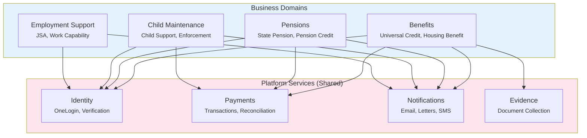
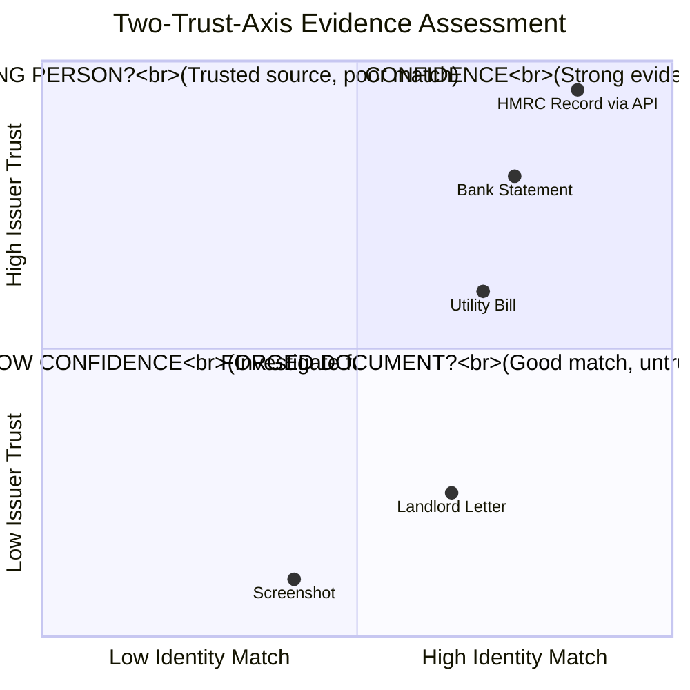
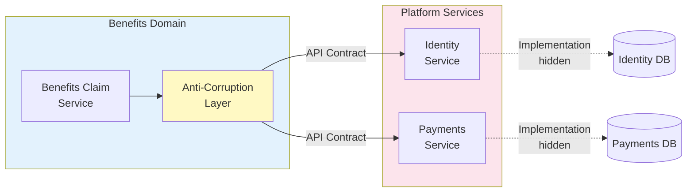

# Paper 6: Putting It All Together — A Government Service Case Study

**Series:** LLM-Assisted Microservice Development  
**Paper:** 6 of 6  
**Version:** 1.1 | March 2026

### Version History

| Version | Date | Changes |
|---------|------|--------|
| 1.0 | Mar 2026 | Initial release |
| 1.1 | Mar 2026 | Expanded Eligibility BC with legislative grounding, product context internals (ClaimantProfile, EligibilityAssessment, EntitlementCalculation, EligibilityPolicy, EntitlementPolicy); added end-to-end event flow (ClaimSubmitted→PaymentScheduled) with statutory mapping |

---

## Introduction

Papers 1–5 presented principles, patterns, and processes. This paper shows what happens when you apply all of them to a real system with real constraints: decomposing a complex government domain into bounded contexts, designing microservices with clear ownership, and establishing the architectural boundaries that make safe LLM assistance possible at scale.

The UK Department for Work and Pensions serves as our case study. DWP provides social security, pensions, and benefits to millions of citizens across multiple distinct business domains — Universal Credit, State Pension, Child Maintenance, Employment Support — that happen to share the same organisational umbrella and common platform services. Getting the boundaries right between these domains is not a theoretical exercise: it is the difference between a system that can evolve safely and one that gradually calcifies into a distributed monolith.

> **If this is your first paper in the series:** The most important background concepts are bounded contexts, aggregates, and RAG scoping — covered in Papers 1 and 3. This paper makes sense without them, but those papers explain *why* the boundaries are drawn where they are. For the deepest value, read Papers 1–3 first and return here for the applied example.

> **Series reading guide:** Papers 1–3 establish the foundations. Paper 4 describes the full automation pipeline. Paper 5 is the practical setup guide. This paper applies everything to a complex, real case study intended as a capstone and reference.

The DWP case study demonstrates:
1. How to decompose a large domain into bounded contexts when those contexts share vocabulary but mean different things
2. How platform services (shared across all domains) differ from business services in governance and RAG scope
3. How evidence and identity can be modelled as separate bounded contexts that compose without coupling
4. How this structure enables safe, scoped LLM assistance — and how it makes certain architectural mistakes impossible to commit silently

---

## Part One: The Problem Space

### Understanding DWP

The UK Department for Work and Pensions provides social security, pensions, benefits, and financial support services to millions of citizens — Universal Credit, Pension Credit, Disability benefits, Carer's Allowance, Employment and Support Allowance (ESA), and more. These aren't one system or one domain — they're multiple distinct business areas that happen to share common platform capabilities.

The modernisation challenge includes:
- Reducing fraud and error
- Speeding up benefit decisions
- Improving customer experience
- Integrating identity verification through GOV.UK One Login
- Creating a "single customer view" without creating a god-model

This is exactly the kind of problem Domain-Driven Design was designed to solve: multiple domains with overlapping concerns, shared services, and the need for both independence and coordination.

### The Domain Federation

The first thing to understand about DWP is that it's not one domain — it's a federation of domains, each with its own model, language, and rules. Benefits, Pensions, Child Maintenance, and Employment Support are distinct business areas that happen to share the same organisational umbrella. Forcing them into one unified domain model would create the "god-model" antipattern: a massive, inconsistent mess that tries to mean everything to everyone.

Traditional benefits systems ask "Is this person eligible?" and try to verify identity as part of answering that question. The architecture we'll describe reverses this: "What do we know with what confidence about this person?" becomes the foundation, and eligibility decisions consume that verified truth. This shift enables:
- Evidence reuse across benefits
- Fraud detection through confidence analysis
- Policy agility without touching the identity layer

---

## Part Two: The Architectural Decomposition

### Business Domains and Platform Services

DWP operates as a federation:

**Business Domains:**
- **Benefits** — Universal Credit, Housing Benefit
- **Pensions** — State Pension, Pension Credit
- **Child Maintenance** — Child support, enforcement
- **Employment Support** — JSA, work capability assessments

Each domain has its own language, business rules, experts, and pace of change. The word "payment" means something different in Benefits (regular benefit payments) than in Child Maintenance (enforcement collections).

**Platform Services (Shared):**
- **Identity** — OneLogin integration, verification
- **Payments** — Transactions, reconciliation
- **Notifications** — Email, letters, SMS
- **Evidence** — Document collection, validation



This structure reflects Paper 1's taxonomy: business domains are *core subdomains* (competitive differentiators with complex rules), while platform services are *generic subdomains* (necessary but not differentiating, suitable for central governance and potential reuse).

### The Two-Trust-Axis Architecture

DWP must make benefit decisions based on evidence, but truth isn't binary — it's accumulated confidence. When a citizen uploads a utility bill as proof of address, two questions matter:
1. Does this evidence relate to this person? (Identity Match)
2. Can we trust the issuer? (Issuer Trust)

These separate concerns become separate bounded contexts.



An authentic document from a real issuer might still not prove identity — a landlord can sign a tenancy letter without verifying the tenant's ID. You need both axes to compute attribute confidence. This is why Identity and Evidence are separate bounded contexts: each models a distinct trust dimension.

---

## Part Three: The Chicken-and-Egg Problem

### Claimed Identity vs. Verified Identity

Before explaining bounded contexts in detail, we need to address a fundamental architectural puzzle that many identity systems get wrong: **how do you bind evidence to an identity when you haven't proven the identity exists yet?**

**The Naive Approach (Why It Fails):**
1. User claims to be "John Smith, born 1980-03-15"
2. System tries to find existing identity matching those attributes
3. User uploads evidence (utility bill, bank statement)
4. System tries to link evidence to the found identity

The problems: What if there are three John Smiths born in March 1980? What if this is a new person? What if evidence contradicts claimed attributes? What if evidence reveals two people using one login (fraud)?

**The Correct Architecture: Claimed Identity as the Anchor**

The solution separates **claimed identity** from **verified identity**:

1. **Claimed Identity (Digital Identity)** is created when a user first authenticates via OneLogin
   - This is a digital anchor point — a unique identifier for "this authentication session and all evidence gathered during it"
   - Attributes are claimed but unverified: name, DOB, address
   - Status: `Unverified` or `PartiallyVerified`
   - This identity may not yet correspond to any real-world person in DWP systems

2. **Evidence is bound to the Claimed Identity**, not a verified person
   - Evidence arrives: utility bill with name "J Smith" and address "12 Oak Road"
   - Evidence is linked to the Claimed Identity UUID
   - Attributes are extracted from evidence and stored independently

3. **Resolution determines what this Claimed Identity actually represents**
   - The Resolution service compares claimed attributes + evidence against existing verified identities
   - Possible outcomes:
     - **Merge:** Matches existing verified identity with high confidence → merge evidence
     - **Split:** Sharing credentials with someone else (fraud) → split into two identities
     - **Create:** Genuinely new person → promote claimed identity to verified
     - **Ambiguous:** Insufficient evidence → pending state, more evidence required

4. **Verification establishes uniqueness within the identity domain**

```
OneLogin Authentication → Claimed Identity (UUID)
                              ↓
                    Evidence Gathering
                    (multiple sources)
                              ↓
                      Resolution Engine
                ┌─────────────┼─────────────┐
                ↓             ↓             ↓
            Create        Merge         Split/Ambiguous
         (new person) (existing match) (fraud/unclear)
                ↓             ↓             ↓
                    Verified Identity
                              ↓
            Customer360 (attribute snapshot)
                              ↓
        Eligibility Contexts (policy interpretation)
```

**Why This Matters:**

This architecture makes fraud patterns detectable:
- Multiple people using one login (evidence divergence)
- One person with multiple identities (evidence convergence)
- Stolen credentials (evidence location/pattern mismatches)
- Fabricated evidence (low issuer trust + poor attribute correlation)

---

## Part Four: Bounded Contexts in Detail

Each bounded context below corresponds to a distinct problem area with its own language, aggregates, and owning team. For the formal aggregate specifications and the full rationale behind each separation, see Paper 2, Section 4. What follows is the narrative account of *why* each context took the shape it did.

#### Identity Bounded Context (Platform)

The identity team's first question was deceptively simple: what exactly is an identity? Their initial instinct was to model it as a verified record — a confirmed set of attributes about a real person. But this broke immediately when they tried to describe what happens before verification is complete. What do you call the thing that accumulates evidence during an authentication session?

They needed two distinct things: a **Claimed Identity** — a unique digital anchor point for a user's authentication session and everything gathered during it — and a **Verified Identity**, which only comes into existence once the resolution process confirms that this Claimed Identity corresponds to a unique real-world person. The split between these two isn't an implementation detail; it's the architectural insight that makes fraud detection possible. When evidence attached to a single Claimed Identity starts arriving with different names, addresses, and biometric signals, that divergence is structurally visible. Two people may be sharing credentials. The boundary catches it.

The key aggregate is `IdentityProfile` — a verified attribute collection with confidence scores, cycling through states from `ClaimedOnly` through `PartiallyVerified` to `FullyVerified`, with side exits to `Ambiguous` and `Fraudulent`. The `identity-resolution-service` is the only microservice that may create or modify Verified Identities. Every other service creates Claimed Identities and submits evidence against them; resolution is a platform responsibility.

#### Evidence Bounded Context (Platform)

The evidence team's founding invariant came from a hard lesson in legacy systems: once stored, evidence must never change. Altering evidence destroys the chain of custody that makes fraud prosecution possible. If you can't prove the original document was unchanged from the moment of submission, the audit trail breaks. This immutability principle shaped everything downstream.

`EvidenceItem` is a fact assertion with its provenance intact. Metadata can be added — classification, validation results, confidence scores from external assessors. Content cannot be changed. The original payload is frozen at ingestion. This means the evidence service operates at high volume (uploads, OCR, AI attribute extraction) without any write contention on the core record.

The reason evidence is independent of identity — linked, not owned — matters most when things go wrong. When fraud is detected and an identity is split into two (because the same login was being shared by two people), the evidence stays intact and can be relinked without needing to touch the evidence service. Neither identity knows anything about how the evidence is stored; the Resolution context manages the links.

#### Trust & Provenance Bounded Context (Platform)

The trust team's job is the question no other context can answer: how reliable is the source? A landlord letter and an HMRC record both provide address information, but their confidence values differ by an order of magnitude. This context models the two-dimensional problem — issuer trust (how much do we trust the organisation that produced this evidence?) and verification capability (is this issuer authorised to verify this particular attribute?) — and holds the authoritative answer.

One constraint emerged from painful realisation: trust tiers must be immutable for evidence already issued. If an issuer is retroactively downgraded — say, a document authentication provider loses its accreditation — you cannot quietly apply the downgrade to all evidence they provided. That would silently corrupt the confidence scores on which past benefit decisions were made. Downgrading an issuer requires a formal review, an explicit re-assessment of all evidence they produced, and an audit trail of what changed and when.

#### Resolution & Corroboration Bounded Context

If Identity asks "who is this person?" and Evidence asks "what do we know about them?", Resolution asks "does this evidence belong to this identity, and how confident are we?" This was the hardest context to get right, and the one architects initially underestimated.

Their first design put resolution logic inside the Identity context. It owned both the identity model and the matching process, and it worked — until they tried to model the fraud scenario where evidence suggested two people were sharing credentials. The Identity aggregate was simultaneously the entity under question and the entity making the investigation decision. The conflict was structurally unresolvable in a single context.

Separating Resolution created the boundary that made the conflict visible. Evidence arrives from the Evidence context. Identity exists in the Identity context. Resolution reasons about the connection with its own vocabulary: `EvidenceLink` (the association between evidence and identity, with match confidence), `ResolutionDecision` (the Create/Merge/Split/Enrich decision with an audit trail), and `IdentityGraph` (the network of evidence, attributes, and identities). Confidence is computed as match confidence × issuer trust × authenticity × freshness × independence of sources.

#### Customer360 Bounded Context (Shared Kernel)

Customer360 emerged from a proliferation problem. Five different services each needed to answer "where does this person live?" Each built their own version. Each had different confidence thresholds, different interpretations of "primary address," and different staleness tolerances. The inconsistency was not just inefficient — it was a compliance risk.

Customer360 was designed to solve this by providing a single read model of verified customer attributes. The critical design constraint — debated longer than any other in the platform team — was the strict separation between *reporting* and *interpreting*. Customer360 answers "what verified relationships exist with what confidence?" It explicitly does not answer "what does this mean for the housing benefit entitlement?" That is policy interpretation, and policy belongs in the Eligibility contexts, not in the platform.

For LLM assistance, Customer360 RAG is available as read-only context to all consuming services. An LLM assisting a Benefits engineer can query Customer360 in its context. It cannot propose modifications to it.

#### Eligibility Bounded Context (One Per Benefit)

The eligibility architects came to an uncomfortable conclusion early: Universal Credit eligibility and State Pension eligibility are not the same problem wearing different rules. They look similar on the surface — both determine benefit entitlement — but they change for completely different reasons, are owned by completely different policy teams, and would, if combined, create the god-model the framework exists to prevent.

The decision was one Eligibility bounded context per benefit. Each context has its own `EligibilityRequest` aggregate, its own `PolicyRuleSet` aggregate (versioned explicitly — policy changes must never silently override past decisions), and its own `DecisionResult` aggregate with its complete audit trail. A strict invariant applies to all of them: decisions can only be based on attributes that have reached the declared minimum confidence threshold. An eligibility service cannot decide on unverified claims.

This separation also maps cleanly to team ownership. The Universal Credit policy team owns UC eligibility rules. The Pensions policy team owns State Pension rules. Neither needs to understand, negotiate with, or be blocked by the other.

The legislative foundation for this separation runs deeper than organisational preference. UC income rules and ESA income rules are defined in entirely separate statutory instruments — the Universal Credit Regulations 2013 and the Employment and Support Allowance Regulations 2013 respectively. They count different income sources, permit different deductions, and apply different taper mathematics. Sharing an income model across UC and ESA would not be a simplification; it would embed a category error. Different legislative instruments mandate different domain concepts.

What does a product Eligibility context actually contain? The UC context illustrates the pattern. Its core aggregates are `ClaimantProfile` (household composition, income sources, work status — the factual picture of the claimant's circumstances at a point in time), `EligibilityAssessment` (the act of evaluating rules against those circumstances to produce an eligibility outcome), and `EntitlementCalculation` (the monetary award — standard allowance, housing element, capital deductions, taper rate application). These are three distinct concepts with three distinct lifecycles: a claimant's profile can change without triggering a new assessment; an assessment can be challenged without altering the entitlement calculation already in payment.

The rules themselves live in domain services rather than aggregates, because rules change independently of individual claimant records. `EligibilityPolicy` encapsulates income thresholds, work capability criteria, and residency requirements — each rule class mapping to a distinct statutory instrument. `EntitlementPolicy` encapsulates the standard allowance tables, housing element rules, and taper logic. When parliament amends the taper rate, only `EntitlementPolicy` changes. When the Work Capability Assessment criteria are reformed, only `EligibilityPolicy` changes. No other bounded context is affected.

#### Payments Bounded Context (Platform)

The Payments context solved a problem that seemed simple but revealed surprising depth: what does "complete" mean for a payment? The team quickly found that authorisation, capture, and settlement were three separate states with three distinct invariants, and conflating them created logic that was impossible to reason about.

You cannot capture more than you authorised. You cannot issue a refund larger than the captured amount. Reconciliation records must balance — a deceptively simple invariant across hundreds of thousands of daily transactions. The team explicitly separated `PaymentInstruction` (intent) from `PaymentStatus` (lifecycle), because the story of a payment moving through authorised → captured → overpaid → recovered was a narrative that a single aggregate would have obscured into a state machine with dozens of flags.

`Overpayment` and `ReconciliationRecord` are separate aggregates, not fields on a payment. Each has its own consistency boundary, its own invariants, and — critically — its own audit trail that can be provided to citizens, auditors, and fraud investigators without exposing the full payment lifecycle.

---

## Part Five: Inter-Context Communication

### The Pattern: Anti-Corruption Layers

This is what makes federated organisations work. The benefits-claim-service (within Benefits) needs to verify a citizen's identity. It does NOT import Identity domain models directly or access the Identity database. Instead:
1. It calls the identity-service's published API contract
2. Translates responses through its own anti-corruption layer
3. The microservice knows *what* Identity provides, not *how* Identity implements it

#### Example: Benefits → Identity (Requires ACL)

**Identity Context speaks in terms of `IdentityProfile`:**
```python
class IdentityProfile:
    identity_id: UUID
    verification_level: Literal["LOW", "MEDIUM", "HIGH", "VERIFIED"]
    place_relationships: List[PlaceRelationship]
    trust_score: float
    evidence_chain: List[EvidenceItem]
```

**Benefits Context speaks in terms of `Claimant`:**
```python
class Claimant:
    claimant_id: UUID
    identity_verified: bool
    current_address: Address
    can_receive_payments: bool
```

**The ACL translates between these models:**
```python
class IdentityACL:
    def translate_to_claimant(
        self, 
        response: IdentityVerificationResponse
    ) -> ClaimantVerificationStatus:
        return ClaimantVerificationStatus(
            claimant_id=UUID(response.identity_id),
            identity_verified=response.verification_level in ["HIGH", "VERIFIED"],
            current_address=Address(
                line1=response.primary_place['address_line_1'],
                postcode=response.primary_place['postcode']
            ),
            can_receive_payments=response.verification_level == "VERIFIED"
        )
```

**Why the ACL matters:** Identity's model includes trust scores, evidence chains, and verification levels. Benefits doesn't care — it just needs "Can this person claim benefits?" The ACL shields Benefits from Identity's implementation details. If Identity adds a new evidence type or changes trust scoring, Benefits is unaffected as long as the contract remains stable.



### The Service Manifest

To make this pattern enforceable — and to enable LLM assistance that respects these boundaries — we need a machine-readable way to declare what each service owns and what it can access:

```json
{
  "microservices": {
    "benefits-claim-service": {
      "domain": "benefits",
      "boundedContext": "claims",
      "owner": "benefits-claim-team",
      "platformDependencies": ["identity", "payments", "evidence"],
      "contracts": {
        "consumes": ["identity-api-v2", "evidence-api-v1"]
      }
    }
  }
}
```

**For LLM assistance:** The benefits-claim-service RAG includes the Identity API contract as read-only context, but does NOT include the identity-service's implementation code. The LLM can see how to call the platform service but cannot modify it. Contract tests ensure compatibility even as both services evolve.

### Putting It Together: End-to-End Event Flow

The architectural decomposition described in Parts Two through Five is most legible as a sequence of domain events crossing context boundaries. A single Universal Credit claim, from submission to first payment, produces the following chain:

1. Claimant submits application → Claims context emits `ClaimSubmitted`
2. Supporting documents uploaded → Evidence context emits `EvidenceAdded`
3. Identity verified against evidence → Trust context emits `IdentityVerified`
4. UC Eligibility context consumes `IdentityVerified`, evaluates policy rules → emits `EligibilityAssessed`
5. Decision context records the outcome and audit trail → emits `DecisionMade`
6. Payments context receives `DecisionMade`, schedules the award disbursement → emits `PaymentScheduled`

No context in this chain queries another context's database. No context makes a synchronous call that would block the chain if a downstream service is slow. Each event crosses a context boundary as a published contract — each consumer decides what to do upon arrival, according to its own rules and its own invariants.

This chain is also a statutory map. Legislation mandates claim management, evidence handling, identity verification, eligibility assessment, formal decision-making, and payment as legally separable acts — each with its own accountability and audit requirements. The bounded context decomposition is not an architectural preference layered over the legislation; it is a direct reflection of the statutory structure the service exists to execute.

---

## Part Six: Implications for LLM Assistance

### Why This Matters for the Framework

The DWP decomposition demonstrates exactly what the framework must handle:

**For Benefits domain code, the LLM must:**
- Use Benefits language (Claimant, Benefit Award, Payment Schedule)
- NOT use Identity language (Subject, Credential) directly in domain code
- Respect that Identity is accessed via contract, not implementation
- Understand that Customer360 is a read model, not an aggregate to modify

**For the platform Identity service, the constraints differ:**
- Recognise that multiple business domains consume this service
- Contract changes require impact analysis across ALL consumers
- Breaking changes trigger coordinated migration workflows
- Test burden is higher because downtime affects the entire organisation

### The Four-Tier RAG Model Applied

From Paper 3, the four-tier model enforces these boundaries:

| Tier | DWP Application |
|------|-----------------|
| **Domain RAG** | Benefits team sees Benefits contexts + platform contracts |
| **Service RAG** | Identity team sees Identity implementation + all consumer contracts |
| **Shared Kernel RAG** | Customer360 schema accessible to all domains (read-only for most) |
| **Infrastructure RAG** | AWS/Kubernetes patterns available to all |

### Governance Implications

**Platform services (Identity, Payments, Evidence):**
- Changes require cross-domain impact analysis
- Contract versioning is mandatory
- Higher test coverage requirements
- Longer approval chains

**Business services (Eligibility, Claims):**
- Teams have autonomy within contracts
- Faster approval for internal changes
- Policy teams own eligibility rules

---

## Part Seven: Practical Implementation Examples

### Starting From Scratch: The Child Maintenance Greenfield

To illustrate how the framework operates when building with no legacy constraints, consider DWP designing the Child Maintenance digital service from scratch. The Child Maintenance Service (CMS) handles support calculations, payment collection, and enforcement between separated parents. It has no existing digital service — just a legacy of paper-based processes and telephony. The brief: design this properly, knowing it will need LLM assistance and safe evolution for the next decade.

#### Phase 1: Discovering the Domain

In Design Mode, the LLM has access to the Child Maintenance policy documents, stakeholder interview notes, and process diagrams. You ask: "Based on these requirements, what bounded contexts do you see? Where are the natural seams?"

The LLM observes that "case" means different things in different conversations. A Social Mobility Advisor uses "case" to mean the relationship arrangement between two parents. A Finance Officer uses "case" to mean an arrears recovery action. These are different languages signalling different bounded contexts.

It proposes five contexts: **Case Management** (the arrangement between the paying and receiving parent, including calculation of the payment amount), **Payments** (collecting and disbursing, separate from calculating), **Enforcement** (when payments fail — liability orders, deduction from earnings, vehicle immobilisation), **Assessment** (determining the paying parent's disposable income — a calculation problem with its own policy rules), and **Compliance** (the history of a case: how often has this paying parent paid, missed, been given extensions?).

You push back on Assessment: "Should that be inside Case Management?" The LLM reasons: Assessment rules change frequently because they follow legislation, while Case Management rules are relatively stable. Different expert ownership. Different change cadence. Different language — Assessment uses `DisposableIncome`, `IncomeSource`, `DeductionRate`; Case Management uses `CaseRecord`, `CalculatedAmount`, `ReviewDate`. The separation stands.

Once the five contexts are agreed, they're documented formally. These documents become the seed of the Domain Architecture tier RAG.

#### Phase 2: Defining Aggregates and Microservices

Within each bounded context, you identify aggregates. For the Enforcement context, you ask: "What aggregates do you see? What are their invariants?"

The LLM proposes three. The `EnforcementCase` aggregate models a single enforcement action with its invariant: you cannot escalate enforcement without evidence of missed payment above the threshold. The `LiabilityOrder` aggregate models the legal instrument with its invariant: a liability order cannot be issued without a court hearing record. The `DeductionFromEarnings` aggregate models the employer instruction with its invariant: deduction cannot exceed the legal maximum percentage of net earnings, regardless of arrears.

The team decides that `DeductionFromEarnings` and `LiabilityOrder` are tightly coupled enough to live in one microservice (`enforcement-action-service`), while `EnforcementCase` is separate (`enforcement-case-service`) because it needs access to Case Management data to make escalation decisions.

The output is a service manifest — the `monorepo.json`.

#### Phase 3: Contract-First Design

Before any implementation, contracts are defined between services. The Case Management service needs to inform the Enforcement service when a payment is missed. Rather than a direct call, this is an event contract: `PaymentMissed` with `caseId`, `scheduledAmount`, `missedDate`, `cumulativeArrears`. The Assessment service provides income data via a REST contract: `GET /assessments/{respondentId}/current` returning `DisposableIncome` with `calculationDate` and `confidence`.

Consumer services write contract tests against these specifications before the providers implement them. The Assessment team can start building knowing exactly what the Case Management team expects — and that CI will catch any deviation before it reaches integration.

#### Phase 4: Implementing Within Boundaries

The framework shifts to Evolution Mode. A developer asks: "Implement the RecordMissedPayment use case." The system queries only the `payments-service` RAG, retrieves the Payment aggregate, the contract definition for the `PaymentMissed` event, and the existing test patterns. Everything within declared paths. Imports from allowed dependencies only.

The LLM cannot accidentally import from the Enforcement service even if doing so would seem convenient. The manifest doesn't allow it. The CI validation would catch it. The boundary prevents the tight coupling that, in five years, would make the services impossible to change independently.

### Migrating an Existing System: Extracting from a Monolith

Most architects face a different reality: existing systems, legacy code, organisational inertia. Here's how the framework applies when extracting microservices from a 15-year-old monolith.

#### Phase 1: Build Framework Infrastructure (Months 1-2)

Before touching the legacy system, build the framework machinery: RAG infrastructure, CI/CD pipelines, contract testing tooling. But critically, don't enforce anything yet. The framework exists but operates in "observe and learn" mode.

Create a minimal manifest documenting the world as it exists:

```json
{
  "legacySystems": {
    "core-monolith": {
      "paths": ["legacy/core/**"],
      "language": "Java",
      "status": "decomposing",
      "target-contexts": ["payments", "orders", "customers"]
    }
  }
}
```

#### Phase 2: Strangle the Edge (Months 3-6)

Pick a bounded context to extract — ideally one with clear boundaries and willing teams. For this example: Payments.

1. Define the Payments API contract that the monolith will eventually call
2. Create the payments-service with Clean Architecture scaffolding
3. Build payment-service's RAG index from the new code
4. Run both systems in parallel, routing a percentage of traffic to the new service

The LLM now assists with the new service using proper guardrails, while the monolith remains outside the framework.

#### Phase 3: Gradual Migration (Months 6-18)

Each extracted service gets its own manifest entry, RAG index, and CI/CD guardrails. The monolith shrinks. The manifest grows. Teams migrate at their own pace.

```json
{
  "legacySystems": {
    "core-monolith": {
      "status": "decomposing",
      "extractedContexts": ["payments", "notifications"],
      "remaining": ["orders", "inventory", "customers"]
    }
  },
  "microservices": {
    "payment-processing": { "...": "..." },
    "notification-service": { "...": "..." }
  }
}
```

Eventually, the monolith disappears. The manifest becomes the single source of truth. The framework that started as an observer becomes the enforcer.

---

## Part Eight: The Strategic Insight

### What This Architecture Enables

DWP's architecture is not "build a benefits system." It's "build a national trust platform that multiple benefit systems consume."

Truth about a citizen emerges through a chain of bounded contexts:
1. **Identity resolution** establishes who this person is
2. **Evidence collection** determines what we know about them
3. **Issuer trust** evaluates how reliable the sources are
4. **Attribute corroboration** computes the confidence level
5. **Policy application** determines whether this meets benefit rules

Each step is a separate bounded context with clear ownership, contracts, and confidence thresholds. Eligibility decisions are downstream consumers of verified truth — they don't create it.

This separation enables evidence reuse across benefits (upload once, use everywhere), consistent identity with no duplicate records, fraud detection through structural anomalies, policy agility without touching identity or evidence layers, and platform evolution that doesn't cascade into benefit-specific services.

### What Architects Got Wrong Initially

**The first domain model put Claims and Eligibility in the same bounded context.** It seemed logical — a citizen's claim leads directly to an eligibility decision. But the language was wrong immediately. "Claim" in the Claims Intake context means "a citizen's request for benefit, with supporting evidence." "Claim" in the Eligibility context means "a case under policy assessment." Same word, different meanings, different actors, different ownership, different change cadence. This is the textbook signal of a missed context boundary. Separating them removed the linguistic confusion and clarified ownership: Intake owns the submission journey, Eligibility owns the policy logic.

**The second mistake was assuming the Payment context was simple.** A payment is just moving money — initially modelled as one aggregate with a status field. The moment the team tried to represent an overpayment recovery spanning multiple future payment periods, the status field had seventeen possible combinations and the invariants were impossible to reason about. Separating `PaymentInstruction`, `PaymentStatus`, `Overpayment`, and `ReconciliationRecord` as distinct aggregates resolved the confusion by making each concern's consistency boundary explicit.

### What Surprised Them

The biggest surprise was how much the boundary structure affected fraud detection capability. The assumption had been that fraud would need to be detected algorithmically — analysing patterns across the data. What emerged was that correctly drawn boundaries made many fraud patterns *structurally visible* rather than requiring algorithmic hunting.

When a single Claimed Identity began receiving evidence with consistently different names and addresses from two distinct households, this did not need analysis to find. It surfaced as an anomaly in the Resolution context's evidence linking: the same identity had divergent evidence streams suggesting two people. The architecture made the fraud visible before any human reviewed it.

Similarly, one person attempting to create two Verified Identities (to claim the same benefit twice) showed up as a convergence anomaly — two Claimed Identities with evidence pointing to the same real-world attributes, trying to resolve to two separate Verified Identities. The graph structure of the Resolution context caught this as a merge candidate, not a create candidate.

### What the Framework Prevented

Three specific violations the framework caught before they reached production.

**The Benefits team's identity shortcut.** During implementation, the Benefits team began building identity resolution logic inside `benefits-claim-service`. Frustrated with the round-trip latency of calling the Identity API, they started pulling identity database records directly through a shared connection. The manifest flagged the import direction before the PR reached review: `identity-db` was not in `benefits-claim-service`'s allowed dependencies. CI validation failed. The architectural conversation revealed the real issue was in the API contract — the Identity service's attribute endpoint required three separate calls to assemble what Benefits needed as one. The platform team added a composite attribute endpoint. The performance requirement was met without coupling Benefits to Identity internals.

**The Payments team's eligibility assumption.** The Payments service began checking eligibility status directly before processing a payment instruction. The reasoning seemed sound: why issue a payment if the person is ineligible? But eligibility belongs in the Eligibility context. The allowed dependencies for `payment-processing-service` did not include any eligibility service's implementation code. The layer validation caught an import from `universal-credit-eligibility-service` within the Payments domain layer. The correct fix was a contract: Payments receives a `PaymentInstruction` with an `eligibilityVerifiedAt` field, signed by the Eligibility service. Payments trusts the assertion without re-running the check.

**The Evidence team's immutability drift.** Six months into operation, `evidence-validation-service` began modifying the `raw_payload` field of `EvidenceItem` records when OCR produced corrections. The immutability invariant — evidence content must never change once ingested — existed in the domain model, but the validation service had been written to update records rather than creating linked assessment records alongside the original. An architecture fitness test caught this: it specifically verified that no OCR output was being written to `EvidenceItem.raw_payload`. The service was corrected to create `ExtractedAttributes` records linked to the original, preserving the original payload intact.

### For Architects

This is the pattern for any large organisation with multiple business domains and shared services. The boundaries aren't theoretical — they're the difference between a maintainable system and a distributed monolith.

### For LLM Assistance

These boundaries become enforcement points. The LLM can't accidentally couple Benefits to Identity internals because it physically cannot see them. It can't break eight services while fixing one because contract tests fail automatically. It can't corrupt the immutability invariant because the domain layer has no method that permits it.

This is DDD doing its job: making complex systems comprehensible by creating boundaries that both humans and LLMs must respect.

---

## Conclusion

This case study has demonstrated how all the elements from Papers 1-5 combine in practice:

- **Paper 1's DDD principles** decomposed DWP into business domains and platform services, identified bounded contexts with precise language, and located aggregates that become microservices

- **Paper 2's semantic identity** appears in the two-trust-axis model, the claimed-vs-verified identity distinction, and the resolution patterns that handle fraud detection

- **Paper 3's RAG scoping** determines what each service can see: Identity sees broad context for resolution, Benefits sees narrow context plus contracts, Customer360 is read-only for consumers

- **Paper 4's automation** enforces the manifest, runs contract tests, prevents cross-boundary violations, and catches architectural drift before humans review

- **Paper 5's implementation guidance** applies to each microservice as it's built or extracted

The DWP example is complex — it has to be, to demonstrate the framework's value. Simpler systems don't need this machinery. But any organisation with multiple domains, shared services, and the need to modernise without creating chaos will recognise these patterns.

The framework doesn't make complexity disappear. It makes complexity *manageable* — by creating boundaries that both humans and AI assistants must respect.

---

## References

- Paper 1: Domain-Driven Design and Clean Architecture Fundamentals
- Paper 2: Evidence-Based Identity and Cross-Boundary Coordination
- Paper 3: LLM Assistance, Service-Scoped RAG, and CI/CD Guardrails
- Paper 4: End-to-End Automated LLM-Assisted Development
- Paper 5: Getting Started — A Practical Implementation Guide
- Evans, Eric. *Domain-Driven Design: Tackling Complexity in the Heart of Software*
- Vernon, Vaughn. *Implementing Domain-Driven Design*
