# Domain-Driven Design & Clean Architecture for Enterprise Systems

**A Foundational Reference for Solution Architects**

*Part 1 of the Architecting Modern Government Services Series*

*Version 1.5 | March 2026*

---

## Version History

| Version | Date | Changes |
|---------|------|--------|
| 1.0 | Feb 2026 | Initial release |
| 1.1 | Feb 2026 | Added Mermaid diagrams, clarified code-sharing patterns |
| 1.2 | Mar 2026 | Added §1.3 subsection: legislation as boundary driver; legislative layers table; worked policy-to-domain-model example; EligibilityPolicy domain service pattern |
| 1.3 | Mar 2026 | Rewrote §1.1 to clarify recursive subdomain decomposition; added two-level decomposition (product lines → functional subdomains); clarified Core/Supporting/Generic classification with consistent examples |
| 1.4 | Mar 2026 | Added manufacturing analogy introduction to Part I — Ford/assembly line parallel to domain decomposition |
| 1.5 | Mar 2026 | Added §1.5 "Using External Data for Decisions" — three patterns for cross-context data; anti-corruption layer; Identity→Eligibility→Payments flow diagram |

---

## Executive Summary

Complex systems require boundaries at multiple levels. Domain-Driven Design, microservices, and Clean Architecture each provide different types of boundaries that work together. Understanding this hierarchy is essential for building maintainable, evolvable systems—and for understanding where guardrails must be enforced when adopting AI-assisted development or implementing cross-organisational coordination.

This paper presents the complete hierarchy from domain to deployment:

| Level | What it is | Example |
|-------|-----------|---------|
| **Domain** | The overall problem space | DWP (Social Security) |
| **Subdomain** | A distinct problem area | Benefits, Pensions, Identity |
| **Bounded Context** | A consistent model with precise language | Eligibility Context, Claims Context |
| **Aggregate** | Entities that change together | EligibilityDecision, ClaimHistory |
| **Microservice** | A deployment unit | eligibility-decision-service |
| **Clean Architecture** | Code layers within a microservice | Entities, Use Cases, Adapters |

**The key insight:** You're not designing services. You're discovering natural fault lines in reality. Microservices are the deployment reflection of those fault lines.

Each level of this hierarchy exists because human minds have limits, teams need to work in parallel, businesses change and systems must evolve, and someone needs to understand what went wrong at 3am when production breaks. These structures exist for human comprehension, not computer efficiency.

---

## Part I: The Hierarchy of Boundaries

Ford makes cars. DWP makes entitlement decisions. The engineering challenge is the same.

Ford doesn't build "a car." It builds the Fiesta, Focus, Mustang — different products sharing a manufacturing capability. Each product decomposes into systems: powertrain, chassis, interior, electronics. Each system decomposes further: the powertrain becomes engine, transmission, exhaust; the engine becomes pistons, valves, gaskets. Some components are shared across products — the same entertainment system might appear in three models. Others are differentiators — the Mustang's V8 is why people buy it. And when components aren't reused, the reason is usually non-functional, not functional: a bus engine could theoretically power a moped — same combustion, same output shaft — but good luck installing it.

No single engineer knows how to build an entire car. That's not a failure; it's the design. Ford invented the assembly line precisely because the complexity of a car exceeds any individual's cognitive capacity. Specialists own components. Interfaces between components are standardised. Teams work in parallel. The organisational structure mirrors the product structure — not by accident, but because that's how you build complex things at scale.

This isn't a new paradigm. Software borrowed these ideas from manufacturing: componentisation, separation of concerns, interface contracts, platform thinking. Domain-Driven Design is the assembly line applied to business logic. What follows is how to apply it.

### 1.1 Domains and Subdomains

**A domain is a sphere of knowledge and activity—a problem space.** Consider the UK Department for Work and Pensions (DWP). DWP's domain is social security: providing financial support to citizens through benefits, pensions, and related services.

A domain is NOT a bounded context—it's too large and has too much linguistic variation to have one consistent model. Terms like "claimant," "payment," and "assessment" mean different things in different parts of DWP. That's why domains must be decomposed into **subdomains**.

#### Decomposition is Recursive

Subdomains decompose further into smaller subdomains. This is where many teams get confused — they think decomposition is one step, not recursive.

**First decomposition — product lines:** DWP's domain breaks down into distinct business areas:

- **Benefits** — Universal Credit, Housing Benefit, and related payments
- **Pensions** — State Pension, Pension Credit
- **Child Maintenance** — calculating and collecting payments between separated parents
- **Employment Support** — helping job seekers find work

Each of these is a subdomain. But each is still too large for one model. Benefits uses "claimant," Pensions uses "pensioner," Child Maintenance uses "paying parent" and "receiving parent." Even within a single product line, terms like "claim" mean different things in different contexts.

**Second decomposition — functional areas within a product line:** Take Benefits. It contains further subdomains:

- **Eligibility** — Determining whether a citizen qualifies for a benefit
- **Claims** — Managing the lifecycle of a benefit application
- **Awards** — Calculating and managing the monetary entitlement
- **Compliance** — Detecting and handling fraud, overpayments, and appeals

These are the subdomains you actually model. "Eligibility" has precise rules, a clear language, and distinct experts. So does "Claims." They are separate enough to warrant separate models.

**Cross-cutting subdomains serve all product lines.** Some capabilities are needed by Benefits, Pensions, Child Maintenance, and Employment Support equally:

- **Identity** — Verifying who citizens are
- **Evidence** — Storing and validating supporting documents
- **Payments** — Issuing money to citizens
- **Notifications** — Sending letters, emails, and alerts

These are also subdomains — they have their own language, rules, and experts. They happen to be shared across product lines rather than owned by one.

#### Strategic Classification: Core, Supporting, and Generic

Every subdomain — at any level of decomposition — falls into one of three strategic categories. This classification determines how you invest in it:

| Classification | What it means | Investment approach |
|----------------|---------------|---------------------|
| **Core** | Where the organisation creates unique value — this is what DWP does better than anyone else | Build in-house with your best people; differentiation lives here |
| **Supporting** | Necessary but not differentiating — standard business operations | Build efficiently; don't over-engineer |
| **Generic** | Commodity capabilities any organisation needs — no competitive advantage from doing it differently | Buy, use open-source, or build once and share |

**How does this classification apply to DWP?**

The product lines are not the right level to classify — they're too coarse. You classify the subdomains *within* them:

| Subdomain | Classification | Rationale |
|-----------|----------------|-----------|
| Eligibility (within Benefits) | **Core** | Complex policy rules that define what DWP does; unique to UK social security law |
| Claims (within Benefits) | **Supporting** | Standard case management; necessary but not differentiating |
| Identity (cross-cutting) | **Generic*** | Identity verification is typically a commodity problem — but see the note below |
| Payments (cross-cutting) | **Generic** | Payment processing is standardised; use established patterns |
| Compliance (within Benefits) | **Core** | Fraud detection rules and policy enforcement are unique to DWP's operating context |

> **A note on Identity at DWP:** The table marks Identity as Generic with an asterisk because DWP's identity problem is fundamentally different from most organisations. Most businesses need *account ownership*: "is this the same person who signed up?" Users can call themselves whatever they like — the system just needs to know they control the account. That is a commodity problem.
>
> DWP needs something harder: proof that a *real person exists*, and confidence that they are talking to *that specific person* — to a measurable level of trust. Few organisations need this. Fewer still disburse public money as a direct function of it. The stakes are categorically different.
>
> There is a further complication: DWP's cohorts often lack the evidence that typical identity verification relies on. Many claimants do not have passports, driving licences, or credit histories. GOV.UK Verify demonstrated this gap clearly — populations with the greatest need for government services had the least verifiable digital footprint. This means DWP cannot simply adopt commodity identity solutions; it must build or commission capabilities that work for its actual population.
>
> Finally, benefits eligibility depends on verified *attributes* (age, residency, household composition) and verified *relationships* (partner, dependents, carers) — not just "is this the right person." Evidence and identity become inseparable.
>
> **For this paper, we will set that complexity aside.** The rest of this document treats Identity and Evidence as Generic platform services to keep the DDD explanations clean. Paper 2 is where we get into the real model — claimed versus verified identity, evidence chains, confidence scoring, and how these interlock with eligibility. If you're here for DDD fundamentals, read on. If you're here for identity, skip to Paper 2.

Notice that "Benefits" as a whole isn't classified — you can't invest in "Benefits" as if it were one thing. Eligibility needs your best engineers building differentiated logic. Claims needs solid engineering but doesn't warrant the same investment.

#### Generic Subdomains Become Platform Services

When a generic subdomain serves multiple product lines, implement it once and share it. Identity isn't specific to Benefits or Pensions — both need it. So Identity becomes a **platform service**: a shared capability owned by a platform team, governed centrally, with strict compatibility requirements because changes affect all consumers.

Platform services are still subdomains — they have bounded contexts, aggregates, and microservices. What makes them "platform" is governance: they're shared, centrally owned, and changes require impact analysis across all consumers.

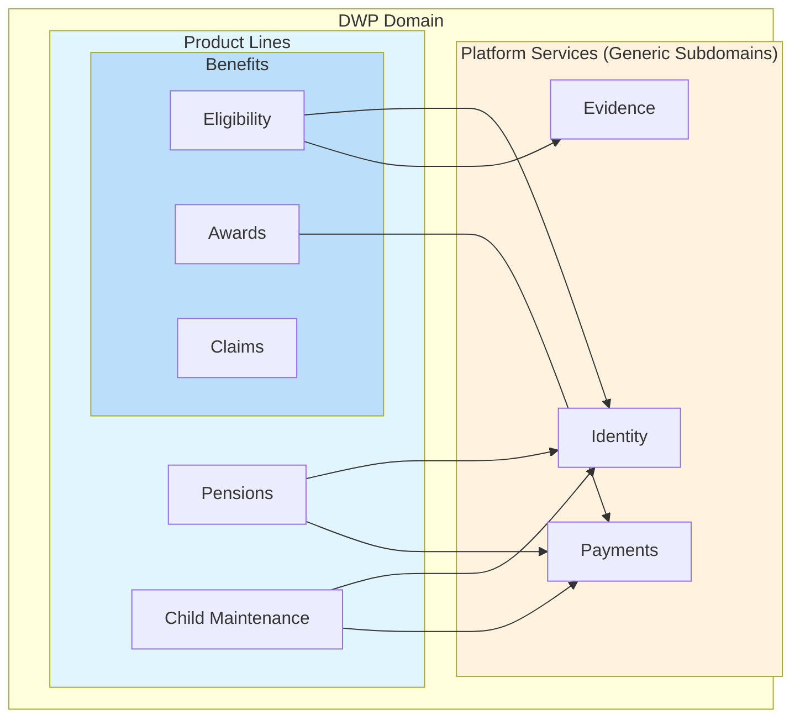

#### The Key Insight

Subdomain decomposition is recursive. You don't stop at "Benefits" — you keep decomposing until you reach subdomains small enough to have one consistent language and one clear set of experts. That's when you've found the right level to design bounded contexts.

The strategic classification (Core/Supporting/Generic) tells you *how much to invest* in each subdomain. Core subdomains get your best people and custom-built solutions. Generic subdomains get standardised solutions — build once and share, or buy off the shelf. This classification determines team structure, technology choices, and architectural governance.

### 1.2 Bounded Contexts

**A subdomain is a problem space—it exists in the business whether we build software or not.** Benefits eligibility is a subdomain because DWP has eligibility rules to apply.

**A bounded context is a solution space—it's how we choose to model that problem in software.** The domain (DWP) is too large with too much linguistic variation to be one model—Benefits uses "claimant," Pensions uses "pensioner," Child Maintenance uses "paying parent." You decompose the domain into subdomains, then create a model for each subdomain (or part of a subdomain) within a bounded context.

#### What is a Model?

In DDD terms, a model is not just a database schema or data structure—it's a **domain model**: the software representation of business concepts with their rules and relationships. A model includes:

**Value Objects** — Immutable descriptors without identity. Think of these like user-defined types: a `Money` type that bundles amount and currency together, an `Address` type, a `DateOfBirth` type. Two value objects with identical data are equal.

**Entities** — Objects with identity that persist over time. A `Claimant`, an `EligibilityDecision`. The critical distinction from value objects: two entities with identical data are still different if they have different IDs. A Claimant with ID 12345 is not the same person as a Claimant with ID 67890, even if they have the same name and address.

**Aggregates** — Clusters of entities and value objects that form consistency boundaries. Think of these like a parent class that owns and controls access to child entities through composition (not inheritance). An `EligibilityDecision` aggregate includes the decision entity, its evidence entities, and its rule value objects—they must change together. One entity is the **aggregate root**—the single entry point that controls all access. Nothing outside the aggregate can directly modify child entities; all changes go through the root. In this example, `EligibilityDecision` is the root—you can't add evidence or change rule results except by calling methods on the decision itself.

**Invariants** — Business rules that must always be true. "An EligibilityDecision cannot be approved without minimum evidence confidence." Invariants are enforced by the aggregate root—nothing outside the aggregate can directly modify its internals in ways that would violate the rules.

**Ubiquitous Language** — The precise shared vocabulary used by developers and domain experts. A dictionary of terms with exact definitions that everyone uses consistently.

**A model, then, is the complete collection:** all the value objects, entities, aggregates, invariants, and the ubiquitous language that defines them. It's how we encapsulate business logic—entities know their own rules, aggregates enforce their invariants through controlled access, and the language provides precise shared understanding.

**The bounded context is where that model applies consistently.** Within the Eligibility bounded context, "claimant" means one precise thing, "assessment" follows specific rules, and every term in the ubiquitous language has exactly one definition. If you find that "claim" means something different in eligibility determination versus payment processing, that's a signal you need separate bounded contexts—separate models with their own consistent language.

#### Mapping Subdomains to Bounded Contexts

The relationship isn't always 1:1:

- **Simple subdomains** often map 1:1 to bounded contexts (Identity subdomain → one Identity bounded context)
- **Complex subdomains** may need multiple bounded contexts (Benefits subdomain → separate Eligibility, Claims, and Awards contexts if the language diverges enough)
- **Closely related simple subdomains** might share a bounded context (rare, but possible)

**When does a subdomain need multiple bounded contexts instead of being split into multiple subdomains?**

If the problem areas share the same business experts, change together for business reasons, and sit in the same part of the organisation, but use sufficiently different language or rules that unifying them creates confusion—that's when you keep them as one subdomain but model them with separate contexts.

For example, Benefits might be one subdomain from an organisational perspective (one directorate, one budget, shared policy experts), but Eligibility uses such different language and rules from Claims processing that forcing them into one model would create the "god-model" antipattern. The subdomain boundary reflects business structure; the bounded context boundary reflects linguistic clarity.

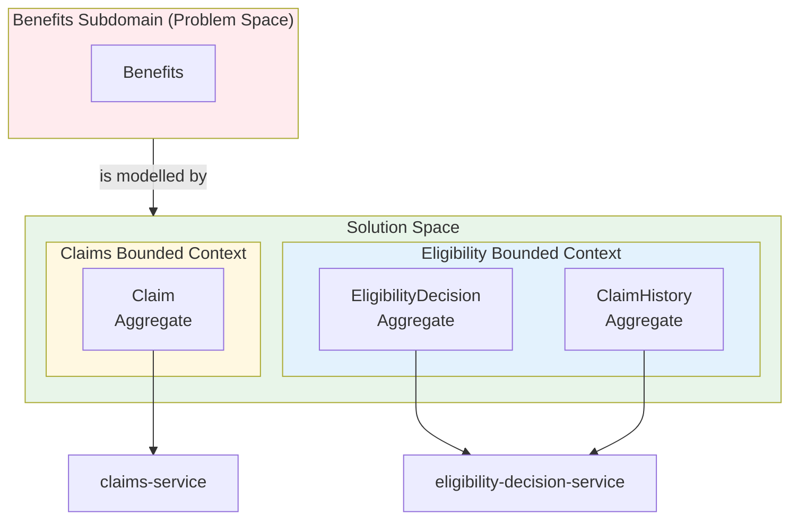

*The diagram shows aggregates becoming services — deployment units that own their aggregate's data and logic. Section 1.5 explains this relationship fully.*

### 1.3 How to Identify Bounded Context Boundaries

The question "how many bounded contexts should we have?" is a design skill, not a formula. But reality leaves traces. Six signals reliably indicate where boundaries naturally exist—think of them as diagnostic cues an experienced architect learns to notice.

**The first clue is who owns the rules.** In any organisation, certain people are authoritative for specific decisions. If different groups own the truth in different areas, those areas have fundamentally different sources of authority and should not share a model. In DWP, the fraud team owns identity resolution; policy teams own eligibility rules; frontline intake teams own evidence capture; finance owns payments. These are not coordination preferences—the rules themselves come from different places and change when different things happen in the world.

**The second signal is a language clash.** The moment you find yourself saying "well, in *this* part of the system, 'person' means..." you have identified a bounded context boundary. Shared words with different meanings create models that cannot be precise. In DWP, "verified" means a statistical confidence score in the Identity context but "meets policy criteria for benefit entitlement" in the Eligibility context. Forcing these into one model means neither definition can be stated cleanly.

| Word | In Identity BC | In Eligibility BC |
|------|---------------|------------------|
| "Person" | Graph-resolved entity | Applicant in a case |
| "Address" | Evidence-backed fact | Declared residence |
| "Verified" | Confidence score | Meets policy criteria |

**The third signal is different change drivers.** Ask "why would this logic change?" and count the distinct answers. Identity scoring changes when fraud patterns evolve. Residency rules change when legislation updates. Evidence types change when new document formats become acceptable. Credential formats change when standards bodies publish new specifications. Different change drivers mean different business pressures, different teams pushing changes, and different deployment cadences—all of which compound into coupling problems when areas share a model.

**The fourth signal is incompatible invariants.** Every bounded context enforces rules that must always hold true. Identity must resolve to exactly one graph node per real human. Evidence is append-only once stored. Eligibility decisions are versioned by policy effective date. Payment records carry double-entry balance integrity. When invariants come from different domains of authority, enforcing them in a single model forces constant compromise. Each context can enforce its rules cleanly only when separated from others with conflicting consistency requirements.

**The fifth signal is a data lifecycle mismatch.** Evidence is append-only historical record. Identity is continuously merged and deduplicated. Eligibility lives in case-based snapshots. Credentials are versioned and revocable. When storage and access patterns differ this fundamentally, a shared model must accommodate every lifecycle variant simultaneously—the storage layer becomes a tangle of special cases. Separate bounded contexts can adopt the storage pattern each data type actually needs.

**The sixth signal is the cognitive load test.** Ask "can one team fully understand this model and reason about its edge cases without qualification?" If explaining the model requires "...except in this other part where things work differently," you have crossed a comprehension boundary. A bounded context should be entirely knowable by its team. When it isn't, reasoning about changes becomes unreliable, and the rate of unexpected failures increases.

#### The Practical Heuristic

When deciding "should this be a new BC?" ask:

1. Would merging these models force awkward compromises in meaning?
2. Do different people own the rules?
3. Do they change for different reasons?
4. Would I version their rules independently?
5. Would different teams naturally work on them?

**If 3+ are yes → split.**

**Why this matters for microservices:** Every BC boundary is a distributed systems tax—network calls, eventual consistency, failure handling, messaging, monitoring. You don't split for purity—you split when semantic independence outweighs the distributed cost. The signals above tell you when it does.

> **See also:** Paper 4, Section 2 shows how these six signals can be automated into domain manifest generation. Paper 6, Part Two applies them to discover the full DWP bounded context map.

#### How Do You Know When Boundaries Are Right?

Boundaries are hypotheses, not facts. You propose them based on the signals above, then validate them through implementation. Here's how to know if you got it wrong:

**Signs your boundaries are too narrow (too many contexts):**
- Every user action requires coordinating multiple services
- You're building lots of sagas for what feel like simple operations
- Teams constantly need to coordinate releases
- "We can't do X until the Y team deploys their change"

**Signs your boundaries are too wide (not enough contexts):**
- Teams step on each other working in the same codebase
- The ubiquitous language has asterisks ("*except in the payment flow")
- Changes in one area unexpectedly break another area
- New team members take months to understand the model

**Signs your boundaries are in the wrong place:**
- You keep needing to share entities between services
- One service is always calling another for "just one more thing"
- Data that changes together lives in different services

**What to do about it:** Boundaries can be refactored. It's expensive but not impossible. If you see these signals early, adjust before the cost compounds. If you're unsure, start with fewer, larger bounded contexts and split when pain emerges—it's easier to split a monolith than to merge microservices.

#### Applying the Signals: Legislation as a Boundary Driver

For government systems, there is a boundary source that pre-empts discovery: **legislation itself**. Acts of Parliament, statutory instruments, and regulations are not just compliance requirements—they are a pre-existing boundary map. Each act encodes distinct rules, terms, and change cadences. Understanding that structure gives architects a head start on decomposition that years of event-storming might otherwise only approximate.

At DWP, legislation stratifies naturally into DDD-relevant tiers:

| Legislative Layer | Examples | DDD Interpretation |
|---|---|---|
| Core administration acts (e.g. Social Security Administration Act 1992) | Claims processing, payment machinery, decisions | Platform / shared bounded contexts — stable, centrally governed |
| Product-specific statutes (Welfare Reform Act; SSCA 1992 benefits provisions) | UC rules, PIP assessment criteria, ESA work capability | Product bounded contexts — change with policy, team-owned |
| Statutory instruments and regulations | Income thresholds, taper rates, assessment criteria | Domain logic *within* a product context — frequently updated |

The practical implication: when a statutory instrument changes the UC taper rate, that change belongs inside the UC Eligibility context's `EntitlementPolicy` domain service. It does not touch Claims, Payments, or the State Pension Eligibility context. Legislation-as-boundary-map lets you identify which team owns which change before a line of code is written.

**Translating a policy statement into a domain model** follows a consistent three-step pattern. Take the statutory concept: *"a person has limited capability for work."* Step one is to extract the policy intent — what must be *true* at a point in time. Here: the claimant's health condition is assessed as preventing normal employment. This is not an attribute of a `Person` entity; it is a *status* with its own lifecycle, evidence requirements, and appeal rights.

Step two is to name it as a domain concept: `WorkCapabilityStatus`. This aggregate has states (not assessed, assessed limited, assessed fit for work, under appeal), governed transitions (reversion to "not assessed" is only possible at tribunal), and its own invariant: status can only be set by an authorised assessor, never by a claimant directly.

Step three is to encapsulate the rules as a **domain service**. A domain service is stateless logic that doesn't naturally belong to any single entity or aggregate — it operates *on* domain objects rather than *being* one. Use cases (application layer) orchestrate workflows; domain services encode business rules that span multiple objects or represent pure policy logic.

Why not make this an aggregate? Because aggregates own state — they persist, they have identity, they enforce invariants on *their own data*. The eligibility rules don't own data; they evaluate the current state of other aggregates (`WorkCapabilityStatus`, income records, residency records) and return a decision. They're pure functions, not stateful objects.

Why not an "aggregate of aggregates"? Because that breaks the model. Each aggregate has exactly one root that controls all access. If you nest aggregates, you either have two roots (which one controls access?) or you have one root controlling another root (which means the inner one isn't really an aggregate — it's just an entity). Aggregates are *peers* that communicate through domain events, not a hierarchy where one contains another.

Here, the eligibility rules don't belong inside any one aggregate, so they live in a service:

```
EligibilityPolicy (UC context)
 ├── WorkCapabilityRule       ← Work Capability Assessment Regulations
 ├── IncomeRule               ← Universal Credit Regulations 2013
 └── ResidencyRule            ← Habitual Residence Test guidance
```

Each rule class maps to a distinct legislative instrument. When parliament amends the income thresholds, only `IncomeRule` changes. When the Work Capability Assessment is reformed, only `WorkCapabilityRule` changes. Nothing else moves.

This also makes the language signal (Signal 2) structurally precise: UC income and ESA income use the same English word but are defined in two separate statutory instruments with different counting rules, different permitted deductions, and different taper mathematics. That linguistic divergence is not an implementation quirk — it reflects two different legal regimes. Sharing one income model across UC and ESA is therefore not a simplification; it is a category error dressed as one.

> **The governing principle:** Treat legislation as *policy source code* — it defines what must be true, your domain model defines how it works, and your bounded context is where that definition is held consistently. Legislation provides the constraints and the terminology; DDD provides the structure and the behaviour. The craft is in the translation between them.

### 1.4 Bounded Contexts and Microservice Count

**The default rule: 1 BC → 1 microservice.**

A bounded context is one domain model, one ubiquitous language, one consistency boundary, one set of invariants. Splitting that across multiple services creates a distributed monolith.

Inside a BC, objects reference each other freely, transactions make sense, invariants can be enforced synchronously, and the model evolves together. If you split it, you trade strong consistency for network hops, simple reasoning for eventual consistency headaches, and ACID invariants for saga complexity.

#### Legitimate Reasons for Multiple Microservices per BC (Rare)

1. **Scale characteristics radically differ:** 99% reads vs heavy ML scoring job vs massive batch processing. You might split into a core BC service (owns model + writes) and a stateless compute service (pure function processing), but the second one doesn't own the model—it's infrastructure-ish.

2. **Technical isolation, not domain isolation:** Separate public API gateway service, background worker service, or event projector service. These are delivery mechanics, not BC splits. Still logically one BC.

3. **Team size pressure (Conway's Law):** If a BC becomes too large for one team, you might internally modularize into multiple deployables—but this is a scaling compromise, not ideal DDD. Usually a smell that the BC might actually hide multiple subdomains.

**The consistency test:** Ask "Can a business invariant break if these two services disagree for 5 seconds?" If yes, they belong in the same BC service.

#### The Distributed Layers Antipattern

A common mistake is splitting by technical layer: "read service" vs "write service," "validation service" vs "rules service," "API service" vs "processing service."

The tell: both services need to understand the same domain rules, or both connect to the same database. You haven't separated domain concerns — you've taken code that used to be a function call and made it a network call. Same coupling, more latency, more failure modes.

**Contrast with legitimate infrastructure splits.** An API gateway that routes requests to your BC service doesn't know eligibility rules — it just forwards traffic. A background worker that retries failed jobs doesn't validate claims — it just calls your BC service and handles the response. These are fine because they don't own domain logic; they're plumbing.

The test: if you deleted the "second service" and moved its code into the first as a module, would anything change except deployment mechanics? If the domain model stays identical, you never had two services — you had one service deployed awkwardly.

### 1.5 Aggregates

**Bounded contexts contain aggregates.** An aggregate is a consistency boundary—a cluster of entities that must change together to maintain invariants.

The Eligibility bounded context might contain:
- An `EligibilityDecision` aggregate (the decision with its rules and evidence)
- A `ClaimHistory` aggregate (the timeline of claims and changes)

Each aggregate has a root entity that controls access, and invariants are enforced within the aggregate boundary.

**Aggregates typically become microservices.** A microservice is a deployment unit—something that deploys, scales, and fails independently. Microservices align with aggregates because aggregates define transactional boundaries. The `eligibility-decision-service` owns the `EligibilityDecision` aggregate; the `claim-history-service` owns `ClaimHistory`. Multiple microservices can exist within one bounded context.

#### When Multiple Aggregates Must Cooperate

Aggregates guarantee that their internal rules hold true at a moment in time. But what if a business process needs multiple aggregates to change together—yet they can't be one aggregate due to size, locking, or scalability?

You shift from **state consistency** to **process consistency** using domain events and sagas.

An aggregate finishes a valid state change and emits a fact: `IdentityVerified`, `EvidenceValidated`, `ResidencyRecorded`. These are past-tense domain events announcing "this became true."

A saga (or process manager) coordinates the business flow. When Identity verifies a person, the EligibilityDetermination saga hears the event, loads the EligibilityCase aggregate, and calls `markIdentityCheckPassed()`. The eligibility aggregate updates itself and emits its own event. The saga continues until all conditions are satisfied.

No giant transaction—just process coordination over time.

**The principle:**
- **If it must be true at the same instant → same aggregate**
- **If it must become true eventually → saga**

Aggregates protect truth at a moment. Sagas protect truth across time. This is how complex business processes work in distributed systems without distributed transactions.

#### Using External Data for Decisions

Sagas coordinate *when* things happen. But there's a different question: when an aggregate needs data from another context to make a decision, how does it get that data?

Consider Eligibility. To decide entitlement, it needs:
- Identity confidence (is this a verified person?)
- Evidence status (do the documents support the claim?)
- Residency confirmation (do they live where they say?)

These facts live in other bounded contexts. Eligibility doesn't own them. Three patterns exist:

**1. Query at decision time.** Eligibility calls the Identity service when it needs to check verification status. Simple, but creates runtime coupling — if Identity is down, Eligibility can't decide. Also tempts you to use Identity's model directly, leaking their language into yours.

**2. Maintain a local projection.** Eligibility subscribes to `IdentityVerified`, `EvidenceValidated` events and builds its own read model. When decision time comes, it queries its local copy. No runtime dependency, but the data is eventually consistent — there's a window where Identity knows something Eligibility doesn't yet.

**3. Pass data as parameters.** The use case (application layer) gathers what's needed from other contexts and passes it to the domain. The aggregate receives value objects, not references. This keeps the domain pure but pushes coordination complexity to the application layer.

DWP typically uses pattern 2 for high-volume decisions and pattern 3 for complex cases requiring human review.

**The critical rule: translate into your language.** Eligibility doesn't store Identity's `VerificationResult` object. It stores the fact in its own terms: "verified to threshold X" or "requires manual review." This is the anti-corruption layer — you take external data and translate it into your bounded context's ubiquitous language.

But for audit, you need more than the value — you need *provenance*. Which event did this come from? When did we receive it? What version of Identity's model produced it? This means the translated data isn't a pure value object; it's an entity (or part of one) with identity and timestamp:

```
ReceivedIdentityConfidence
  ├── confidenceLevel: ConfidenceLevel     ← the translated value
  ├── sourceEventId: EventId               ← which event we consumed
  ├── receivedAt: Timestamp                ← when we recorded it
  └── sourceContextVersion: String         ← Identity's schema version
```

When the `EligibilityDecision` aggregate records its decision, it references the `ReceivedIdentityConfidence` it used. Audit can now trace: "This decision used identity confidence from event X, received at time Y, when Identity was running schema version Z." If a dispute arises, you can determine exactly what data the decision was based on.

The same applies downstream. Payments doesn't understand eligibility rules. It receives an `EntitlementAmount` — a fact stated in payment terms, with its own provenance chain. If eligibility logic changes, Payments is unaffected as long as the contract ("here's what to pay") remains stable.

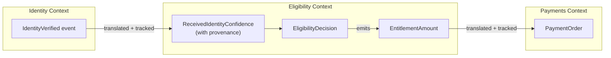

This is why bounded contexts work: each context owns its language, translates at the boundaries, and never lets external models leak in. The coupling is in the *contracts* (events, APIs), not the *models*.

### 1.6 The Complete Hierarchy

| Level | What it is | Relationship | Example |
|-------|-----------|--------------|---------|
| **Domain** | The overall problem space | Contains subdomains | DWP (Social Security) |
| **Subdomain** | A distinct problem area | Modelled by bounded context(s) | Benefits, Pensions, Identity |
| **Bounded Context** | A consistent model with precise language | Contains aggregates | Eligibility Context, Claims Context |
| **Aggregate** | Entities that change together | Implemented by microservice | EligibilityDecision, ClaimHistory |
| **Microservice** | A deployment unit | Structured by Clean Architecture | eligibility-decision-service |
| **Clean Architecture** | Code layers within a microservice | — | Entities, Use Cases, Adapters |

The value of maintaining these as separate concepts is that **they change for different reasons and at different rates:**

- Business organisation evolves slowly—you don't restructure your subdomains monthly
- Models evolve as understanding deepens—bounded contexts might split or merge as you learn more
- Deployment decisions evolve with technical needs—you might split a microservice for scalability without changing your domain understanding

When these concepts are conflated, you get fragile systems. If you assume one domain equals one bounded context equals one microservice, you either end up with microservices that are too large (because domains are big) or you fracture your domain model across deployment units that should share understanding.

> **See also:** Paper 6, Part Four applies this hierarchy to DWP, walking through each level from domain to microservice for the complete government services case study.

---

## Part II: Context Relationships and Communication

### 2.1 The Technical Mechanisms

**The technical mechanisms are the same everywhere:** microservices communicate using REST APIs, gRPC, message queues, event streams, or GraphQL whether they're in the same bounded context or different ones. The HTTP calls look identical. The JSON payloads flow the same way. The technical plumbing doesn't change.

**What changes is the semantic handling.**

### 2.2 Intra-Context Communication

**Within a bounded context:** Microservices share the same model and ubiquitous language.

The `eligibility-decision-service` and `eligibility-rules-service` (both in Eligibility Context) can exchange messages directly. When one sends a `ClaimSubmitted` event containing a `Claimant` object, the other understands exactly what that means—same definitions, same rules, same language. No translation needed.

They use DTOs (Data Transfer Objects) for wire format, but no conceptual translation is required. Both services are implementing slices of the same bounded context. The DTO is just serialisation for transport—it's not translating between different conceptual models.

### 2.3 Inter-Context Communication

**Across bounded contexts:** Microservices have different models and languages, so they need agreements about how to handle the semantic differences at their boundaries.

This is where DDD context relationships come in:

#### Anti-Corruption Layer (ACL)

The consuming context translates the supplier's model into its own language.

When Eligibility calls Customer360, it receives "Customer Profile" data but translates it into "Claimant" through an ACL. Customer360 can change its internal model without breaking Eligibility because the ACL absorbs the difference.

```python
# Eligibility's Anti-Corruption Layer
class IdentityACL:
    def translate_to_claimant(
        self, 
        response: IdentityVerificationResponse
    ) -> ClaimantVerificationStatus:
        return ClaimantVerificationStatus(
            claimant_id=UUID(response.identity_id),
            identity_verified=response.verification_level in ["HIGH", "VERIFIED"],
            current_address=Address(
                line1=response.primary_place['address_line_1'],
                postcode=response.primary_place['postcode']
            ),
            can_receive_payments=response.verification_level == "VERIFIED"
        )
```

#### Shared Kernel

Two contexts agree on shared definitions for their overlap.

Customer360 is a shared kernel across benefit contexts—they all agree on what "verified address" means, what confidence scores represent, and how person relationships are structured. Changes to shared kernel concepts require consensus from all participants.

**What does this mean in practice?** A shared kernel is *shared code*, not just a shared agreement. Both contexts compile against the same types — literally the same classes, interfaces, and value objects. Typically this lives in a shared library (a NuGet package, Maven artifact, or npm module) that both services depend on.

This is stronger than "we agree our ubiquitous languages will align." Language alignment is a social contract; shared kernel is a *compile-time* contract. If the `VerifiedAddress` type changes, both contexts get the change when they update their dependency. Neither can drift without the other noticing.

The trade-off is coupling. Shared kernels create deployment coordination — you can't change the kernel without considering all consumers. This is why they should be *small*: core identity types, common value objects, shared event schemas. If your shared kernel grows to include business logic, you've likely merged two bounded contexts and should recognise that explicitly.

**Why shared code, not a shared service?** A shared service owns data and you call it at runtime. A shared kernel shares *definitions*, not *state*. Each context still owns its own copy of addresses — it just uses the same `VerifiedAddress` type to represent them. Benefits has its addresses; Pensions has its addresses; they're stored separately, governed separately, but described identically.

This matters because:
- No runtime dependency: if the Identity service is down, Benefits can still work with the `VerifiedAddress` objects it already has
- Type safety at compile time: mismatches are caught before deployment, not in production logs
- Each context remains autonomous: it owns its data, just agrees on vocabulary

If you find yourself wanting a shared service that *stores* the shared data, that's not a shared kernel — that's a separate bounded context (like Customer360) with a Customer-Supplier or OHS relationship to its consumers.

**When to use it:** When the cost of translation is higher than the cost of coordination. If Benefits and Pensions both need to understand "verified address" and the definitions must be identical, maintaining two separate `VerifiedAddress` types with translation between them is pure overhead. Share the type.

**When to avoid it:** When contexts need to evolve independently, or when "the same word" actually means subtly different things in each context. If Benefits' "verified" means "above 0.8 confidence" but Pensions' means "human-reviewed," don't force a shared kernel — use an anti-corruption layer and let each context define the term in its own language.

#### Open Host Service (OHS)

The supplier publishes a stable, well-documented API and maintains backward compatibility.

Customer360 is an OHS—it defines its interface, versions it carefully, and doesn't break consumers without migration paths.

#### Customer-Supplier

The contexts coordinate but the supplier has more power. They discuss changes, but the supplier ultimately decides what to provide.

#### Conformist

The downstream context accepts the upstream model without translation—riskier but simpler when the upstream model fits well.

#### Partnership

Two contexts evolve together, coordinating closely and sharing responsibility for the interface between them.

#### The DWP Context Map in Practice

The six patterns above combine in a real architecture. The following context map shows how DWP's principal bounded contexts relate. Each edge is labelled with its relationship type, which determines how integration is designed, tested, and maintained.

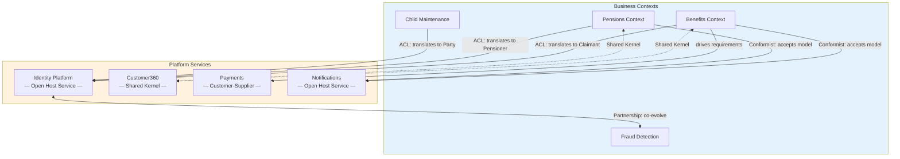

Each relationship type carries different obligations. Anti-corruption layers give consuming contexts independence but require ongoing translation maintenance. The shared kernel (Customer360) provides consistency between Benefits and Pensions but requires consensus for changes—neither team can alter shared definitions unilaterally. The conformist relationships to Notifications are a pragmatic choice: the notification model is simple enough that translation overhead is not warranted. The Identity–Fraud partnership reflects that fraud signal logic co-evolves with identity resolution and is too tightly coupled to manage via a customer-supplier dependency.

> **See also:** Paper 6, Part Four presents the complete bounded context catalogue derived from this map, with team ownership and inter-service contract details.

### 2.4 Why Microservices Don't Share Domain Code

This is where many people get stuck: **if microservices are in the same bounded context, why don't they share the domain entity code?**

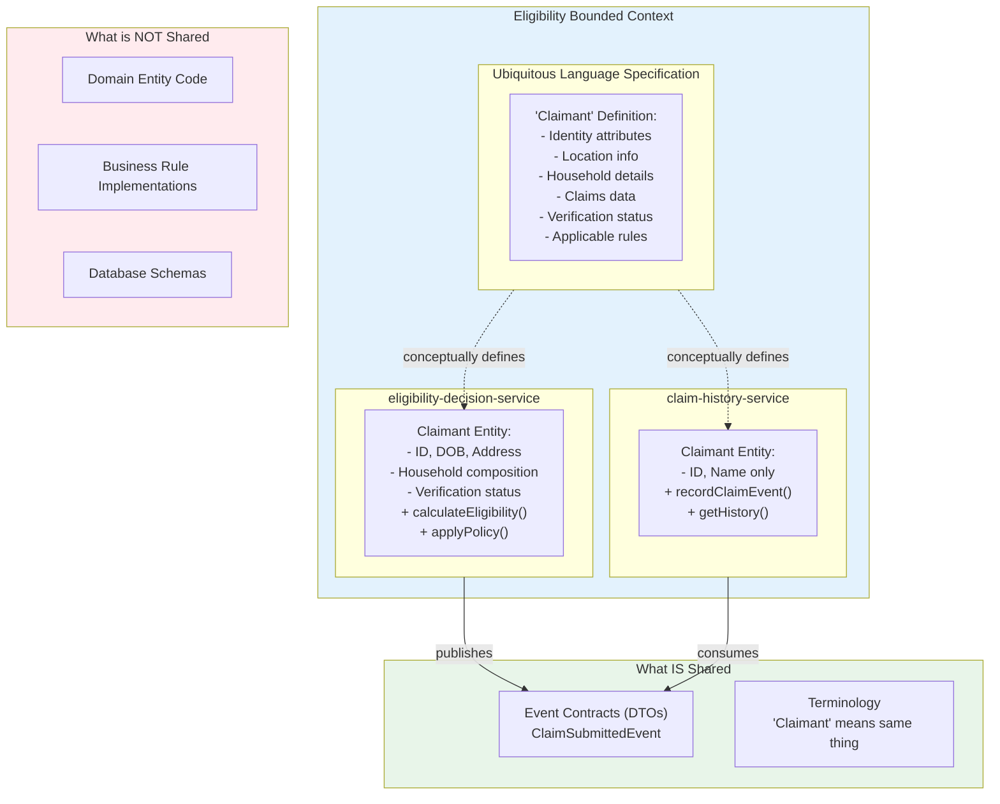

Here's the crucial insight: **A bounded context defines the complete model—the full specification of all concepts, attributes, rules, and language that exist in that problem space. Each microservice implements only the slice of that model relevant to the aggregate it owns.**

Think of the bounded context as the authoritative dictionary and grammar for a language, while each microservice is a conversation using that language for a specific purpose.

Consider the Eligibility Bounded Context. The ubiquitous language specification defines "Claimant" completely:
- Identity attributes (ID, name, date of birth, National Insurance number)
- Location information (current address, previous addresses, residency status)
- Household details (relationships, household composition, dependents)
- Claims data (claim history, active claims, eligibility decisions)
- Verification status (confidence scores, evidence links)
- Rules that apply (eligibility thresholds that vary by benefit type)

This is the complete conceptual model—what "Claimant" means in the Eligibility Context.

Now, two microservices implement different parts:

**The eligibility-decision-service** owns the `EligibilityDecision` aggregate, so its internal `Claimant` entity includes the fields needed to calculate eligibility: ID, date of birth, address, household composition, and verification status. It implements methods like `calculateEligibility()`, `applyPolicy()`, and `checkThresholds()` because these are the invariants its aggregate must enforce.

**The claim-history-service** owns the `ClaimHistory` aggregate, so its internal `Claimant` entity includes just ID and name—enough to identify whose history this is. It implements `recordClaimEvent()` and `getHistory()` because those are its aggregate's invariants.

**Why not share one unified Claimant domain class in a library?**

Because that creates code coupling that destroys the benefits of microservices:
- When `eligibility-decision-service` adds household income fields to support new policy rules, `claim-history-service` must redeploy even though it doesn't use those fields
- Database schema changes become coordinated releases across all services
- You can't optimise each service's internal model for its specific aggregate needs
- Testing requires the shared library to be stable, so changes become slow and risky

**What they do share:**
- Conceptual understanding—both know what "Claimant" means in domain terms
- Contracts—when `eligibility-decision-service` sends a `ClaimSubmittedEvent`, it includes a lightweight DTO with the fields `claim-history-service` needs (claimant ID, claim ID, timestamp). This is a data contract, not a domain entity
- Language—both use the same terminology when discussing requirements with domain experts

**What they don't share:**
- Domain entity implementations
- Business rule code
- Database schemas

Each has its own internal classes optimised for its aggregate. Each implements the rules relevant to its invariants. Each owns its own data store.

This is how you get both conceptual integrity (one consistent model for the bounded context) and implementation independence (each microservice evolves its internals without coordinating releases).

---

## Part III: Clean Architecture Within Microservices

Within a microservice, Clean Architecture creates boundaries between layers. This is where many developers need the most help, so let's be explicit about what Clean Architecture actually means and why it matters.

### 3.1 The Core Principle

Clean Architecture isn't about drawing circles on a whiteboard. It's about protecting business truth from technical chaos.

Frameworks change. Databases change. UIs change. Cloud vendors change. **Your business rules should not.**

Clean Architecture is the structure that makes that separation real.

**The big idea in one sentence:** All dependencies point inward—toward the business. Never the other way around. Your core business rules do not know what database you use, what web framework you use, or whether requests come from REST, GraphQL, CLI, or events. The outside world depends on the core. The core depends on nothing.

### 3.2 What is a Dependency?

In software, if code in module A calls code in module B, or imports from module B, or needs module B to compile or run, then A depends on B.

Dependencies create connections. When B changes, A might break. When you test A, you need B available. Dependencies accumulate into coupling, and coupling makes systems rigid and fragile.

**Why does this matter?**

Because the direction of dependencies determines what breaks what:
- If your business logic depends on your database, then changing databases forces you to rewrite business rules
- If your entities depend on your web framework, then framework upgrades risk breaking core domain logic
- Bad dependency direction creates systems where technical changes cause business changes

Clean Architecture reverses this. Your core business logic doesn't depend on anything external—it defines interfaces for what it needs, and the external world implements those interfaces.

Consider persistence. Your use case needs to save a claim. Instead of calling Postgres directly, it calls a `ClaimRepository` interface that lives *inside* the core:

```
// Defined in the core layer - the domain owns this contract
interface ClaimRepository {
    save(claim: Claim): void
    findById(id: ClaimId): Claim
}
```

The infrastructure layer provides the implementation:

```
// Defined in the infrastructure layer - implements the domain's contract
class PostgresClaimRepository implements ClaimRepository {
    save(claim: Claim): void { /* SQL here */ }
    findById(id: ClaimId): Claim { /* SQL here */ }
}
```

The dependency flows *inward*: `PostgresClaimRepository` depends on `ClaimRepository` (it has to implement that interface). The core doesn't depend on Postgres at all — it defines what it needs and trusts something will provide it. At runtime, dependency injection wires the implementation to the interface.

**"But doesn't the domain still depend on *something* implementing the interface?"** Yes — at runtime, someone must provide an implementation. But there's a crucial difference between *compile-time* and *runtime* dependency:

- **Compile-time**: Can the domain code compile without knowing about Postgres? Yes. The domain only references the interface it owns.
- **Test-time**: Can you test the domain without a real database? Yes. Pass in a fake `InMemoryClaimRepository` that implements the same interface.
- **Change-time**: If you switch from Postgres to DynamoDB, does the domain code change? No. Only the infrastructure layer changes.

The domain depends on *the contract being satisfied*, not on *any specific implementation*. That's the inversion: the infrastructure must conform to the domain's expectations, not the other way around.

**Put simply: outer layers depend on inner layers specifying what they want.** The domain says "I need something that can save and retrieve claims." The infrastructure layer says "I'll provide that using Postgres." The domain doesn't know or care about the second part.

This is why you can swap Postgres for DynamoDB without touching business logic. The infrastructure layer changes; the core doesn't.

**This is dependency inversion**, and it's the mechanism that makes everything else possible.

### 3.3 The Layers

Think of it like a castle with thick inner walls protecting the crown jewels.

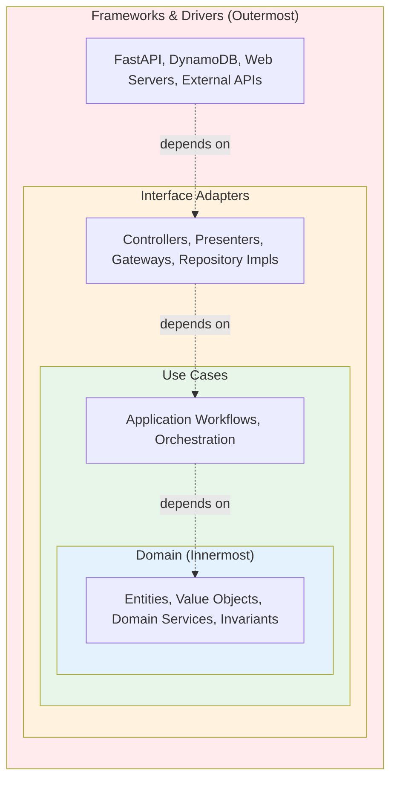

**Dependencies point INWARD only →→→**

**The layers, from most stable to most volatile:**

**Entities (innermost)** contain core business concepts and invariants—the fundamental truths of your domain. A `Refund` entity knows that you can't refund more than the original payment. It doesn't know whether it's stored in DynamoDB or Postgres, whether it arrived via HTTP or a message queue.

This layer also includes **domain services**—stateless logic that spans multiple entities. The `EligibilityPolicy` from §1.3 lives here: it evaluates rules across `WorkCapabilityStatus`, income records, and residency—pure domain logic that doesn't belong inside any single entity. Domain services are part of the domain model, not application orchestration.

**Use Cases** (sometimes called Interactors or Application Services) orchestrate workflows and cause side effects. The `ProcessRefund` use case loads data, calls domain logic, persists changes, emits events. It depends on repository and event bus interfaces.

**The distinction:** Domain services are *pure*—give them inputs, get outputs, no side effects, no dependencies on persistence or messaging. Use cases are *impure*—they load, save, publish, and coordinate. Both contain business logic, but domain services answer questions ("Is this claimant eligible?") while use cases make things happen ("Process this eligibility application and record the outcome").

The same eligibility rules apply whether you're processing a new claim, re-evaluating after a change of circumstances, or running a batch recalculation. The domain service is reused; the use cases for each scenario are different because they coordinate different workflows.

**Interface Adapters** translate between the use cases and the outside world. Controllers receive HTTP requests and translate them into use case inputs. Presenters translate use case outputs into HTTP responses. Repository adapters implement the repository interfaces that use cases depend on, translating domain objects to and from database formats.

**Frameworks and Drivers (outermost)** contain the actual technical implementations—FastAPI, DynamoDB SDK, SNS client, web servers. These are plugins, not foundations. They're the most volatile layer, the easiest to replace, and the least important to your business.

### 3.4 Layer-by-Layer Implementation

Here's how the layers work together in Python with dependency injection:

#### Layer 1: Domain (Entities) — Pure business logic with zero dependencies

```python
class Refund:
    """Domain entity - has identity (payment_id uniquely identifies this refund)"""
    def __init__(self, payment_id: str, amount: Decimal, reason: str):
        self.payment_id = payment_id  # Identity
        self.amount = amount
        self.reason = reason
    
    def validate_against_payment(self, original_amount: Decimal) -> None:
        """Business invariant enforced by the entity"""
        if self.amount > original_amount:
            raise ValueError(f"Refund {self.amount} exceeds payment {original_amount}")
```

**Key points:** The `Refund` entity has **identity** (payment_id), contains the **business invariant** (can't refund more than original), and has **zero imports** from any other layer. It doesn't know about databases, HTTP, or AWS. This is pure domain logic.

#### Layer 2: Application (Use Cases) — Defines interfaces, orchestrates domain logic

```python
from abc import ABC, abstractmethod

# Use case defines the interfaces it needs (dependency inversion)
class RefundRepository(ABC):
    """Interface defined by use case layer - infrastructure will implement"""
    @abstractmethod
    def save(self, refund: Refund) -> None:
        pass
    
    @abstractmethod
    def get_original_payment_amount(self, payment_id: str) -> Decimal:
        pass

class EventBus(ABC):
    """Interface defined by use case layer"""
    @abstractmethod
    def publish(self, event_type: str, data: dict) -> None:
        pass

class ProcessRefundUseCase:
    """Use case orchestrates business workflow"""
    def __init__(self, repo: RefundRepository, event_bus: EventBus):
        # Dependencies point to INTERFACES (abstractions), not concrete implementations
        self._repo = repo  
        self._event_bus = event_bus
    
    def execute(self, payment_id: str, amount: Decimal, reason: str) -> Refund:
        # Step 1: Get original payment to validate (calls interface method)
        original_amount = self._repo.get_original_payment_amount(payment_id)
        
        # Step 2: Create domain entity and enforce invariant
        refund = Refund(payment_id, amount, reason)
        refund.validate_against_payment(original_amount)  # Domain logic
        
        # Step 3: Persist and notify (calls interface methods)
        self._repo.save(refund)
        self._event_bus.publish("RefundProcessed", {
            "payment_id": payment_id, 
            "amount": str(amount)
        })
        
        return refund
```

**Key points:** The use case **depends on abstractions** (`RefundRepository`, `EventBus` interfaces) that it defines itself—these are contracts that specify "I need these operations" without saying how they're implemented. The use case is saying "I need something that can save a refund and get payment amounts, but I don't care if it's DynamoDB, PostgreSQL, or an in-memory store—you implement it, just satisfy this contract."

It knows nothing about DynamoDB, SNS, or HTTP. It orchestrates domain entities and calls interface methods. **Dependency direction: use case → interfaces (contracts owned by use case) ← infrastructure implementations.**

#### Layer 3: Infrastructure — Concrete implementations of interfaces

```python
import boto3
from decimal import Decimal

class DynamoRefundRepository(RefundRepository):
    """Infrastructure implementation - depends inward on interface"""
    def __init__(self, dynamo_client):
        self._client = dynamo_client
    
    def save(self, refund: Refund) -> None:
        # Knows about DynamoDB, translates domain entity to database format
        self._client.put_item(TableName="refunds", Item={
            "payment_id": refund.payment_id,
            "amount": str(refund.amount),
            "reason": refund.reason
        })
    
    def get_original_payment_amount(self, payment_id: str) -> Decimal:
        # Database-specific query logic
        response = self._client.get_item(TableName="payments", Key={"id": payment_id})
        return Decimal(response["Item"]["amount"])

class SnsEventBus(EventBus):
    """Infrastructure implementation - depends inward on interface"""
    def __init__(self, sns_client):
        self._client = sns_client
    
    def publish(self, event_type: str, data: dict) -> None:
        # Knows about SNS, handles AWS-specific publishing
        self._client.publish(
            TopicArn="arn:aws:sns:us-east-1:123456789:refunds",
            Message=json.dumps(data)
        )
```

**Key points:** Infrastructure classes implement the interfaces defined by the use case layer. **They depend inward** (import `RefundRepository` interface and `Refund` entity), never the other way around. These classes contain all the technical details: AWS SDK calls, database queries, serialisation.

You can swap DynamoDB for PostgreSQL by creating a `PostgresRefundRepository` that implements the same interface—use case code doesn't change.

#### Layer 4: Interface Adapters — Translate between external world and use cases

```python
class RefundController:
    """Controller translates HTTP requests into use case calls"""
    def __init__(self, use_case: ProcessRefundUseCase):
        self._use_case = use_case  # Depends on use case
    
    def handle_request(self, request_body: dict) -> dict:
        # Translate from HTTP format (strings, dicts) to domain types
        payment_id = request_body["payment_id"]
        amount = Decimal(request_body["amount"])
        reason = request_body["reason"]
        
        # Execute business logic through use case
        refund = self._use_case.execute(payment_id, amount, reason)
        
        # Translate from domain entity back to HTTP response format
        return {
            "status": "success", 
            "refund_id": refund.payment_id,
            "amount": str(refund.amount)
        }
```

**Key points:** Controllers handle translation between external formats (HTTP JSON) and internal domain types. They depend on use cases but don't contain business logic themselves.

**"How does the controller know the use case's interface?"** By importing it. Outer layers can see and depend on inner layers — that's the *allowed* direction. The controller imports `ProcessRefundUseCase`, sees its `execute(payment_id, amount, reason)` signature, and calls it. The restriction is the reverse: the use case cannot import the controller. Inner layers are blind to what's outside them.

**Notice two different patterns here:**

1. **Controller → Use Case**: The use case defines its own interface. The controller must conform to call it correctly. This is the *normal* direction — inner defines its shape, outer adapts.

2. **Use Case → Repository**: The use case defines the interface it *needs* (what it wants from persistence). Infrastructure must implement that interface. This is *dependency inversion* — inner specifies requirements, outer satisfies them.

Both follow "dependencies point inward," but they work differently. In (1), the controller accepts the use case as-is. In (2), the use case dictates what it wants and infrastructure conforms. The inversion is about who *defines* the contract at a boundary where you want the inner layer protected from infrastructure details.

#### Layer 5: Wiring (Composition Root) — Dependency injection at application startup

```python
def create_app():
    """Application startup - this is where we wire everything together"""
    # Create infrastructure implementations (outermost layer)
    dynamo_client = boto3.client("dynamodb")
    sns_client = boto3.client("sns")
    
    # Inject concrete implementations that satisfy the interfaces
    repo = DynamoRefundRepository(dynamo_client)
    event_bus = SnsEventBus(sns_client)
    
    # Pass implementations to use case (which only knows about interfaces)
    # This is "dependency injection" - injecting actual implementations at runtime
    use_case = ProcessRefundUseCase(repo, event_bus)
    
    # Pass use case to controller
    controller = RefundController(use_case)
    
    return controller
```

**Key points:** This is **dependency injection**—we're injecting the actual implementations at runtime. The framework (or composition root in simpler apps) constructs concrete implementations (DynamoDB, SNS) and passes them to components that only know about abstractions (RefundRepository, EventBus interfaces).

The use case never imports DynamoDB—it receives an object that satisfies its RefundRepository interface. This is where everything gets wired together.

The **dependency direction is always inward**: infrastructure → use case interfaces, controller → use case, use case → domain entities. The core (domain and use cases) never knows about the outer layers (infrastructure and frameworks).

### 3.5 Why Architects Should Care

This structure provides **controlled blast radius:**

| Change Type | What Changes | What Doesn't Change |
|-------------|--------------|---------------------|
| New database | Repository implementation | Use cases, domain logic |
| New UI | Controller/presenter | Use cases, domain logic |
| REST to events | Adapter layer | Use cases, domain logic |
| Business rule change | Entity or use case | Infrastructure, adapters |

Without this architecture, you get:
- Business logic inside controllers
- SQL scattered throughout the codebase
- Framework upgrades breaking core logic
- Impossible testing
- Rewrites instead of refactors

**The mental model to remember:** Your business is the product. Everything else is a plugin. If you can delete your web framework tomorrow and still have your core logic intact, you've done it right.

**The payoff:** Want to swap DynamoDB for PostgreSQL? Write a new `PostgresRefundRepository`, change two lines in `create_app()` to inject the new implementation, and you're done. Use case and domain code unchanged. Want to test without AWS? Create `InMemoryRefundRepository` and `FakeEventBus`, inject those in your test setup. The architecture makes these changes trivial because dependencies point the right direction.

> **What Goes Wrong Without This**
>
> The failure mode is domain logic scattered through the wrong layers. A controller that contains a business rule ("don't allow claims from suspended accounts") cannot be tested without starting a web server. A use case that imports `boto3` directly cannot be tested without AWS credentials. A domain entity that inherits from an ORM base class cannot exist without a database connection.
>
> *Before Clean Architecture:* Policy validation buried inside the FastAPI route handler. Raw SQL inside service functions. Business rules duplicated across three endpoints because there is no canonical home for them.
>
> *After Clean Architecture:* Policy validation lives in the domain entity and is enforced by its invariant. The repository interface is owned by the use case layer. Each endpoint delegates immediately to a use case and translates the result—no logic leaks outward.
>
> The simplest diagnostic: can you run your domain and use-case tests without importing your web framework? If not, the architecture is already leaking.

---

## Part IV: Testing Strategy at Each Tier

With Clean Architecture in place, we can now discuss how to validate that each layer behaves correctly. The layered structure directly enables a layered testing strategy—each boundary creates a natural test seam. Understanding which tests belong at which level is essential for both confidence and efficiency.

The hierarchy requires different testing strategies at each level. Understanding this hierarchy is essential for knowing what tests to write, when to run them, and what they're protecting.

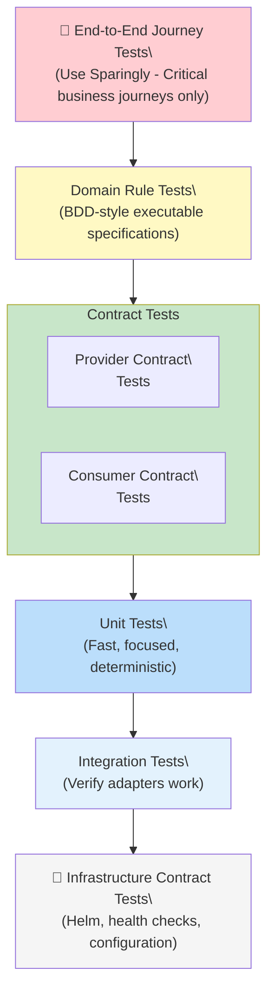

### 4.1 Domain Rule Tests

These are executable specifications that encode business invariants as tests. They're written in business language and validate that domain rules hold true across all implementations.

Example: "A refund amount cannot exceed the original payment amount."

These tests run against any service in the domain and fail if the rule is violated anywhere. They're typically written in a BDD style (Given-When-Then) and live in the domain documentation, not in service code.

```gherkin
Feature: Refund Processing
  
  Scenario: Refund cannot exceed original payment
    Given a payment of £100.00
    When a refund of £150.00 is requested
    Then the refund is rejected
    And the error message indicates "exceeds original payment"
```

### 4.2 Contract Tests

Contract tests ensure that services honour their promises to each other. They come in two flavours:

**Provider contract tests** verify that a service fulfils the contract it publishes. If the payment-processing service promises a `GET /payments/{id}` endpoint that returns specific fields, these tests verify the service actually does that.

**Consumer contract tests** work the other direction, verifying that a service can work with the contracts it depends on. If the refund-management service consumes payment data, these tests verify it can handle the actual shape of data the payment service provides.

Contract tests run on every commit and must all pass before merge. They catch breaking changes before any consumer is affected.

**Key insight:** Contract tests don't test business logic—they test the boundary.

### 4.3 Unit and Integration Tests

This is where most traditional testing happens.

**Unit tests** focus on domain logic and use cases without touching infrastructure—they test business rules, validation, state transitions, and workflows using test doubles for dependencies. Fast, focused, and deterministic.

**Integration tests** verify that infrastructure adapters work correctly: repositories actually store and retrieve data, message publishers actually send messages, HTTP clients actually call external APIs. These are slower and require real infrastructure (or realistic fakes), but they're essential for confidence.

The Clean Architecture enables testing in isolation. Use cases can be tested without databases. Domain logic can be tested without web frameworks. This is where TDD shines—write the test, write the domain logic, wire up infrastructure last.

### 4.4 Infrastructure Contract Tests

These verify that your deployment infrastructure actually works as specified:
- Does the Helm chart deploy successfully?
- Do health checks work?
- Are environment variables correctly configured?
- Do sidecars start?

These tests run in staging environments and catch configuration errors before production.

### 4.5 End-to-End Journey Tests

These test complete business workflows across multiple services—placing an order, processing payment, fulfilling shipment.

They're valuable but expensive: slow to run, brittle, hard to maintain, and difficult to debug when they fail. Use them sparingly for critical business journeys only. They're not a substitute for contract tests—they're a final verification that everything works together.

> **See also:** Paper 3, Part Three covers the CI pipeline that automates this testing strategy—enforcing boundary rules, running contract checks, and flagging architecture violations before merge. Paper 4, Part Two shows how that pipeline integrates with LLM-assisted service generation.

---

## Part V: Governance and Team Alignment

### 5.1 Conway's Law

Conway's Law states that organisations design systems that mirror their communication structure. This isn't just an observation—it's a law of organisational physics.

If your team structure doesn't align with your architectural boundaries, you'll fight friction forever.

### 5.2 Team Alignment Principles

Each bounded context should be owned by one team (or multiple teams if the context is large). Within a bounded context, each microservice should have a single owning team. Cross-team ownership of a single service creates coordination overhead and accountability confusion.

For the Payments bounded context with three microservices (Payment Processing, Refund Management, Settlement Reconciliation), you have two options:

**Option A: One team owns all three services** if they're closely related and change together. This creates a "Payments Team" of 6-10 developers who understand the entire payment domain. They coordinate internally and present a unified interface to other teams.

**Option B: Three teams own one service each** if the services are complex enough to require specialisation and change independently. This creates a Payment Processing Team, a Refund Team, and a Settlement Team. They coordinate through contract meetings and share domain understanding through the bounded context glossary.

### 5.3 Platform Teams vs Domain Teams

**Platform teams** own generic subdomains—the shared services that cut across business areas:
- Platform Identity Team (Identity subdomain)
- Platform Payments Team (Payments subdomain)  
- Platform Notifications Team (Notifications subdomain)
- Developer Experience Team (RAG infrastructure, CI/CD, templates)
- Architecture Team (domain boundaries, standards)

**Domain teams** own business subdomains:
- Benefits Team
- Pensions Team
- Child Maintenance Team

These differ in governance:

| Aspect | Platform Service | Business Subdomain Service |
|--------|------------------|---------------------------|
| Change impact | Affects multiple business subdomains | Affects only owning subdomain |
| Breaking changes | Require coordinated migration | Contained within subdomain |
| Testing burden | Contract tests with all consumers | Subdomain-specific tests |
| SLA requirements | Higher (downtime affects many) | Aligned with subdomain needs |
| Ownership | Central platform team | Subdomain team |

### 5.4 Decision Rights and Escalation

Clear ownership means clear decision rights:

| Level | Decision Rights | Example |
|-------|-----------------|---------|
| Service teams | Internal implementation | How we implement a use case |
| Service leads | Service-level architecture | What aggregates we expose |
| Solution architects | Bounded context boundaries | Cross-context contracts |
| Enterprise architects | Domain structure | Strategic direction |

When decisions span boundaries, you need clear escalation paths:
- If two teams disagree about a contract → escalate to solution architects
- If two bounded contexts have overlapping concerns → escalate to enterprise architects

---

## Conclusion

### What This Hierarchy Provides

The hierarchy from domain to microservice to Clean Architecture layers isn't academic overhead. It provides:

**Vocabulary for discussion** — When architects say "bounded context boundary," everyone knows what that means and why it matters.

**Natural fault lines** — You're not inventing arbitrary service boundaries. You're discovering where reality already has seams.

**Independent evolution** — Different parts of the system can change at different rates without breaking each other.

**Team scalability** — Clear ownership means teams can work in parallel without constant coordination.

**Comprehensibility** — Any single piece of the system is understandable by one team. No god-models.

### The Key Insights

1. **You're discovering, not designing.** Microservices are the deployment reflection of natural fault lines in your problem space.

2. **Boundaries exist for humans.** The CPU doesn't care about separation of concerns. These structures exist because human minds have limits.

3. **Different levels change at different rates.** Don't conflate domains, bounded contexts, and microservices—they evolve independently.

4. **1 BC → 1 microservice** is the default. Split only when you have specific technical reasons.

5. **Dependencies point inward.** Your business logic is the product. Everything else is a plugin.

6. **Contract tests are non-negotiable.** They're how you get service independence without integration chaos.

### Where to Go From Here

This paper provides the foundational concepts. The companion papers in this series apply these principles to specific domains:

- **Paper 2: Evidence-Based Identity** — Applies DDD to the identity coordination problem, showing how bounded contexts (Identity, Evidence, Trust, Resolution) model a complex government domain
- **Paper 3: LLM-Assisted Development with RAG and Guardrails** — Shows how DDD boundaries become enforcement points for safe LLM assistance at scale; Part Three of Paper 3 covers the CI pipeline that flags boundary violations of the kind described here
- **Paper 4: Automated LLM-Driven Development** — Covers how the six boundary signals in Section 1.3 feed into automated domain manifest generation; Paper 4, Section 2 shows the output artefacts that emerge from systematic context discovery
- **Paper 5: Getting Started** — A practical guide for applying this paper's principles in your organisation, including team topology setup and the first 30-day plan
- **Paper 6: DWP Case Study** — Applies the complete bounded context hierarchy from this paper to a live government services architecture; Parts Two and Four present the full context map and bounded context catalogue

---

## Appendix A: Glossary

| Term | Definition |
|------|------------|
| **Domain** | A sphere of knowledge and activity; the overall problem space |
| **Subdomain** | A distinct problem area within a domain |
| **Core Subdomain** | Where the organisation differentiates; unique value |
| **Supporting Subdomain** | Necessary but not differentiating |
| **Generic Subdomain** | Commodity capability; often becomes platform service |
| **Bounded Context** | A linguistic/model boundary where terms have consistent meaning |
| **Ubiquitous Language** | The precise shared vocabulary within a bounded context |
| **Model** | The complete collection of entities, value objects, aggregates, and invariants |
| **Entity** | Object with identity that persists over time |
| **Value Object** | Immutable descriptor without identity |
| **Aggregate** | Cluster of entities forming a consistency boundary |
| **Aggregate Root** | The entry point that controls access to an aggregate |
| **Invariant** | Business rule that must always be true |
| **Anti-Corruption Layer** | Translation layer between bounded contexts |
| **Shared Kernel** | Definitions shared between contexts by agreement |
| **Open Host Service** | Stable, well-documented API with backward compatibility |
| **Saga** | Coordination of multiple aggregates over time using events |
| **Domain Event** | Past-tense fact emitted when aggregate state changes |
| **Clean Architecture** | Layered structure with dependencies pointing inward |
| **Use Case** | Application-specific business workflow |
| **Repository** | Interface for aggregate persistence |
| **Dependency Injection** | Providing implementations at runtime, not compile time |

---

## Appendix B: Quick Reference Diagrams

### The Complete Hierarchy

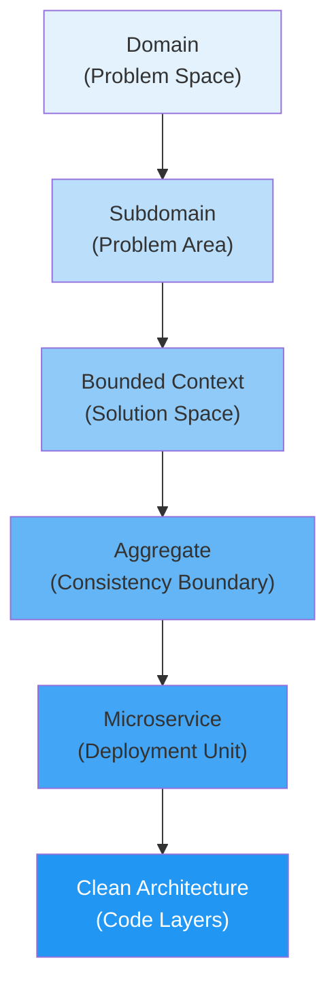

### Clean Architecture Layers

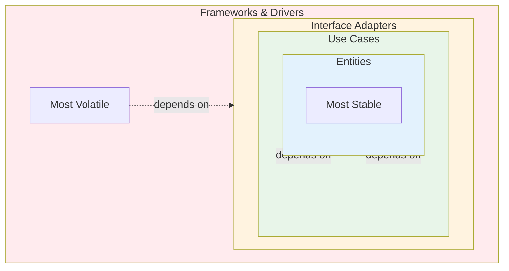

**All dependencies point INWARD →**

### Context Relationship Patterns

```mermaid
flowchart LR
    subgraph ACL["Anti-Corruption Layer"]
        Elig["Eligibility\nContext"] -->|"translates to\nClaimant"| Identity["Identity\nContext"]
    end

    subgraph SK["Shared Kernel"]
        Benefits["Benefits\nContext"] <-->|"Customer360\nshared definitions"| Pensions["Pensions\nContext"]
    end

    subgraph OHS_box["Open Host Service"]
        Client["Any Consumer"] -->|"stable versioned\nAPI"| Platform["Identity\nPlatform"]
    end

    subgraph CS["Customer-Supplier"]
        BenefitsCS["Benefits\n(customer)"] -->|"drives\nrequirements"| PaymentsCS["Payments\n(supplier)"]
    end

    subgraph CONF["Conformist"]
        BenefitsCF["Benefits\nContext"] -->|"accepts model\nwithout translation"| NotifCF["Notifications\nService"]
    end

    subgraph PART["Partnership"]
        IdentityP["Identity\nContext"] <-->|"co-evolve\ninterface"| FraudP["Fraud\nContext"]
    end

    style ACL fill:#e3f2fd
    style SK fill:#e8f5e9
    style OHS_box fill:#fff3e0
    style CS fill:#fce4ec
    style CONF fill:#f3e5f5
    style PART fill:#e0f7fa
```

### Testing Pyramid for DDD

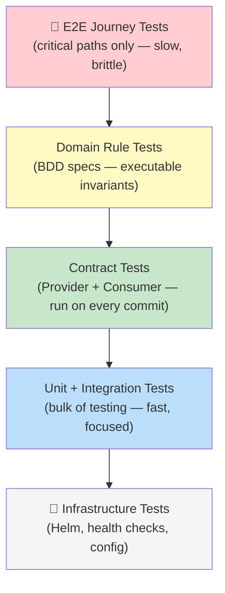

---

*Paper 1 of 6 in the Architecting Modern Government Services series*

**Next:** Paper 2 — Evidence-Based Identity: A Semantic Coordination Architecture  
**See also:** Paper 3 — LLM-Assisted Development with RAG and Guardrails · Paper 4 — Automated LLM-Driven Development · Paper 5 — Getting Started · Paper 6 — DWP Case Study
