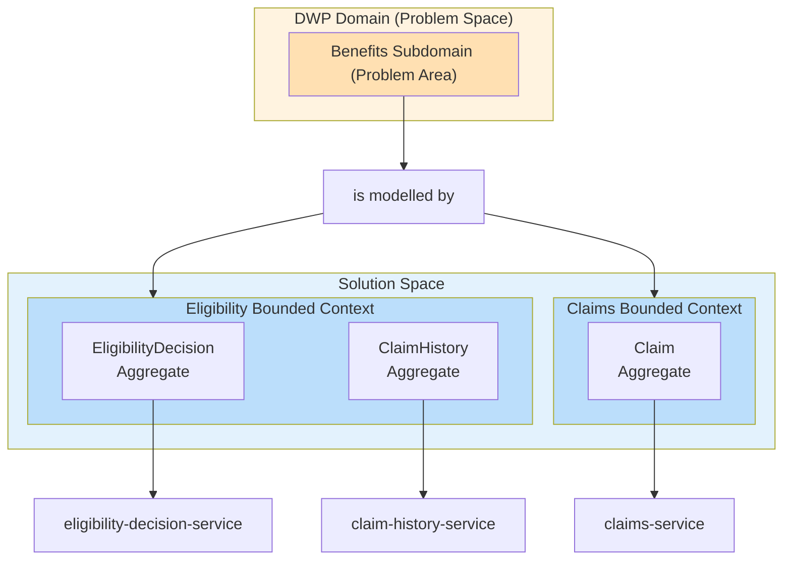
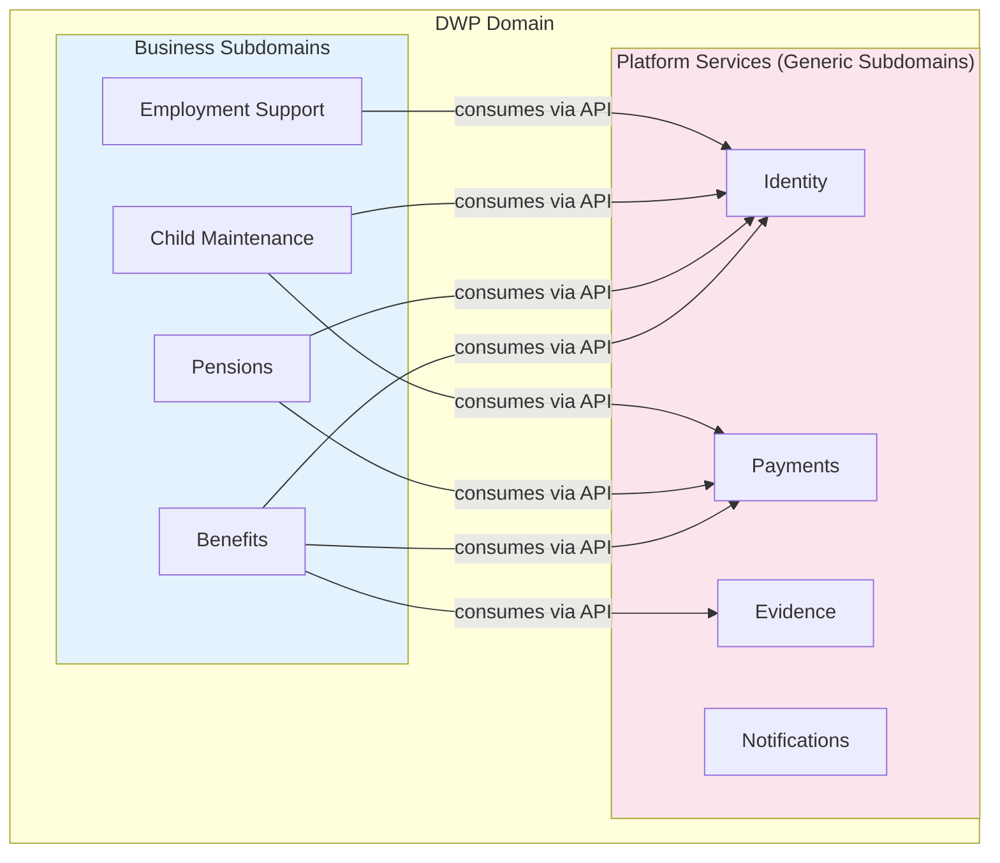
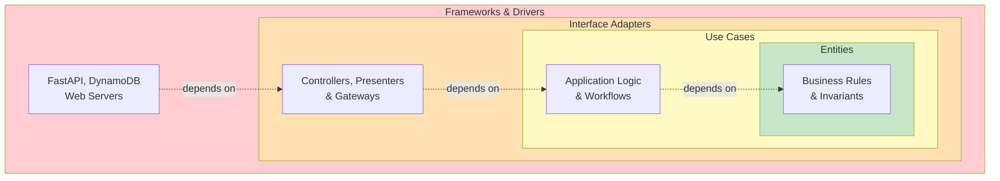
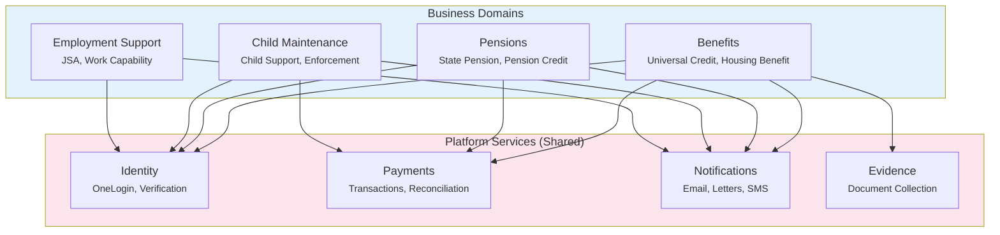
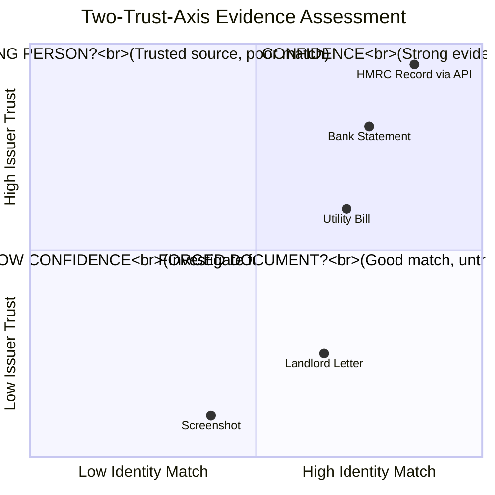
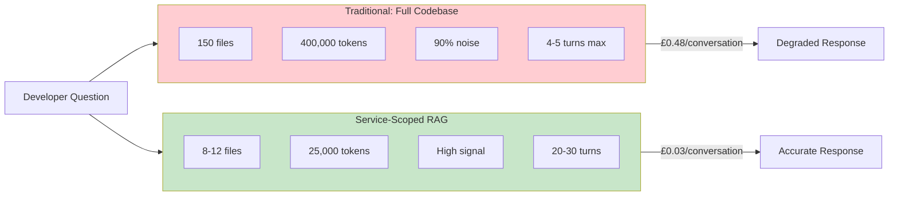
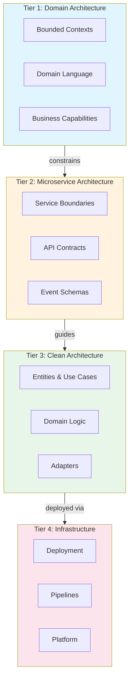
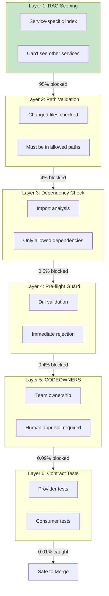
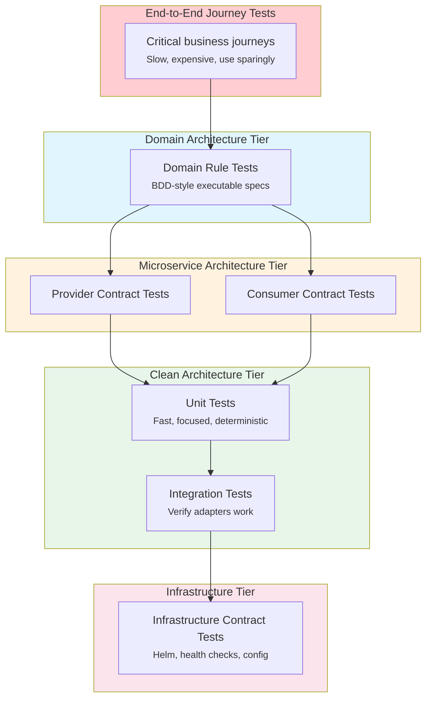

# AI-Assisted Development in Microservice Architectures

**A Strategic Framework for Solution Architects**

*Version 2.0 | January 2026*

---

## Executive Summary

Large Language Models promise to accelerate software delivery and democratize technical knowledge. But in microservice architectures—where boundaries matter, contracts are sacred, and coupling is the enemy—uncontrolled LLM assistance creates chaos, not productivity.

This document presents a framework that dramatically reduces token costs through intelligent context retrieval, prevents boundary violations by design through architectural enforcement, and scales to hundreds of services. The approach combines Service-Scoped RAG (Retrieval-Augmented Generation), a four-tier architectural model, and automated CI/CD guardrails to make safe LLM assistance possible at scale.

The choice is clear: adopt LLMs with architectural control, or watch short-term productivity gains erode into technical debt that costs millions to unwind.

### Document Structure

This framework is presented in seven parts:

```mermaid
graph LR
    P1["Part 1: The Problem<br/><small>DDD hierarchy, boundaries,<br/>why LLMs break architecture</small>"]
    P2["Part 2: DWP Case Study<br/><small>Real-world DDD application<br/>in federated organization</small>"]
    P3["Part 3: Solution Architecture<br/><small>Service-Scoped RAG,<br/>Four-Tier Model, guardrails</small>"]
    P4["Part 4: Implementation<br/><small>Building RAG indexes,<br/>CI/CD enforcement</small>"]
    P5["Part 5: Practical Examples<br/><small>Greenfield & brownfield<br/>migration patterns</small>"]
    P6["Part 6: Economics<br/><small>Cost analysis,<br/>ROI calculations</small>"]
    P7["Part 7: Roadmap<br/><small>18-month implementation<br/>plan</small>"]
    
    P1 --> P2
    P2 --> P3
    P3 --> P4
    P4 --> P5
    P5 --> P6
    P6 --> P7
    
    style P1 fill:#ffcdd2
    style P2 fill:#fff3e0
    style P3 fill:#c8e6c9
    style P4 fill:#bbdefb
    style P5 fill:#e1bee7
    style P6 fill:#b2dfdb
    style P7 fill:#f0f4c3
```

<div style="width: 100%; overflow-x: auto;">



</div>

**How to read this document:** Parts 1-2 diagnose the problem and provide context. Part 3 presents the solution architecture. Parts 4-5 show how to implement it. Parts 6-7 cover business case and rollout.

---

## Part One: The Problem

### The Hierarchy of Boundaries

Complex systems require boundaries at multiple levels. Domain-Driven Design, microservices, and Clean Architecture each provide different types of boundaries that work together. Understanding this hierarchy is essential to understanding where LLM guardrails must be enforced—and why violations at each level cause different kinds of damage.

Let's work through the hierarchy from top to bottom, using DWP as our example because it shows all the levels clearly.

**DWP is a domain.** In DDD terms, a domain is a sphere of knowledge and activity—a problem space. DWP's domain is social security: providing financial support to citizens through benefits, pensions, and related services. A domain is NOT a bounded context—it's too large and has too much linguistic variation to have one consistent model. Terms like "claimant," "payment," and "assessment" mean different things in different parts of DWP. That's why domains must be decomposed.

**A domain contains subdomains.** DWP's domain breaks down into distinct problem areas: Benefits (Universal Credit, Housing Benefit), Pensions (State Pension, Pension Credit), Child Maintenance (child support calculations and enforcement), and Employment Support (job seeker assistance). These are subdomains—smaller, more focused problem spaces within the larger domain. Each subdomain has its own language, rules, and experts, and exists within the broader context of social security.

**Subdomains are classified by strategic importance.** *Core subdomains* are where the organisation differentiates—the unique value it provides. Eligibility determination is core: the complex policy rules that decide who gets what benefit are DWP's reason for existing. *Supporting subdomains* are necessary but not differentiating—case management, appeals handling, correspondence. *Generic subdomains* are commodity capabilities any organisation needs—identity verification, payment processing, notifications. These are necessary but not specific to social security.

**Generic subdomains become platform services.** When a generic subdomain serves multiple other subdomains, it makes sense to implement it once and share it. Identity verification isn't specific to Benefits or Pensions—both need it. So Identity becomes a **platform service**: a shared capability owned by a platform team, governed centrally, with strict compatibility requirements because changes affect all consumers. Platform services are still subdomains—they just happen to be shared and centrally governed.

**Bounded contexts are how we model subdomains—this is where we cross from problem space to solution space.** A subdomain is a *problem space*—it exists in the business whether we build software or not. Benefits eligibility is a subdomain because DWP has eligibility rules to apply. A bounded context is a *solution space*—it's how we choose to model that problem in software. The domain (DWP) is too large with too much linguistic variation to be one model—Benefits uses "claimant," Pensions uses "pensioner," Child Maintenance uses "paying parent." You decompose the domain into subdomains, then create a model for each subdomain (or part of a subdomain) within a bounded context.

**What is a model?** In DDD terms, a model is not just a database schema or data structure—it's a domain model: the software representation of business concepts with their rules and relationships. Think of it as the evolution of data modeling from the monolith world, but richer. A model includes:
- **Value objects**: Immutable descriptors without identity (Money, Address, DateOfBirth). Think of these like user-defined types in traditional programming—a Money type that bundles amount and currency together.
- **Entities**: Objects with identity that persist over time (a Claimant, an EligibilityDecision). Think of these like classes in OOP, but with a critical distinction to value objects: two entities with identical data are still different if they have different IDs. A Claimant with ID 12345 is not the same person as a Claimant with ID 67890, even if they have the same name and address.
- **Aggregates**: Clusters of entities and value objects that form consistency boundaries. Think of these like a parent class that owns and controls access to child entities through composition (not inheritance). An EligibilityDecision aggregate includes the decision entity, its evidence entities, and its rule value objects—they must change together. The aggregate root (EligibilityDecision) is the only entry point; nothing outside can directly modify the child entities. This ensures invariants are enforced.
- **Invariants**: Business rules that must always be true (an EligibilityDecision cannot be approved without minimum evidence confidence). Invariants are enforced by the aggregate root—nothing outside the aggregate can directly modify its internals in ways that would violate the rules.
- **Ubiquitous language**: The precise shared vocabulary used by developers and domain experts—a dictionary of terms with exact definitions

**A model, then, is the complete collection:** all the value objects, entities, aggregates, invariants, and the ubiquitous language that defines them. It's how we encapsulate business logic—entities know their own rules, aggregates enforce their invariants through controlled access, and the language provides precise shared understanding between developers and domain experts. 

**The bounded context is where that model applies consistently.** Within the Eligibility bounded context, "claimant" means one precise thing, "assessment" follows specific rules, and every term in the ubiquitous language has exactly one definition. If you find that "claim" means something different in eligibility determination versus payment processing, that's a signal you need separate bounded contexts—separate models with their own consistent language.

**Mapping subdomains to bounded contexts:**
- Simple subdomains often map 1:1 to bounded contexts (the Identity subdomain → one Identity bounded context)
- Complex subdomains may need multiple bounded contexts (the Benefits subdomain → separate Eligibility, Claims, and Awards contexts if the language diverges enough)
- Closely related simple subdomains might share a bounded context (rare, but possible)

**When does a subdomain need multiple bounded contexts instead of being split into multiple subdomains?** If the problem areas share the same business experts, change together for business reasons, and sit in the same part of the organisation, but use sufficiently different language or rules that unifying them creates confusion—that's when you keep them as one subdomain but model them with separate contexts. For example, Benefits might be one subdomain from an organisational perspective (one directorate, one budget, shared policy experts), but Eligibility uses such different language and rules from Claims processing that forcing them into one model would create the "god-model" antipattern. The subdomain boundary reflects business structure; the bounded context boundary reflects linguistic clarity.

**Bounded contexts contain aggregates.** An aggregate is a consistency boundary—a cluster of entities that must change together to maintain invariants. The Eligibility bounded context might contain an EligibilityDecision aggregate (the decision with its rules and evidence) and a ClaimHistory aggregate (the timeline of claims and changes). Each aggregate has a root entity that controls access, and invariants are enforced within the aggregate boundary.

**Aggregates typically become microservices.** A microservice is a deployment unit—something that deploys, scales, and fails independently. Microservices align with aggregates because aggregates define transactional boundaries. The eligibility-decision-service owns the EligibilityDecision aggregate; the claim-history-service owns ClaimHistory. Multiple microservices can exist within one bounded context.

**When multiple aggregates must cooperate:** Aggregates guarantee that their internal rules hold true at a moment in time. But what if a business process needs multiple aggregates to change together—yet they can't be one aggregate due to size, locking, or scalability? You shift from state consistency to process consistency using domain events and sagas.

An aggregate finishes a valid state change and emits a fact: `IdentityVerified`, `EvidenceValidated`, `ResidencyRecorded`. These are past-tense domain events announcing "this became true." A saga (or process manager) coordinates the business flow. When Identity verifies a person, the EligibilityDetermination saga hears the event, loads the EligibilityCase aggregate, and calls `markIdentityCheckPassed()`. The eligibility aggregate updates itself and emits its own event. The saga continues until all conditions are satisfied. No giant transaction—just process coordination over time.

The principle: **if it must be true at the same instant → same aggregate. If it must become true eventually → saga.** Aggregates protect truth at a moment. Sagas protect truth across time. This is how complex business processes work in distributed systems without distributed transactions.

**Within each microservice, Clean Architecture organises code.** Entities, use cases, adapters, and infrastructure layers ensure business logic stays pure and testable.

**To summarise the hierarchy:**

| Level | What it is | Relationship | Example |
|-------|-----------|--------------|---------|
| **Domain** | The overall problem space | Contains subdomains | DWP (Social Security) |
| **Subdomain** | A distinct problem area | Modelled by bounded context(s) | Benefits, Pensions, Identity |
| **Bounded Context** | A consistent model with precise language | Contains aggregates | Eligibility Context, Claims Context |
| **Aggregate** | Entities that change together | Implemented by microservice | EligibilityDecision, ClaimHistory |
| **Microservice** | A deployment unit | Structured by Clean Architecture | eligibility-decision-service |
| **Clean Architecture** | Code layers within a microservice | — | Entities, Use Cases, Adapters |

Here's how this looks for the Benefits subdomain, which is complex enough to need multiple bounded contexts:

<div style="width: 100%; overflow-x: auto;">



</div>

And here's how DWP's subdomains relate to each other, showing which are business subdomains and which are platform services (generic subdomains):

<div style="width: 100%; overflow-x: auto;">



</div>

Each subdomain—whether business or platform—follows the same internal structure: bounded contexts containing aggregates, implemented as microservices. The difference is governance, not architecture. Business subdomain teams have autonomy; platform service teams must coordinate with all consumers before making changes.

The key insight is that **platform services are subdomains like any other**—they just happen to be generic subdomains that serve multiple business subdomains. Identity has its own bounded contexts, aggregates, and microservices. What makes it a "platform service" is governance: it's shared, centrally owned, and changes require impact analysis across all consumers. (We'll see exactly how this works in the DWP case study in Part Two.)

The value of maintaining these as separate concepts is that they change for different reasons and at different rates. Business organisation evolves slowly—you don't restructure your subdomains monthly. Models evolve as understanding deepens—bounded contexts might split or merge as you learn more about the subdomain. Deployment decisions evolve with technical needs—you might split a microservice for scalability without changing your domain understanding at all.

When these concepts are conflated, you get fragile systems. If you assume one domain equals one bounded context equals one microservice, you either end up with microservices that are too large (because domains are big) or you fracture your domain model across deployment units that should share understanding. The hierarchy gives you flexibility: multiple bounded contexts can exist within a domain, multiple microservices can implement a bounded context, and the clean architecture layers organise code within each microservice.

### How to Identify Bounded Context Boundaries

The question "how many bounded contexts should we have?" is a design skill, not a formula. There are signals that indicate where boundaries naturally exist. Here are six reliable indicators:

**1. Different Business Authority**

Ask: "Who in the organisation owns the truth here?" If different people are authoritative for different areas, those are different contexts.

| Area | Authority |
|------|-----------|
| Identity resolution | Identity operations / fraud team |
| Eligibility rules | Policy / legislation team |
| Evidence capture | Frontline / intake team |
| Payments | Finance team |

These should not share a model because they have different sources of truth and change for different reasons.

**2. Different Language (Ubiquitous Language Clash)**

Same word, different meaning = split. If you find yourself saying "well, in *this* part of the system, 'person' means..." then you've found a boundary.

| Word | In Identity BC | In Eligibility BC |
|------|---------------|------------------|
| "Person" | Graph-resolved entity | Applicant in a case |
| "Address" | Evidence-backed fact | Declared residence |
| "Verified" | Confidence score | Meets policy criteria |

Forcing these into one model makes both definitions muddy. Separate contexts preserve precision.

**3. Different Change Drivers**

Ask: "Why would this logic change?" Areas that change for different reasons should be separate.

| Area | Why it changes |
|------|---------------|
| Identity scoring | Fraud patterns evolve |
| Residency rules | Policy legislation updates |
| Evidence types | New document formats |
| Credential formats | Standards bodies publish new specs |

Different change drivers means different bounded contexts.

**4. Different Invariants**

If the rules that must always hold true are different, you have separate contexts.

| BC | Invariants |
|----|-----------|
| Identity | One person graph node per real human |
| Evidence | Evidence immutable once stored |
| Eligibility | Rules versioned by policy effective date |
| Payments | Double-entry balance integrity |

Mixing invariants creates chaos—you can't enforce them cleanly in one model.

**5. Different Data Lifecycles**

| Data | Lifecycle |
|------|-----------|
| Evidence | Append-only, historical audit trail |
| Identity | Continuously merged/deduped |
| Eligibility | Case-based, snapshot in time |
| Credentials | Versioned and revocable |

When lifecycle patterns differ fundamentally, storage and model structures diverge—indicating separate bounded contexts.

**6. Cognitive Load Test**

If one team cannot fully understand and reason about the model anymore, you've crossed BC size limits. If explaining it requires "well... except in this other part where..." then split it. A bounded context should be comprehensible to its team.

**The Practical Heuristic**

When deciding "should this be a new BC?" ask:
1. Would merging these models force awkward compromises in meaning?
2. Do different people own the rules?
3. Do they change for different reasons?
4. Would I version their rules independently?
5. Would different teams naturally work on them?

If 3+ are yes → split.

**Why this matters for microservices:** Every BC boundary is a distributed systems tax—network calls, eventual consistency, failure handling, messaging, monitoring. So you don't split for purity—you split when semantic independence outweighs distributed cost.

**You're not designing services. You're discovering natural fault lines in reality.** Microservices are the deployment reflection of those fault lines.

### Bounded Contexts and Microservice Count

**The default rule: 1 BC → 1 microservice.** A bounded context is one domain model, one ubiquitous language, one consistency boundary, one set of invariants. Splitting that across multiple services creates a distributed monolith.

Inside a BC, objects reference each other freely, transactions make sense, invariants can be enforced synchronously, and the model evolves together. If you split it, you trade strong consistency for network hops, simple reasoning for eventual consistency headaches, and ACID invariants for saga complexity.

**Legitimate reasons to have multiple microservices for one BC (rare):**

1. **Scale characteristics radically differ:** 99% reads vs heavy ML scoring job vs massive batch processing. You might split into a core BC service (owns model + writes) and a stateless compute service (pure function processing), but the second one doesn't own the model—it's infrastructure-ish.

2. **Technical isolation, not domain isolation:** Separate public API gateway service, background worker service, or event projector service. These are delivery mechanics, not BC splits. Still logically one BC.

3. **Team size pressure (Conway's Law):** If a BC becomes too large for one team, you might internally modularize into multiple deployables—but this is a scaling compromise, not ideal DDD. Usually a smell that the BC might actually hide multiple subdomains.

**The consistency test:** Ask "Can a business invariant break if these two services disagree for 5 seconds?" If yes, they belong in the same BC service.

**What people wrongly do:** Split into "read service" vs "write service," or "API service" vs "processing service," or "validation service" vs "rules service." But all share the same model, data, and invariants. That's not microservices—that's distributed layers. DDD says those belong inside one BC service.

### Context Relationships and Communication

**The technical mechanisms are the same everywhere:** microservices communicate using REST APIs, gRPC, message queues, event streams, or GraphQL whether they're in the same bounded context or different ones. The HTTP calls look identical. The JSON payloads flow the same way. The technical plumbing doesn't change.

**What changes is the semantic handling:**

**Within a bounded context (intra-context):** Microservices share the same model and ubiquitous language. The eligibility-decision-service and eligibility-rules-service (both in Eligibility Context) can exchange messages directly. When one sends a "ClaimSubmitted" event containing a "Claimant" object, the other understands exactly what that means—same definitions, same rules, same language. No translation needed.

**Across bounded contexts (inter-context):** Microservices have different models and languages, so they need agreements about how to handle the semantic differences at their boundaries. This is where DDD context relationships come in:

- **Anti-Corruption Layer (ACL)**: The consuming context translates the supplier's model into its own language. When Eligibility calls Customer360, it receives "Customer Profile" data but translates it into "Claimant" through an ACL. Customer360 can change its internal model without breaking Eligibility because the ACL absorbs the difference.

- **Shared Kernel**: Two contexts agree on shared definitions for their overlap. Customer360 is a shared kernel across benefit contexts—they all agree on what "verified address" means, what confidence scores represent, and how person relationships are structured. Changes to shared kernel concepts require consensus from all participants.

- **Open Host Service (OHS)**: The supplier publishes a stable, well-documented API and maintains backward compatibility. Customer360 is an OHS—it defines its interface, versions it carefully, and doesn't break consumers without migration paths.

- **Customer-Supplier**: The contexts coordinate but the supplier has more power. They discuss changes, but the supplier ultimately decides what to provide.

- **Conformist**: The downstream context accepts the upstream model without translation—riskier but simpler when the upstream model fits well.

- **Partnership**: Two contexts evolve together, coordinating closely and sharing responsibility for the interface between them.

**Think of it like a Venn diagram:** where bounded contexts overlap or interact, you need explicit agreements about the shared/translated concepts at that boundary. The technical mechanisms (HTTP, events) are identical, but the semantic handling determines whether you translate (ACL), agree on shared meaning (Shared Kernel), or accept their model (Conformist).

**One bounded context relationship can involve multiple microservice calls.** The Eligibility Context consuming Customer360 (semantic relationship: ACL) might involve the eligibility-decision-service calling the customer-profile-service REST API, plus the eligibility-rules-service subscribing to customer-verification-events, plus both services translating responses through ACL code. Multiple technical communications, one conceptual boundary with one translation strategy.

### The Bounded Context vs. Microservice Implementation Question

This is where many people get stuck: **if microservices are in the same bounded context, why don't they share the domain entity code?**

Here's the crucial insight: **A bounded context defines the complete model—the full specification of all concepts, attributes, rules, and language that exist in that problem space. Each microservice implements only the slice of that model relevant to the aggregate it owns.** Think of the bounded context as the authoritative dictionary and grammar for a language, while each microservice is a conversation using that language for a specific purpose.

Consider the Eligibility Bounded Context. The ubiquitous language specification defines "Claimant" completely: identity attributes (ID, name, date of birth, National Insurance number), location information (current address, previous addresses, residency status), household details (relationships, household composition, dependents), claims data (claim history, active claims, eligibility decisions), verification status (confidence scores, evidence links), and the rules that apply to claimants (eligibility thresholds that vary by benefit type). This is the complete conceptual model—what "Claimant" means in the Eligibility Context.

Now, two microservices implement different parts. The eligibility-decision-service owns the EligibilityDecision aggregate, so its internal Claimant entity includes the fields needed to calculate eligibility: ID, date of birth, address, household composition, and verification status. It implements methods like calculateEligibility(), applyPolicy(), and checkThresholds() because these are the invariants its aggregate must enforce. The claim-history-service owns the ClaimHistory aggregate, so its internal Claimant entity includes just ID and name—enough to identify whose history this is. It implements recordClaimEvent() and getHistory() because those are its aggregate's invariants.

Why not share one unified Claimant domain class in a library? Because that creates code coupling that destroys the benefits of microservices. When eligibility-decision-service adds household income fields to support new policy rules, claim-history-service must redeploy even though it doesn't use those fields. Database schema changes become coordinated releases across all services. You can't optimize each service's internal model for its specific aggregate needs. Testing requires the shared library to be stable, so changes become slow and risky.

What they do share is conceptual understanding—both know what "Claimant" means in domain terms. They share contracts: when eligibility-decision-service sends a ClaimSubmittedEvent, it includes a lightweight DTO with the fields claim-history-service needs (claimant ID, claim ID, timestamp). This is a data contract, not a domain entity. They share language—both use the same terminology when discussing requirements with domain experts.

What they don't share is domain entity implementations, business rule code, or database schemas. Each has its own internal classes optimized for its aggregate. Each implements the rules relevant to its invariants. Each owns its own data store.

This is how you get both conceptual integrity (one consistent model for the bounded context) and implementation independence (each microservice evolves its internals without coordinating releases). The bounded context is the shared understanding; the microservices are independent implementations of different parts of that understanding. When they communicate, they use contracts that carry just the information needed, not the full internal model. claim-history-service doesn't need to know about household composition or eligibility thresholds—it just needs to know "a claim was submitted by claimant X at time Y." The DTO carries this, and each service maps it to its own internal model.

### Clean Architecture Within Microservices

Within a microservice, Clean Architecture creates boundaries between layers. This is where many developers need the most help, so let's be explicit about what Clean Architecture actually means and why it matters.

Clean Architecture isn't about drawing circles on a whiteboard. It's about protecting business truth from technical chaos. Frameworks change. Databases change. UIs change. Cloud vendors change. Your business rules should not. Clean Architecture is the structure that makes that separation real.

The big idea in one sentence: **all dependencies point inward—toward the business. Never the other way around.** Your core business rules do not know what database you use, what web framework you use, or whether requests come from REST, GraphQL, CLI, or events. The outside world depends on the core. The core depends on nothing.

**What does "dependency" mean?** In software, if code in module A calls code in module B, or imports from module B, or needs module B to compile or run, then A depends on B. Dependencies create connections. When B changes, A might break. When you test A, you need B available. Dependencies accumulate into coupling, and coupling makes systems rigid and fragile.

**Why does this matter?** Because the direction of dependencies determines what breaks what. If your business logic depends on your database, then changing databases forces you to rewrite business rules. If your entities depend on your web framework, then framework upgrades risk breaking core domain logic. Bad dependency direction creates systems where technical changes cause business changes, where swapping infrastructure means rewriting logic, and where testing requires booting up half the internet.

Clean Architecture reverses this. Your core business logic doesn't depend on anything external—it defines interfaces for what it needs, and the external world implements those interfaces. Your use cases don't call the database directly; they call a repository interface. The database adapter implements that interface. This means the core doesn't know or care what database you use. It depends on the interface (which it owns), not the implementation (which the infrastructure layer provides).

**Why does the core need interfaces?** Because it needs to do real work without creating dependencies on volatile technical details. A ProcessRefund use case needs to persist data, but it can't depend on DynamoDB without coupling business logic to AWS. Instead, it depends on a RefundRepository interface that it defines in its own layer. The infrastructure layer provides a DynamoRefundRepository implementation. The dependency points from infrastructure toward the core (implementing the interface), not from core toward infrastructure. This is dependency inversion, and it's the mechanism that makes everything else possible.

Think of it like a castle with thick inner walls protecting the crown jewels.

<div style="width: 100%; overflow-x: auto;">



</div>

The layers, from most stable to most volatile:

**Entities** (the innermost layer) contain core business concepts and invariants—the fundamental truths of your domain. A Refund entity knows that you can't refund more than the original payment. It doesn't know whether it's stored in DynamoDB or Postgres, whether it arrived via HTTP or a message queue.

**Use Cases** (sometimes called Interactors or Application Services) contain application-specific business rules and workflows. The ProcessRefund use case orchestrates the steps: validate the request, check business rules, update the Refund entity, persist the change, emit events. It knows *what* needs to happen but not *how* the infrastructure accomplishes it.

**Interface Adapters** translate between the use cases and the outside world. Controllers receive HTTP requests and translate them into use case inputs. Presenters translate use case outputs into HTTP responses. Repository adapters implement the repository interfaces that use cases depend on, translating domain objects to and from database formats.

**Frameworks and Drivers** (the outermost layer) contain the actual technical implementations—FastAPI, DynamoDB SDK, SNS client, web servers. These are plugins, not foundations. They're the most volatile layer, the easiest to replace, and the least important to your business.

The key mechanism that makes this work is **dependency inversion**. Instead of use cases depending directly on database code, use cases depend on *interfaces* that infrastructure implements. The ProcessRefund use case says "I need something that can store a Refund"—it defines a RefundRepository interface. The infrastructure layer provides a DynamoRefundRepository that implements that interface. The use case never knows DynamoDB exists.

**Here's how the layers work together in Python with dependency injection:**

**Layer 1: Domain (Entities) — Pure business logic with zero dependencies**

```python
class Refund:
    """Domain entity - has identity (payment_id uniquely identifies this refund)"""
    def __init__(self, payment_id: str, amount: Decimal, reason: str):
        self.payment_id = payment_id  # Identity
        self.amount = amount
        self.reason = reason
    
    def validate_against_payment(self, original_amount: Decimal) -> None:
        """Business invariant enforced by the entity"""
        if self.amount > original_amount:
            raise ValueError(f"Refund {self.amount} exceeds payment {original_amount}")
```

**Key points:** The `Refund` entity has **identity** (payment_id), contains the **business invariant** (can't refund more than original), and has **zero imports** from any other layer. It doesn't know about databases, HTTP, or AWS. This is pure domain logic.

**Layer 2: Application (Use Cases) — Defines interfaces, orchestrates domain logic**

```python
from abc import ABC, abstractmethod

# Use case defines the interfaces it needs (dependency inversion)
class RefundRepository(ABC):
    """Interface defined by use case layer - infrastructure will implement"""
    @abstractmethod
    def save(self, refund: Refund) -> None:
        pass
    
    @abstractmethod
    def get_original_payment_amount(self, payment_id: str) -> Decimal:
        pass

class EventBus(ABC):
    """Interface defined by use case layer"""
    @abstractmethod
    def publish(self, event_type: str, data: dict) -> None:
        pass

class ProcessRefundUseCase:
    """Use case orchestrates business workflow"""
    def __init__(self, repo: RefundRepository, event_bus: EventBus):
        # Dependencies point to INTERFACES (abstractions), not concrete implementations
        self._repo = repo  
        self._event_bus = event_bus
    
    def execute(self, payment_id: str, amount: Decimal, reason: str) -> Refund:
        # Step 1: Get original payment to validate (calls interface method)
        original_amount = self._repo.get_original_payment_amount(payment_id)
        
        # Step 2: Create domain entity and enforce invariant
        refund = Refund(payment_id, amount, reason)
        refund.validate_against_payment(original_amount)  # Domain logic
        
        # Step 3: Persist and notify (calls interface methods)
        self._repo.save(refund)
        self._event_bus.publish("RefundProcessed", {
            "payment_id": payment_id, 
            "amount": str(amount)
        })
        
        return refund
```

**Key points:** The use case **depends on abstractions** (`RefundRepository`, `EventBus` interfaces) that it defines itself—these are essentially contracts that specify "I need these operations" without saying how they're implemented. The use case is saying "I need something that can save a refund and get payment amounts, but I don't care if it's DynamoDB, PostgreSQL, or an in-memory store—you implement it, just satisfy this contract." It knows nothing about DynamoDB, SNS, or HTTP. It orchestrates domain entities and calls interface methods. **Dependency direction: use case → interfaces (function contracts owned by use case) ← infrastructure implementations (actual code that fulfills the contracts).**

**Layer 3: Infrastructure — Concrete implementations of interfaces**

```python
import boto3
from typing import Decimal

class DynamoRefundRepository(RefundRepository):
    """Infrastructure implementation - depends inward on interface"""
    def __init__(self, dynamo_client):
        self._client = dynamo_client
    
    def save(self, refund: Refund) -> None:
        # Knows about DynamoDB, translates domain entity to database format
        self._client.put_item(TableName="refunds", Item={
            "payment_id": refund.payment_id,
            "amount": str(refund.amount),
            "reason": refund.reason
        })
    
    def get_original_payment_amount(self, payment_id: str) -> Decimal:
        # Database-specific query logic
        response = self._client.get_item(TableName="payments", Key={"id": payment_id})
        return Decimal(response["Item"]["amount"])

class SnsEventBus(EventBus):
    """Infrastructure implementation - depends inward on interface"""
    def __init__(self, sns_client):
        self._client = sns_client
    
    def publish(self, event_type: str, data: dict) -> None:
        # Knows about SNS, handles AWS-specific publishing
        self._client.publish(
            TopicArn="arn:aws:sns:us-east-1:123456789:refunds",
            Message=json.dumps(data)
        )
```

**Key points:** Infrastructure classes implement the interfaces defined by the use case layer. **They depend inward** (import `RefundRepository` interface and `Refund` entity), never the other way around. These classes contain all the technical details: AWS SDK calls, database queries, serialization. You can swap DynamoDB for PostgreSQL by creating a `PostgresRefundRepository` that implements the same interface—use case code doesn't change.

**Layer 4: Interface Adapters — Translate between external world and use cases**

```python
class RefundController:
    """Controller translates HTTP requests into use case calls"""
    def __init__(self, use_case: ProcessRefundUseCase):
        self._use_case = use_case  # Depends on use case
    
    def handle_request(self, request_body: dict) -> dict:
        # Translate from HTTP format (strings, dicts) to domain types
        payment_id = request_body["payment_id"]
        amount = Decimal(request_body["amount"])
        reason = request_body["reason"]
        
        # Execute business logic through use case
        refund = self._use_case.execute(payment_id, amount, reason)
        
        # Translate from domain entity back to HTTP response format
        return {
            "status": "success", 
            "refund_id": refund.payment_id,
            "amount": str(refund.amount)
        }
```

**Key points:** Controllers handle translation between external formats (HTTP JSON) and internal domain types. They depend on use cases but don't contain business logic themselves.

**Layer 5: Wiring (Composition Root) — Dependency injection at application startup**

```python
def create_app():
    """Application startup - this is where we wire everything together"""
    # Create infrastructure implementations (outermost layer)
    dynamo_client = boto3.client("dynamodb")
    sns_client = boto3.client("sns")
    
    # Inject concrete implementations that satisfy the interfaces
    repo = DynamoRefundRepository(dynamo_client)
    event_bus = SnsEventBus(sns_client)
    
    # Pass implementations to use case (which only knows about interfaces)
    # This is "dependency injection" - injecting actual implementations at runtime
    use_case = ProcessRefundUseCase(repo, event_bus)
    
    # Pass use case to controller
    controller = RefundController(use_case)
    
    return controller
```

**Key points:** This is called **dependency injection** because we're injecting the actual implementations at runtime. The framework (or composition root in simpler apps) constructs concrete implementations (DynamoDB, SNS) and passes them to components that only know about abstractions (RefundRepository, EventBus interfaces). The use case never imports DynamoDB—it receives an object that satisfies its RefundRepository interface. This is where everything gets wired together. The **dependency direction is always inward**: infrastructure → use case interfaces, controller → use case, use case → domain entities. The core (domain and use cases) never knows about the outer layers (infrastructure and frameworks).

**The payoff:** Want to swap DynamoDB for PostgreSQL? Write a new `PostgresRefundRepository`, change two lines in `create_app()` to inject the new implementation, and you're done. Use case and domain code unchanged. Want to test without AWS? Create `InMemoryRefundRepository` and `FakeEventBus`, inject those in your test setup. The architecture makes these changes trivial because dependencies point the right direction.

Why should architects care? Because this structure provides **controlled blast radius:**

- New database? Only the repository implementation changes.
- New UI? Only the controller/presenter changes.
- Moving from REST to events? Only the adapter changes.
- Business rule change? Only the use case or entity changes.

Without this architecture, you get business logic inside controllers, SQL scattered throughout the codebase, framework upgrades breaking core logic, impossible testing, and rewrites instead of refactors. Clean Architecture stops that erosion.

The mental model to remember: **your business is the product. Everything else is a plugin.** If you can delete your web framework tomorrow and still have your core logic intact, you've done it right.

The boundaries at this level are dependency boundaries. They ensure business logic remains pure, testable, and portable. You can swap databases without touching domain logic. You can test use cases without spinning up infrastructure. When these boundaries erode, you get business rules scattered through controllers, database schemas driving domain design, and changes that ripple unpredictably through the codebase.

### Why This Hierarchy Matters for LLM Assistance

Each boundary level requires different enforcement strategies, and violations at each level cause different kinds of harm.

At the domain level, the risk is confusing domain languages—an LLM trained on both Commerce and Fulfilment code might use "order" ambiguously, creating subtle bugs where the wrong mental model is applied. Enforcement comes through Domain RAG with glossaries that establish which language applies in which context.

At the bounded context level, the risk is coupling internal models across contexts—an LLM might import Customer entities directly into Payments rather than going through the anti-corruption layer. Enforcement comes through contract-first design where the LLM sees only the published contracts, not the internal implementations.

At the aggregate/microservice level, the risk is cross-service modifications—an LLM working on RefundManagement might "helpfully" modify PaymentProcessing because it sees related patterns. Enforcement comes through service-scoped RAG where the LLM physically cannot see other services' code.

At the Clean Architecture level, the risk is layer violations—an LLM might put business rules in the infrastructure layer or create dependencies that point the wrong direction. Enforcement comes through architectural fitness functions that detect and reject layer violations.

An LLM assisting with refund logic in the RefundManagement microservice should understand it's in the Payments bounded context and use that domain language. It should see only the Refund aggregate's code. It should respect the dependency direction within the service. And it should know the contracts it must honor—both the APIs it provides and the ones it consumes. Without this hierarchy of understanding, an LLM might reach into the PaymentProcessing service to add related logic, or import Customer context models directly, or put business rules in the infrastructure layer. Each violation happens at a different boundary level; each requires different prevention.

### Why LLMs Make Boundaries More Critical

LLMs don't naturally respect any of these boundaries. They see patterns and connections everywhere. They're trained to be helpful, which means "improving" things beyond what you asked for. And they have perfect recall—every file they've seen is equally accessible in their reasoning.

This creates a dangerous new failure mode: **the catastrophic tinkering cascade**. Imagine your payments service processes hundreds of thousands of transactions daily with 99.5% success rates. Someone asks an LLM to optimize a query. But the LLM has visibility across the entire codebase. It notices the notification service has similar patterns, "standardizes" them, refactors shared code, and touches six services instead of one. Each change might be correct in isolation, but together they introduce subtle incompatibilities. Success rates drop from 99.5% to 87% to 45%. The incident response team struggles because modifications are scattered across twenty files in six services.

**The critical insight: with LLMs, the risk isn't gradual architectural erosion. It's rapid, catastrophic destabilization through well-intentioned but boundary-ignorant modifications.** Traditional development has protective friction—humans get tired, lose context, focus on one thing at a time. LLMs have no such friction. They can refactor twenty services as easily as one function, never losing focus or forgetting what they saw.

### The Three Dimensions of Failure

When organizations adopt LLMs without guardrails, failure manifests in three interconnected ways.

**First, boundary violations compound.** LLMs treat everything as potentially relevant. They don't know that the payments service shouldn't import from the notifications service implementation. They don't understand that domain logic belongs in the domain layer, not scattered throughout infrastructure code. Services designed to be independent become coupled. Business logic leaks across domain boundaries. The properties that make microservices valuable—loose coupling, independent deployability, clear ownership—evaporate one "helpful" modification at a time.

**Second, costs explode exponentially.** Token usage doesn't grow linearly with scale. Loading a service folder into context might consume 400,000 tokens. That's manageable for a single request. But conversations accumulate. First request: 400,000 tokens. Second request: 800,000 tokens. Third request: 1.2 million tokens. By the fourth or fifth turn, you're approaching context window limits and the conversation must reset. The developer loses the thread of reasoning, must re-explain the problem, and the LLM starts from scratch.

Scale this to an organization with a hundred services making ten changes per service per month, and you're looking at costs between £500,000 and over £1 million annually—just in token usage. That doesn't count the hidden costs: architectural cleanup, integration fixes, review overhead from changes that touch too many things.

**Third, quality degrades paradoxically.** More context produces worse results. When an LLM processes 2 million tokens to answer a question requiring 25,000 tokens of relevant information, the signal-to-noise ratio plummets. Relevant business rules are buried in irrelevant files. The LLM gets distracted by patterns that look similar but aren't actually related. Accuracy drops from 85-95% with focused context down to 45-60% with full repository access. The LLM changes the wrong files, misses edge cases, and introduces bugs that wouldn't exist if it had just been given the right information in the first place.

### The Conversation Scope Problem

There's another dimension that's easy to miss: conversations accumulate irrelevant history that continues to consume tokens and dilute accuracy.

A developer fixes a refund bug, loading 25,000 tokens of context about refund logic. Great. But then, without starting a new conversation, they ask the LLM about implementing a fraud detection feature. The LLM now carries both the refund context and the fraud detection context—50,000 tokens. Then they ask about optimizing database queries. Now it's 75,000 tokens. By day's end, the conversation has touched six different features, accumulated 150,000 tokens of context, and the LLM is reasoning over a mental model that includes irrelevant information from hours ago.

This creates compounding problems. Each new request pays the token cost for all previous context, even though 90% of it is now irrelevant. Accuracy degrades as the context becomes polluted—the LLM might try to apply refund patterns where they don't belong. Conversations hit context window limits after 5-6 turns instead of 20-30.

The solution is deliberate conversation scoping: one conversation per feature, per bug fix, per distinct task. When you fix the refund bug, that conversation ends. When you start working on fraud detection, you start a fresh conversation with fresh context. Think of it like pair programming with a human colleague—you don't expect them to keep all the refund details in their head while reasoning about fraud. You give them permission to focus fully on the new task. LLMs need the same permission, and conversation boundaries provide it.

### Why Traditional Approaches Fail

Organizations facing these problems typically try three approaches, and all three fail for the same fundamental reason: they try to control LLM behavior through instructions and process rather than through architecture.

The first approach is to write better prompts. "Only change files in the payments service. Do not touch other services. Follow Clean Architecture principles." It's appealing because it's easy and requires no infrastructure investment. It's also ineffective. LLMs are helpful, not obedient. When they see an "obvious improvement" in a file they shouldn't touch, they touch it anyway. Instructions don't constrain what an LLM can see, and visibility equals capability.

The second approach is to rely on code review. Humans catch boundary violations after the code is written, reject the pull request, and ask for changes. This is better than nothing, but it operates at the wrong point in the workflow. The work has already been done. The tokens have already been spent. And as you scale to 50, 100, 200 services, code review becomes a bottleneck that nobody can keep up with.

The third approach is to limit LLM access to a single service folder. This is closer to the right answer, but it still suffers from the context explosion problem. A service folder might contain 150 files and 400,000 tokens. The LLM loads everything with equal weight—domain logic, infrastructure boilerplate, test utilities, configuration files—and the conversation still collapses after four or five turns.

What's actually needed is a fundamental shift in approach: enforce boundaries through architecture, not instructions. Make violations impossible, not just discouraged.

---

## Part Two: DDD Applied — A DWP Case Study

**Why this case study matters:** Before diving into the technical solution, we need to see DDD principles applied to a real-world system that exhibits all the complexity the framework must handle: multiple business domains, shared platform services, complex domain logic, and the need for both independence and coordination. DWP provides this example. 

If you can understand how DDD decomposes DWP's complexity, you'll understand how to apply it to any large organization. The patterns we'll see—platform services consumed by business domains, bounded contexts with precise language, aggregates that become microservices—are universal. The specific lessons we'll extract:

1. How platform services (generic subdomains) differ from business services in governance
2. How bounded contexts handle the same concept (like "address") differently based on policy
3. How evidence and identity can be modeled as separate bounded contexts that compose
4. How this structure makes LLM assistance safer (narrow RAG scope, clear contracts, isolated changes)

The UK Department for Work and Pensions (DWP) provides social security, pensions, benefits, and financial support services to millions of citizens—Universal Credit, Pension Credit, Disability benefits, Carer's Allowance, Employment and Support Allowance (ESA), and others. These aren't one system or one domain—they're multiple distinct business areas that happen to share common platform capabilities. The modernization challenge is to reduce fraud and error, speed up benefit decisions, improve customer experience, integrate identity verification through GOV.UK One Login across channels, and create a "single customer view" without creating a god-model. This is exactly the kind of problem Domain-Driven Design was designed to solve: multiple domains with overlapping concerns, shared services, and the need for both independence and coordination.

### The Domain Landscape and Architectural Shift

The first thing to understand about DWP is that it's not one domain—it's a federation of domains, each with its own model, language, and rules. Benefits, Pensions, Child Maintenance, and Employment Support are distinct business areas that happen to share the same organizational umbrella. Forcing them into one unified domain model would create the "god-model" antipattern: a massive, inconsistent mess that tries to mean everything to everyone. Each domain needs its own model with its own boundaries.

Traditional benefits systems ask "Is this person eligible?" and try to verify identity as part of answering that question. The architecture we'll describe reverses this: "What do we know with what confidence about this person?" becomes the foundation, and eligibility decisions consume that verified truth. This shift enables evidence reuse across benefits, fraud detection through confidence analysis, and policy agility without touching the identity layer.

DWP operates as a federation of business domains: Benefits handles Universal Credit and Housing Benefit; Pensions manages state pension calculations; Child Maintenance deals with child support and enforcement; Employment Support provides job seeker assistance and work capability assessments. Each domain has its own language, business rules, experts, and pace of change. The word "payment" means something different in Benefits (regular benefit payments) than in Child Maintenance (enforcement collections).

<div style="width: 100%; overflow-x: auto;">



</div>

Supporting these business domains are platform services that provide reusable capabilities: Identity handles citizen authentication and GOV.UK One Login integration; Payments processes transactions and reconciliation; Notifications sends emails and letters; Evidence manages document collection and verification. These shared services are governed centrally and must maintain strict backwards compatibility because breaking changes cascade across all domains.

### The Two-Trust-Axis Architecture

DWP must make benefit decisions based on evidence, but truth isn't binary—it's accumulated confidence. When a citizen uploads a utility bill as proof of address, two questions matter: (1) Does this evidence relate to this person? (2) Can we trust the issuer? These separate concerns become separate bounded contexts.

<div style="width: 100%; overflow-x: auto;">



</div>

An authentic document from a real issuer might still not prove identity—a landlord can sign a tenancy letter without verifying the tenant's ID. You need both axes to compute attribute confidence.

### The Chicken-and-Egg Problem: Claimed Identity and Evidence Binding

Before explaining bounded contexts, we need to address a fundamental architectural puzzle that many identity systems get wrong: **how do you bind evidence to an identity when you haven't proven the identity exists yet?**

This is the chicken-and-egg problem of identity resolution.

**The Naive Approach (Why It Fails):**
- User claims to be "John Smith, born 1980-03-15"
- System tries to find existing identity matching those attributes
- User uploads evidence (utility bill, bank statement)
- System tries to link evidence to the found identity

The problem: what if there are three John Smiths born in March 1980? What if this is a new person? What if the evidence contradicts the claimed attributes? What if evidence reveals this is actually two people using one login (fraud)?

**The Correct Architecture: Claimed Identity as the Anchor**

The solution is to separate **claimed identity** from **verified identity**:

1. **Claimed Identity (Digital Identity)** is created when a user first authenticates via OneLogin
   - This is a digital anchor point—a unique identifier for "this authentication session and all evidence gathered during it"
   - Attributes are claimed but unverified: name, DOB, address
   - Status: `Unverified` or `PartiallyVerified`
   - This identity may not yet correspond to any real-world person in DWP systems

2. **Evidence is bound to the Claimed Identity**, not a verified person
   - Evidence arrives: utility bill with name "J Smith" and address "12 Oak Road"
   - Evidence is linked to the Claimed Identity UUID
   - Attributes are extracted from evidence and stored independently
   - At this stage, we have: one digital identity + multiple pieces of evidence + extracted attributes

3. **Resolution determines what this Claimed Identity actually represents**
   - The Resolution service compares claimed attributes + evidence against existing verified identities
   - Possible outcomes:
     - **Merge:** This claimed identity matches an existing verified identity with high confidence → merge evidence into existing identity
     - **Split:** This claimed identity was sharing credentials with someone else (fraud pattern) → split into two identities
     - **Create:** This is a genuinely new person → promote claimed identity to verified identity
     - **Ambiguous:** Insufficient evidence → identity remains in pending state, more evidence required

4. **Verification establishes uniqueness within the identity domain**
   - Once resolution completes, verified attributes are established
   - Confidence scores indicate trust level for each attribute
   - The identity is now unique and authoritative within DWP's identity domain
   - Subsequent evidence reinforces or challenges existing attributes

The complete flow looks like this:

```
OneLogin Authentication → Claimed Identity (UUID)
                              ↓
                    Evidence Gathering
                    (multiple sources)
                              ↓
                      Resolution Engine
                ┌─────────────┼─────────────┐
                ↓             ↓             ↓
            Create        Merge         Split/Ambiguous
         (new person) (existing match) (fraud/unclear)
                ↓             ↓             ↓
                    Verified Identity
                              ↓
            Customer360 (attribute snapshot)
                              ↓
        Eligibility Contexts (policy interpretation)
```

**Evidence Preservation:** When a Claimed Identity resolves, the evidence trail is preserved in full. If merged into an existing identity, all evidence becomes part of that identity's history with the original Claimed Identity UUID retained in the audit trail. If split due to fraud, evidence is partitioned based on attribute correlation. This ensures complete traceability for compliance and fraud investigation.

**Legacy Identity Integration:** When an existing DWP citizen (already in legacy Customer Information Systems) first authenticates via OneLogin, a Claimed Identity is created, but resolution includes matching against legacy records. High-confidence matches auto-merge into Verified Identity with historical data preserved. Ambiguous matches require caseworker review. This enables gradual migration without forcing re-verification of 40 million established identities.

**Why This Matters:**

This architecture makes several fraud patterns detectable:
- Multiple people using one login (evidence divergence)
- One person with multiple identities (evidence convergence)
- Stolen credentials being used (evidence location/pattern mismatches)
- Fabricated evidence (low issuer trust + poor attribute correlation)

**For Customer360: The "360 View" Challenge**

Different benefits define "customer" differently based on their policies. Universal Credit cares about household composition. Pension Credit cares about retirement age. Child Maintenance cares about parental relationships. Even fundamental concepts like "address" are policy-dependent: Is a care home your address during a brief stay? If you work away and have a flat you use 3 nights a week, is that your address? Does "address" mean registered address, main residence, or place of current stay?

**The Customer360 Solution:** It stores verified place relationships—not "addresses." A person has a verified relationship to a location (owned property, rented accommodation, care home, registered address) with confidence scores. Each benefit's Eligibility Context interprets which places count as "address" for their policy. Same verified place relationships, different policy lenses determining which place matters for which purpose.

Customer360 provides a shared kernel of core attributes with confidence scores: Identity Profile containing verified name, date of birth, and National Insurance number; place relationships (person-to-location associations like owned property, rented accommodation, care home residence, registered address) with relationship type and verification date; person relationships with roles and effective dates; contact preferences; and complete evidence history. Both place relationships and person relationships are verified attributes backed by evidence—utility bills for place occupancy, birth certificates for parent/child, marriage certificates for spouse. They have their own confidence scores and follow the same resolution pattern. Universal Credit sees "person has rented accommodation at location X, confidence 0.91" and decides that counts as their main residence. Pension Credit sees "person has care home residence at location Y, confidence 0.95" and decides that counts as their address only if the stay exceeds 6 weeks—same place relationship, different policy interpretation.

Each benefit domain applies its own interpretation of these shared attributes through policy rules in its Eligibility Context. Customer360 doesn't try to define "what is your address" or "which place counts"—it provides verified place relationships and person relationships that each benefit interprets according to its own business rules. This is the correct application of DDD: shared kernel for verified relationships, but policy-specific interpretation of which relationships matter in each bounded context. The "360 view" is not one unified truth—it's a consistent foundation of verified facts that multiple policy domains interpret differently.

### Key Bounded Contexts

Here's how DWP's subdomains are modeled through bounded contexts, showing the aggregates and microservices within each:

**Identity Bounded Context** (models the Identity subdomain - a generic/platform subdomain)

This context models citizen identity as it relates to DWP services. It distinguishes between Claimed Identity (the initial digital anchor from OneLogin authentication) and Verified Identity (established after resolution and evidence corroboration). 

*Core aggregates:* Identity Profile (verified attributes with confidence scores, moving through states: ClaimedOnly, PartiallyVerified, FullyVerified, Ambiguous, Fraudulent), Claimed Identity (unverified assertions with evidence links), Verification Session (the resolution process).

*Microservices:* The identity-resolution-service manages the Identity Profile aggregate and enforces the invariant: one verified identity per real-world person, with all evidence binding preserved in audit trails. An Anti-Corruption Layer translates OneLogin credentials into internal Identity Profiles. Resolution operations include Create (new person), Merge (matches existing identity), Split (fraud detected), and Enrich (additional evidence strengthens existing identity). 

*For LLM assistance:* The identity-resolution-service has broad RAG access to compare claimed identities against all verified identities, while the benefits-claim-service has narrow RAG—it can create Claimed Identities and submit evidence, but cannot perform resolution.

**Evidence Bounded Context** (models the Evidence subdomain - a generic/platform subdomain)

This context models evidence ingestion, classification, and storage. 

*Core aggregates:* Evidence Item (with type, source, and collection metadata), Extracted Attributes (OCR/AI-processed data), Authenticity Score (validation results).

*Microservices:* The evidence-ingestion-service and evidence-validation-service manage these aggregates. Two invariants are enforced: evidence is immutable once ingested (you can add metadata, but never alter the original), and evidence is independent of identity—linked, not owned. 

*Why this separation matters:* Evidence arrives from multiple channels, needs OCR and AI processing, and operates at high volume. Keeping evidence independent means that when fraud is detected and an identity splits, the evidence remains intact and can be relinked to the correct identity.

**Trust & Provenance Bounded Context** (models issuer trust - a generic/platform subdomain)

This context models issuer trust, credential validation, and verification methods.

*Core aggregates:* Issuer (trusted organizations), Trust Tier (issuer classification), Verification Capability (what an issuer can verify), Cryptographic Key (for digital credentials).

*Microservices:* The issuer-trust-service maintains these aggregates and enforces invariants: issuers must be validated before their evidence is trusted, and trust tiers are immutable for evidence already issued—you can't retroactively downgrade trust on a document that was accepted at a higher tier. 

*Why this matters:* This forms a security boundary with centralised trust policy that's reusable across all subdomains.

**Resolution & Corroboration Bounded Context** (models identity resolution logic)

This context models the complex reasoning that matches evidence to identities, resolves claimed identities, and computes attribute confidence.

*Core aggregates:* Evidence Link (connecting evidence to identities with match confidence), Resolution Decision (Create/Merge/Split/Enrich operations with full audit trails), Identity Graph (network of evidence, attributes, identities, and relationships).

*Microservices:* The identity-resolution-service handles claimed→verified transitions using the trust computation formula: match confidence multiplied by issuer trust, authenticity, freshness, and independence. This is compute-intensive, graph-based reasoning that's independent of policy rules.

*Critical insight:* Evidence is never "owned by" an identity—it's linked with confidence scores. This enables detection of fraud patterns when evidence suggests identities should be split, merged, or flagged.

**Customer360 Bounded Context** (Shared Kernel across all benefit subdomains)

This is a special bounded context that provides read models of verified customer attributes—snapshots of identity, place relationships (person-to-location associations with relationship types like owned property, rented accommodation, care home, registered address), person relationships (parent/child, spouse, household member), and evidence trails with confidence levels. 

*Core aggregates:* Customer Profile (read-only aggregate populated from Identity, Evidence, and Resolution contexts).

*Governance:* This shared kernel is co-owned by all consuming subdomains with changes requiring cross-domain approval. The critical limitation: Customer360 provides verified relationships with confidence scores, but does NOT define what those relationships mean for policy purposes. It doesn't decide "which place is your address" or "which relationship makes you a household member"—those are policy interpretations that belong in Eligibility contexts. Customer360 answers "what verified relationships exist with what confidence?" not "what does this mean for eligibility?"

*For LLM assistance:* Customer360 RAG is read-only for consuming microservices—an LLM helping with Benefits code can query Customer360 but cannot modify it, since modifications come only from Resolution and Corroboration services.

**Eligibility Bounded Context** (one per benefit - core subdomain for each benefit type)

Each benefit (Universal Credit, Pension Credit, etc.) has its own Eligibility bounded context that models policy rules for determining eligibility.

*Core aggregates:* Eligibility Request (application with claimed circumstances), Policy Rule Set (versioned eligibility rules), Decision Result (approved/denied with reasoning), Decision Audit Trail (full history).

*Microservices:* Each benefit has its own eligibility-decision-service (e.g., universal-credit-eligibility-service, pension-credit-eligibility-service). Each enforces the invariant: decisions can only be based on verified attributes meeting confidence thresholds—you cannot make an eligibility decision on unverified claims.

*Why separate contexts:* Different benefits have different rules, different change cycles, and different policy ownership. Universal Credit eligibility rules change at a different pace than State Pension rules, and different policy teams own those decisions.

**Payments Bounded Context** (models the Payments subdomain - a generic/platform subdomain)

This context models payment execution and reconciliation as a platform service.

*Core aggregates:* Payment Instruction (what to pay), Payment Status (lifecycle tracking), Overpayment (recovery tracking), Reconciliation Record (settlement with banks).

*Microservices:* The payment-processing-service and payment-reconciliation-service manage these aggregates.

*Why this is a platform service:* Payments are shared across all benefit subdomains, require strict financial controls, and must meet compliance requirements that are consistent regardless of which benefit is being paid.

### How Business Subdomains Consume Platform Services

This is the pattern that makes federated organizations work. The benefits-claim-service (a microservice within the Benefits subdomain) needs to verify a citizen's identity. It does NOT import Identity domain models directly or access the Identity database. Instead, it calls the identity-service's published API contract and translates responses through its own anti-corruption layer. The microservice knows *what* Identity provides, but not *how* Identity implements it.

#### Inter-BC Communication Example: Benefits → Identity (Requires ACL)

When Benefits asks Identity "who is this person?", the two contexts speak different languages:

**Identity Context** speaks in terms of `IdentityProfile`:
```python
# Identity's domain model
class IdentityProfile:
    identity_id: UUID
    verification_level: Literal["LOW", "MEDIUM", "HIGH", "VERIFIED"]
    place_relationships: List[PlaceRelationship]
    trust_score: float
    evidence_chain: List[EvidenceItem]
```

**Benefits Context** speaks in terms of `Claimant`:
```python
# Benefits' domain model
class Claimant:
    claimant_id: UUID
    identity_verified: bool
    current_address: Address
    can_receive_payments: bool
```

The ACL translates between these models. Identity returns this DTO:

```python
# Identity's API contract (what it publishes)
class IdentityVerificationResponse:
    identity_id: str
    verification_level: str
    primary_place: dict  # type='registered_address'
    verified_at: str
```

Benefits' ACL receives this and translates it into Benefits' language:

```python
# Benefits' Anti-Corruption Layer
class IdentityACL:
    def translate_to_claimant(
        self, 
        response: IdentityVerificationResponse
    ) -> ClaimantVerificationStatus:
        return ClaimantVerificationStatus(
            claimant_id=UUID(response.identity_id),
            identity_verified=response.verification_level in ["HIGH", "VERIFIED"],
            current_address=Address(
                line1=response.primary_place['address_line_1'],
                postcode=response.primary_place['postcode']
            ),
            can_receive_payments=response.verification_level == "VERIFIED"
        )
```

**Why the ACL matters:** Identity's model includes trust scores, evidence chains, and verification levels. Benefits doesn't care about any of that complexity—it just needs a yes/no answer: "Can this person claim benefits?" The ACL shields Benefits from Identity's implementation details. If Identity adds a new evidence type or changes how trust scores work, Benefits is unaffected as long as the API contract remains stable.

#### Intra-BC Communication Example: Within Eligibility Context (No ACL)

Within the same bounded context, services share the same conceptual model but still use DTOs to communicate:

**Eligibility-Decision-Service** owns the `EligibilityDecision` aggregate:
```python
# Domain entity (lives in eligibility-decision-service)
class EligibilityDecision:
    decision_id: UUID
    claimant_id: UUID
    assessment_rules_applied: List[RuleId]
    decision: Literal["ELIGIBLE", "INELIGIBLE", "REVIEW_REQUIRED"]
    effective_date: date
    
    def apply_housing_rule(self, rule: HousingRule) -> None:
        # Complex invariant enforcement logic here
        pass
```

**Eligibility-Rules-Service** needs to know which rules apply to a decision, but doesn't own the decision:

```python
# DTO shared within Eligibility BC (both services understand this)
class EligibilityDecisionDTO:
    decision_id: str
    claimant_id: str
    assessment_rules: List[str]  # Rule IDs
    decision: str
    effective_date: str
```

The rules service receives this DTO and interprets it using the **same Eligibility ubiquitous language**:

```python
# In eligibility-rules-service
class RulesOrchestrator:
    def fetch_applicable_rules(
        self, 
        decision: EligibilityDecisionDTO
    ) -> List[Rule]:
        # Both services know what "assessment_rules" means
        # Both share the same understanding of "decision" states
        # No conceptual translation needed
        return self.rule_repo.find_by_ids(decision.assessment_rules)
```

**Why no ACL needed:** Both services are implementing slices of the same bounded context. They share the same ubiquitous language: "eligibility decision," "assessment rules," "claimant" all mean exactly the same thing in both services. The DTO is just a wire format to avoid tight coupling at the code level—it's not translating between different conceptual models.

**The key difference:**
- **Inter-BC (Benefits ↔ Identity):** Different languages, different models, ACL translates `IdentityProfile` → `Claimant`
- **Intra-BC (within Eligibility):** Same language, same model, DTO just serializes for transport

<div style="width: 100%; overflow-x: auto;">

```mermaid
graph LR
    subgraph benefits[\"Benefits Domain\"]
        BC[\"Benefits Claim<br/>Service\"]
        ACL[\"Anti-Corruption<br/>Layer\"]
    end
    
    subgraph platform[\"Platform Services\"]
        ID[\"Identity<br/>Service\"]
        PAY[\"Payments<br/>Service\"]
    end
    
    BC --> ACL
    ACL -->|\"API Contract\"| ID
    ACL -->|\"API Contract\"| PAY
    
    ID -.->|\"Implementation<br/>hidden\"| IDB[(Identity DB)]
    PAY -.->|\"Implementation<br/>hidden\"| PDB[(Payments DB)]
    
    style benefits fill:#e3f2fd
    style platform fill:#fce4ec
    style ACL fill:#fff9c4
```

</div>

To make this pattern enforceable—and to enable LLM assistance that respects these boundaries—we need a machine-readable way to declare what each service owns and what it can access. This is the role of a **service manifest**: a configuration file that captures the architectural truth about your system. Think of it as "infrastructure as code" for your domain boundaries. (The complete manifest structure is covered in Part Four; here's a simplified view showing how a Benefits service declares its platform dependencies:)

```json
{
  "microservices": {
    "benefits-claim-service": {
      "domain": "benefits",
      "boundedContext": "claims",
      "owner": "benefits-claim-team",
      "platformDependencies": ["identity", "payments", "evidence"],
      "contracts": {
        "consumes": ["identity-api-v2", "evidence-api-v1"]
      }
    }
  }
}
```

**For LLM assistance:** The benefits-claim-service RAG includes the Identity API contract as read-only context, but does NOT include the identity-service's implementation code. The LLM can see how to call the Identity platform service, but cannot modify it. Contract tests ensure compatibility even as both services evolve independently.

### Why This Matters for LLM Assistance

When an LLM assists with Benefits domain code, it must use Benefits language (Claimant, Benefit Award, Payment Schedule) and must NOT use Identity language (Subject, Credential) directly in domain code. It must respect that Identity is accessed via contract, not implementation, and understand that Customer360 is a read model, not an aggregate to modify.

When an LLM assists with the platform Identity service, the constraints are different: it must recognize that multiple business domains consume this service, that contract changes require impact analysis across ALL consumers, and that breaking changes trigger coordinated migration workflows. The test burden is higher because downtime affects the entire organization.

The four-tier RAG model (covered in Part Three) enforces these boundaries. Domain RAG means the Benefits team sees Benefits contexts plus platform contracts. Service RAG means the Identity team sees Identity implementation plus all consumer contracts. Shared Kernel RAG means Customer360 schema is accessible to all domains, but read-only for most.

### The Strategic Insight

DWP's architecture is not "build a benefits system." It's "build a national trust platform that multiple benefit systems consume."

Truth about a citizen emerges through a chain of bounded contexts: identity resolution establishes who this person is, evidence collection determines what we know about them, issuer trust evaluates how reliable the sources are, attribute corroboration computes our confidence level, and finally policy application determines whether this meets benefit rules. Each step is a separate bounded context with clear ownership, contracts, and confidence thresholds. Eligibility decisions are downstream consumers of verified truth—they don't create it.

This separation enables evidence reuse across benefits (upload once, use everywhere), consistent identity across domains (no duplicate identities), fraud detection through confidence analysis (weak evidence patterns surface automatically), policy agility (change benefit rules without changing identity/evidence), and platform service evolution (improve Identity without touching multiple benefit systems).

**For architects:** This is the pattern for any large organization with multiple business domains and shared services. The boundaries aren't theoretical—they're the difference between a maintainable system and a distributed monolith.

**For LLM assistance:** These boundaries become enforcement points. The LLM can't accidentally couple Benefits to Identity internals because it physically cannot see them. It can't break 8 services while fixing one because contract tests fail automatically.

This is DDD doing its job: making complex systems comprehensible by creating boundaries that humans—and LLMs—must respect.

**Why this matters for the framework:** The DWP case study demonstrates exactly what the framework must handle. We've seen multiple business subdomains (Benefits, Pensions) consuming shared platform services (Identity, Payments). We've seen bounded contexts with precise terminology ("claimant" in Eligibility vs "customer" in Customer360). We've seen aggregates that become microservices (EligibilityDecision, ClaimHistory). And we've seen why this structure matters: each bounded context has its own RAG index, each platform service has stricter governance, and contract boundaries prevent coupling.

Now we can show how the framework enforces these boundaries for LLM assistance.

---

## Part Three: The Solution Architecture

### The Core Principle

The solution rests on a deceptively simple principle: **give the LLM exactly what it needs to know, nothing more, and make it physically impossible to violate architectural boundaries.**

This is accomplished through three complementary mechanisms working in concert. Service-Scoped RAG provides focused context by retrieving only the relevant code and documentation for a specific task. A multi-tier architectural model segregates concerns so that domain questions, contract questions, implementation questions, and infrastructure questions are handled separately with appropriate context. And CI/CD guardrails enforce boundaries automatically, blocking any change that violates architectural rules before a human even sees it.

The genius is in the combination. RAG alone would reduce token costs but wouldn't prevent violations. Architectural tiers alone would provide structure but wouldn't solve the context explosion. CI/CD guardrails alone would catch problems but only after the work is done. Together, they create a system where efficient assistance and architectural robustness are two sides of the same coin.

### The Framework vs. The Implementation

Before diving deeper, let's clarify a critical distinction that often causes confusion: what exactly is the "framework" you're building, and what's project-specific?

**The reusable framework** is the machinery you build once and use across all projects. This includes:
- RAG infrastructure (embedding generation, vector databases, semantic search)
- CI/CD pipeline templates (path validation, dependency checking, contract test orchestration)
- Contract testing patterns and tooling
- Architectural fitness functions that detect layer violations
- Service templates that encode Clean Architecture
- The monorepo manifest schema that defines service boundaries
- Governance workflows and approval processes

Think of this as the *platform*—the tools and automation that enforce architectural discipline regardless of what you're building.

**Project-specific implementations** are the actual systems you build using that platform. This includes:
- The specific domain models, entities, and business rules
- The bounded contexts you discover through domain analysis
- The service boundaries you define based on aggregates
- The actual contracts (APIs, events) that services expose
- The business logic within each service

**How they relate:** The framework is language-agnostic and domain-agnostic. Whether you're building a benefits system in Java or a pension system in Python, the framework works the same way. You define your domains in the manifest, establish your contracts, implement within Clean Architecture templates, and the CI/CD guardrails ensure boundaries are respected. The framework doesn't care *what* you build—it ensures you build it with architectural discipline.

This means you invest in building the framework once (2-4 months of platform engineering), and then you can apply it to any new project or existing system that needs architectural control. Each new project gets the benefits immediately without rebuilding the infrastructure.

### Understanding RAG

Before diving into how Service-Scoped RAG works, let's clarify what RAG actually is and why it's the right approach for this problem.

**You don't train your own model.** This is critical to understand. This framework uses existing, commercially available LLMs—GPT-4, Claude, Gemini, or similar models that are already trained on vast amounts of code and natural language. These models already understand programming languages, software patterns, testing practices, and architectural concepts. They're general-purpose reasoning engines that don't need to be taught what a microservice is or how to write a unit test.

The challenge isn't that LLMs don't understand code. The challenge is that they don't understand *your* code, *your* domain, *your* architectural decisions, *your* business rules. And more specifically, they don't know what they should and shouldn't change when helping you.

There are three ways to give an LLM knowledge about your codebase. Training or fine-tuning means taking a base model and continuing its training on your codebase. This sounds appealing but has critical flaws: it's expensive (hundreds of thousands of pounds for serious training runs), the knowledge freezes at training time, and the model learns your mistakes as thoroughly as your good practices. It also doesn't solve the boundary problem—the model still sees everything equally.

Context window stuffing means putting all your relevant code directly into each request. This works for small projects, but breaks catastrophically at scale. A 100-service microservice architecture might contain 200 million tokens. You can't fit that in any context window.

Retrieval-Augmented Generation is the middle path that solves both problems. You don't modify the model at all. Instead, you build an index of your codebase—a searchable knowledge base. When you ask a question, the system searches this index to find the 8-12 most relevant chunks of code and documentation. These chunks are inserted into the LLM's context along with your question. The LLM reasons over this focused context and provides an answer. When your code changes, you update the index, not the model.

RAG is the right answer for microservice architectures because it's cost-effective (no expensive training runs), stays current automatically (the index regenerates on every commit), provides focused context (25,000 high-signal tokens instead of 400,000 noisy ones), and enforces boundaries by construction (separate indexes per service mean the payments LLM assistance physically cannot see notifications). It works with any model and any language. The practical implication: you need infrastructure engineers, not data scientists. RAG uses standard tools like ChromaDB, Pinecone, or Weaviate, semantic search, and LLM API integration.

### Why Source Code? Why Not Cut Out the Middle Man?

A provocative question deserves consideration: if LLMs are so capable, why are we still generating source code at all? Why not train models directly on machine code, skip the human-readable intermediate representation, and remove humans from the loop entirely? That would be a genuine paradigm shift—not asking for a faster horse, but reimagining transportation altogether.

The answer reveals something fundamental about why this framework exists. Source code isn't primarily for computers—it's for humans. Compilers have always been capable of producing machine code; the reason we write Java or Python or TypeScript is so that humans can read, understand, verify, and modify what the system does. The entire edifice of software engineering—code review, testing, debugging, refactoring, documentation—exists because humans need to reason about system behavior. Machine code would be perfectly efficient but utterly opaque.

The boundaries we've spent this document discussing exist for the same reason. Bounded contexts, aggregates, microservices, Clean Architecture layers—none of these are for the computer's benefit. The CPU doesn't care about domain language or separation of concerns. These structures exist because human minds have limited capacity, because teams need to work in parallel, because businesses change and systems must evolve, and because someone needs to understand what went wrong at 3am when production breaks.

If you truly removed humans from the loop—LLMs generating machine code, deploying autonomously, self-healing without human oversight—you wouldn't need microservices. You wouldn't need this framework. You'd need something entirely different: verification systems, formal proofs, AI safety constraints, and probably a level of trust in AI systems that doesn't yet exist and may never be advisable for critical business infrastructure.

That future may come. But it's not today's problem. Today, humans remain in the loop—as architects, reviewers, operators, and ultimately accountable decision-makers. Source code is how we keep them there. This framework is about making AI assistance work within that reality: augmenting human capability rather than replacing human judgment, accelerating development while preserving the comprehensibility that makes systems maintainable. The goal isn't to remove humans from software development. It's to remove the drudgery while keeping the understanding.

### How Service-Scoped RAG Works

Traditional approaches to LLM assistance operate like handing someone a library card and saying "find what you need." Service-Scoped RAG operates like having a reference librarian who knows exactly which eight books contain the answer to your question.

<div style="width: 100%; overflow-x: auto;">



</div>

When a developer asks to add partial refund support to the payments service, the system doesn't load 150 files containing 400,000 tokens. Instead, it performs a semantic search across a pre-indexed representation of the service, finding the 8-12 files that are actually relevant. These might include the refund test suite (which encodes the expected behavior), the Payment aggregate root (which contains the current refund logic), the ProcessRefund use case (which orchestrates the operation), and an architectural decision record explaining why settlement works the way it does.

The context provided to the LLM is 25,000 tokens instead of 400,000 tokens. But more importantly, it's the *right* 25,000 tokens. Tests appear first, making expected behavior clear. Domain logic is prioritized over infrastructure boilerplate. ADRs provide the "why" behind design decisions. The LLM isn't distracted by irrelevant patterns because irrelevant files simply aren't included.

The real magic happens over multiple conversation turns. Without RAG, each turn doubles the context size until the conversation becomes unusable. With RAG, each turn adds only the newly retrieved relevant context, and the conversation flows naturally like a pair programming session. The developer can explore, refine, test, and iterate without losing the thread of reasoning.

### The Four-Tier Architectural Model

The framework organizes concerns into four distinct tiers, each with its own sphere of influence, its own RAG context, and its own verification mechanisms.

<div style="width: 100%; overflow-x: auto;">



</div>

**The Domain Architecture tier** sits at the strategic level, dealing with bounded contexts, domain language, and business capabilities. This is where you answer questions like "Should refund logic live in the payments domain or the finance domain?" The RAG at this tier contains business capability maps, domain glossaries, context boundaries, and cross-context contracts. Verification comes through domain rule tests—executable specifications that encode business invariants. Changes at this tier are rare but impactful, typically requiring enterprise architect approval.

**The Microservice Architecture tier** governs service boundaries, contracts, and inter-service communication. This is where you answer questions like "What should the refund API contract look like?" and "Is this change backwards compatible?" The RAG contains OpenAPI specifications, event schemas, versioning policies, and lists of consumer services. Verification comes through contract testing—both provider tests (does my service fulfill its promises?) and consumer tests (do I satisfy what other services need?). Changes at this tier are more frequent but must maintain backwards compatibility.

**The Clean Architecture tier** controls the internal structure of individual services—the domain, application, and infrastructure layers that keep business logic pure and testable. This is where you answer questions like "How do I implement partial refunds?" The RAG contains the actual service code, prioritizing tests and domain logic over infrastructure boilerplate. Verification comes through TDD and architectural fitness functions that ensure layers don't become coupled. Changes at this tier are daily and can be largely automated if tests pass.

**The Infrastructure & Deployment tier** handles platforms, deployment pipelines, and operational concerns. This is where you answer questions like "How do I add Redis to my service deployment?" The RAG contains Terraform configurations, Kubernetes manifests, security baselines, and deployment patterns. Verification comes through infrastructure contract tests that ensure deployments actually work in staging before going to production. Changes at this tier follow a different cadence than application code and are owned by platform teams.

The tiers are nested and coordinated. Domain rules constrain service contracts. Service contracts guide internal implementation. Internal implementation is deployed through infrastructure. Each tier can only make changes that respect the constraints of the tier above it, and the CI/CD system enforces this automatically.

### Design Phase vs. Evolution Phase

Each tier moves through two distinct phases with fundamentally different characteristics, and understanding this distinction is critical to using LLMs effectively.

**The Design Phase** is when boundaries are being discovered and established. The RAG scope is broad because you're exploring possibilities. The LLM's role is to propose options, generate alternatives, and help humans think through trade-offs. Human involvement is high because these are decisions that shape the architecture for years to come. The goal is to establish boundaries and contracts that will guide all future work.

During design, you might ask an LLM to analyze a legacy system and suggest bounded context candidates, or to propose an event-driven architecture for cross-service communication. The LLM has access to a wide range of reference material—patterns, examples, anti-patterns, business requirements—and its job is to help architects make informed decisions. Once decisions are made, they're frozen in contracts, manifests, and test suites.

**The Evolution Phase** is when boundaries are established and work happens within them. The RAG scope is narrow because you're implementing within constraints. The LLM's role is to write code, refactor, and maintain implementations that respect existing boundaries. Human involvement is low for routine changes because the CI/CD system catches violations automatically. The goal is to maintain architectural integrity while moving quickly.

During evolution, you might ask an LLM to add a new feature to an existing service or refactor domain logic for clarity. The LLM has access to only the specific service's code and the contracts it must honor. It cannot see other services' implementations, cannot change shared contracts without permission, and cannot violate layer boundaries. The guardrails make incorrect changes impossible to merge.

The transition from design to evolution is explicit and deliberate. A service moves from design to evolution when its contracts are written, its boundaries are defined, its test suite is in place, and its RAG index is built. From that point forward, the architecture guides the LLM rather than the LLM proposing the architecture.

### The Critical Insight: RAG Follows Architecture

**RAG follows architecture—architecture does not follow RAG.** RAG is an enforcement mechanism, not a design tool. You use Domain-Driven Design to discover what your services should be. You use business capability mapping to decide bounded contexts. RAG then enforces those decisions at the AI assistance level, making the LLM behave like a disciplined developer who respects boundaries.

This means the process of building a microservice estate with LLM assistance follows a very specific flow: design wide, contract sharp, build narrow, evolve safely. Each step narrows the LLM's world until it's operating within constraints that make autonomous assistance safe.

**From concept to code:** Part Three described what the framework does (Service-Scoped RAG, four tiers, CI/CD guardrails). Part Four shows how to actually build it—creating RAG indexes, wiring up enforcement, and making it production-ready.

---

## Part Four: Implementation

### Building the RAG Index

Let's demystify what actually happens when you create a Service RAG index. There's no magic here—just deliberate curation and engineering.

First, you decide what belongs. This is a human decision encoded in a manifest. For a payments service, you might include everything under `services/payments/**` plus explicitly allowed shared contracts like `libs/payment-interfaces/**`. You exclude other services, old experiments, and global utilities unless explicitly permitted. This manifest becomes law—the single source of truth for what the LLM can see.

```json
{
  "services": {
    "payments": {
      "paths": ["services/payments/**", "libs/payment-interfaces/**"],
      "dependencies": ["libs/money-types", "libs/events-common"],
      "owner": "payments-team",
      "contracts": {
        "provides": ["refund-api-v2", "payment-events-v1"],
        "consumes": ["user-api-v3"],
        "consumers": ["notifications-service", "finance-service"]
      }
    }
  }
}
```

Second, you chunk the code and documentation. LLMs don't read files; they read chunks. A chunk might be a single function, a class, a test, or a documentation section—typically 200 to 800 tokens each. Each chunk gets metadata: its file path, its type (test, domain logic, infrastructure, documentation), which service it belongs to, and what concepts it relates to. This metadata enables smart retrieval later.

Third, you create embeddings. Each chunk is converted into a vector—a list of numbers that represents its semantic meaning. Similar meanings produce similar vectors. Tests about refunds cluster together. Documentation about settlement rules clusters together. These vectors are stored in a service-specific index. Critically, you maintain one index per service, not one global repository index. This physical separation prevents cross-service leakage.

The RAG index is derived data, like build artifacts. You never edit it directly. It's just a fast lookup system that answers: "Given this question, which bits of this service matter?"

### Keeping RAG Current

The beauty of the approach is that RAG maintenance is boring and automatic—which is exactly what you want.

RAG updates happen automatically on three triggers: when code merges to main, when a release is cut, and optionally on a nightly schedule. When an update runs, the system detects which files changed, re-chunks only the affected code, re-embeds those chunks, and updates the index in place. No human involvement required.

The update process is incremental and efficient. If you change three files in a 150-file service, only those three files are re-processed. The git diff tells you exactly what changed. A simple script updates just those chunks.

What goes into RAG evolves by phase. During the Design Phase, you include service templates, architecture guidelines, similar services for reference, domain glossaries, and contract examples. During the Evolution Phase, you include actual service code prioritizing domain and application layers, the complete test suite, service-specific ADRs, service contracts, and relevant shared library interfaces marked read-only.

What never goes into Service RAG: other services' implementation code, global utilities unless explicitly allowed, deprecated or experimental code, and infrastructure code (which has its own separate Infrastructure RAG).

### Layered Enforcement Controls

The real power of this approach comes from layered segregation controls that make boundary violations not just discouraged but physically impossible.

<div style="width: 100%; overflow-x: auto;">



</div>
    style L2 fill:#dcedc8
    style L3 fill:#f0f4c3
    style L4 fill:#fff9c4
    style L5 fill:#ffe0b2
    style L6 fill:#ffccbc
    style SAFE fill:#81c784
```

At the foundation sits the monorepo manifest—a single `monorepo.json` file at your repository root that defines the truth about service boundaries. For each service, it declares allowed paths, permitted dependencies, ownership, and contracts. This manifest enables everything else: automated path validation, dependency checking, contract test discovery, ownership enforcement, and impact analysis.

The first layer of defense is RAG scoping itself. When you request a change to the payments service, the system locks RAG scope to only those declared paths. The LLM physically cannot see other services because they're not in the index it queries. This is pre-emptive control—95% of problems are prevented here simply by controlling visibility.

The second layer is path validation in CI. Before any code is committed, an automated check validates that all changed files are within the allowed scope for the target service. A simple script loads the manifest, examines the git diff, and fails if any file is outside the permitted paths. This catches any attempt to modify unauthorized files before human review.

The third layer is dependency validation. The same CI check analyzes imports in changed files to ensure they only reference allowed dependencies. If you try to import from another service's implementation or use a prohibited shared library, the check fails automatically.

The fourth layer is the pre-flight diff guard. Before the LLM can even apply a patch, a validator examines the proposed diff and rejects it if any file path fails the allowlist. This provides immediate feedback, not just at PR time.

The fifth layer is CODEOWNERS integration. Each service path has declared owners. If you use separate bot accounts per service, each bot is a member of only its service team and can only approve changes within its scope. Cross-service changes require human approval from both teams.

The sixth layer is contract testing enforcement. Any change that touches a service contract must pass contract tests for both provider and consumers (detailed in the Testing Strategy section below). These run automatically in CI, and all must pass before merge is allowed.

Together, these layers create defense in depth. If RAG scoping somehow fails, path validation catches it. If path validation somehow fails, dependency checking catches it. If all automated checks somehow fail, CODEOWNERS requires human approval. Violations aren't just discouraged—they're systematically prevented.

### Testing Strategy at Each Tier

The four-tier architectural model requires different testing strategies at each level. Understanding this hierarchy is essential for knowing what tests to write, when to run them, and what they're protecting.

<div style="width: 100%; overflow-x: auto;">



</div>

**Domain Architecture Tier: Domain Rule Tests**

These are executable specifications that encode business invariants as tests. They're written in business language and validate that domain rules hold true across all implementations. Example: "A refund amount cannot exceed the original payment amount." These tests run against any service in the domain and fail if the rule is violated anywhere. They're typically written in a BDD style (Given-When-Then) and live in the domain documentation, not in service code.

**Microservice Architecture Tier: Contract Tests**

Contract tests ensure that services honor their promises to each other. They come in two flavors. Provider contract tests verify that a service fulfills the contract it publishes—if the payment-processing service promises a GET /payments/{id} endpoint that returns specific fields, these tests verify the service actually does that. Consumer contract tests work the other direction, verifying that a service can work with the contracts it depends on; if the refund-management service consumes payment data, these tests verify it can handle the actual shape of data the payment service provides.

Contract tests run on every commit and must all pass before merge. They catch breaking changes before any consumer is affected. The key insight: contract tests don't test business logic—they test the boundary.

**Clean Architecture Tier: Unit and Integration Tests**

This is where most traditional testing happens. Unit tests focus on domain logic and use cases without touching infrastructure—they test business rules, validation, state transitions, and workflows using test doubles for dependencies. Fast, focused, and deterministic. Integration tests verify that infrastructure adapters work correctly: repositories actually store and retrieve data, message publishers actually send messages, HTTP clients actually call external APIs. These are slower and require real infrastructure (or realistic fakes), but they're essential for confidence.

The Clean Architecture enables testing in isolation. Use cases can be tested without databases. Domain logic can be tested without web frameworks. This is where TDD shines—write the test, write the domain logic, wire up infrastructure last.

**Infrastructure Tier: Infrastructure Contract Tests**

These verify that your deployment infrastructure actually works as specified. Does the Helm chart deploy successfully? Do health checks work? Are environment variables correctly configured? Do sidecars start? These tests run in staging environments and catch configuration errors before production.

**Cross-Cutting: End-to-End Journey Tests**

These test complete business workflows across multiple services—placing an order, processing payment, fulfilling shipment. They're valuable but expensive: slow to run, brittle, hard to maintain, and difficult to debug when they fail. Use them sparingly for critical business journeys only. They're not a substitute for contract tests—they're a final verification that everything works together.

**Testing and LLM Assistance**

When an LLM generates code, the test strategy provides automatic verification:
1. LLM proposes changes and tests
2. Unit tests verify business logic correctness
3. Integration tests verify infrastructure works
4. Contract tests verify boundaries are honored
5. Architectural fitness functions verify layer separation
6. Domain rule tests verify business invariants hold

This creates a safety net where LLM-generated code must prove it's correct before merging. The tests are executable specifications that the LLM must satisfy.

### The LLM Workflow Step by Step

Now let's trace through exactly what happens when an LLM assists with a code change.

First comes service identification. Before any retrieval happens, the system must deterministically identify which service is being changed. This isn't guessed by the LLM—it's derived from explicit context like a service label on the request, a branch naming convention, or a routing step that maps features to services.

Second comes semantic search. The LLM generates a query based on your request. For "add partial refund support," the query might be "partial refund settlement logic implementation." This query is run against only the payments service RAG index—other service indexes are never touched. The semantic search returns chunks ranked by relevance, typically 20-30 candidates.

Third comes intelligent re-ranking. Raw semantic similarity isn't enough. The system re-ranks results using metadata: tests get highest priority (they encode expected behavior as executable specs), then domain logic (business rules), then ADRs (explain "why"), then application layer (use cases), then infrastructure (only if needed). This prioritization ensures the LLM sees the most authoritative information first.

Fourth comes context assembly. The top 8-15 chunks are assembled into the LLM's context, totaling about 25,000 tokens instead of 400,000. Crucially, this context includes an explicit constraint: "You may not propose changes outside these paths." This is defense in depth—even though file access is already restricted.

Fifth comes reasoning. The LLM reasons over this focused context. It sees the refund test suite defining current behavior, the Payment aggregate showing current implementation, the architectural decision record explaining regulatory requirements, and the value objects it needs to work with. It doesn't see 142 irrelevant files. It isn't distracted by other services.

Sixth comes diff proposal. The LLM outputs a proposed change as a unified diff—just text, with no side effects yet.

Seventh comes automated validation. Before any code is touched, the pre-flight diff guard validates that all files in the diff are within allowed paths. The path validator confirms scope. The dependency checker confirms no unauthorized imports. Only if all pass does the process continue.

Eighth comes application and testing. The patch is applied by a deterministic tool (not by the LLM directly), service-specific tests are run for fast feedback, and a pull request is created by a bot account with the changes logged for audit. Humans review business logic, not architectural compliance—that's already been validated.

### Data Governance and LLM Assistance

The framework so far has focused on code boundaries, but data is equally critical—especially in government and regulated industries where PII, GDPR compliance, data retention, and audit trails are non-negotiable.

**Each Microservice Owns Its Data**

The foundational principle: each microservice has its own database that no other service accesses directly. This is database-per-service, not a shared database. Services communicate through APIs and events, never through direct database access. This ensures that data schemas can evolve independently without breaking consumers.

When an LLM assists with data-related changes, it operates within this boundary. It can modify the refund-management service's database schema, but it cannot touch the payment-processing service's database—even though they're in the same bounded context.

**Data Contracts Are Part of the Service Manifest**

Just as services have API contracts, they also have data contracts—the shape of data they expose through their APIs and events. These contracts are versioned and tested. When an LLM proposes a change that affects data shape, contract tests catch incompatibilities automatically.

The service manifest includes data ownership:

```json
{
  "microservices": {
    "payment-processing": {
      "database": {
        "type": "postgres",
        "schema": "payments",
        "owner": "payments-team",
        "pii": ["cardholder_name", "billing_address"],
        "retention": "7-years"
      }
    }
  }
}
```

This metadata drives compliance checks: PII fields require encryption, retention policies trigger automated archival, and sensitive data never appears in logs or RAG indexes.

**RAG and Data: What LLMs See**

This is critical: **production data never goes into RAG indexes or LLM prompts**. Ever. The risks are too high—data leakage, PII exposure, compliance violations.

Instead:
- RAG indexes contain database *schemas* and migration scripts (the structure, not the data)
- Code examples use synthetic data or anonymized samples
- Test data is generated, not copied from production
- LLM assistance for data queries uses schema definitions, not actual records

When a developer asks "How do I query refunds for a specific payment?", the LLM sees the repository interface, the database schema, and example queries—but no actual payment or refund data.

**Schema Evolution Follows Contract Versioning**

When you need to change a database schema, the process mirrors API contract changes:

1. Propose the schema change (LLM can assist here using schema RAG)
2. Write a migration script that's backwards compatible (additive changes only)
3. Update the data contract if external shape changes
4. Run contract tests to ensure consumers still work
5. Deploy the migration to staging and verify
6. Deploy to production with rollback plan

The LLM can generate migration scripts, but it must follow the versioning rules: no dropping columns that are still in use, no changing types in breaking ways, no removing constraints that consumers depend on.

**Handling Cross-Service Data Needs**

When the refund-management service needs customer information, it doesn't query the customer service's database directly. Instead:

1. It calls the customer service's API (contract-tested)
2. Or it consumes customer events and maintains a read model (eventual consistency)
3. Or it receives customer data as part of the refund request (data passed in)

The LLM, when assisting with such changes, sees only the customer service's published contract—not its internal database structure. This enforces the anti-corruption layer pattern and prevents coupling through data.

**Compliance and Audit**

The framework logs all LLM-assisted changes that touch data:
- What question was asked
- What files were changed
- What schema migrations were generated
- Who approved the changes
- What tests were run

This audit trail is essential for compliance reviews. You can demonstrate that no LLM ever saw production PII, that all changes went through proper approval, and that all data access followed the principle of least privilege.

---

## Part Five: Practical Examples

Before diving into examples, let's clarify terminology that often causes confusion:

- **Business service** or **business capability**: A high-level capability the business needs, like "Payments" or "Customer Management." These are what business stakeholders talk about.
- **Bounded context**: A DDD concept—a linguistic and model boundary where terms have consistent meaning. Often maps to one or more business capabilities.
- **Microservice**: A deployable unit that typically implements one aggregate within a bounded context. There may be several microservices within a single bounded context.
- **Service** (unqualified): In this document, when we say "service" without qualification, we mean microservice—the deployable unit with its own RAG index and ownership.

### Starting From Scratch: A Greenfield Project

The most instructive example isn't adding a feature to an existing system—it's building from nothing. Let's walk through how LLM assistance works when there's no code yet, no boundaries defined, no RAG indexes to query.

#### Phase 1: Discovering the Domain

You're building an e-commerce platform. The business wants to sell products, take payments, fulfil orders, and handle customer support. Before writing a line of code, you need to understand the domain landscape.

At this stage, the LLM operates in **Design Mode** with deliberately broad context. You provide it with business requirements documents, stakeholder interview notes, existing process diagrams, and perhaps legacy system documentation. The RAG index at this phase contains reference material: DDD patterns, example domain models from similar businesses, common e-commerce bounded contexts, and your organisation's architectural principles.

You ask: "Based on these requirements, what bounded contexts do you see? Where are the natural seams?" The LLM isn't constrained to a single service because no services exist yet. It's helping you think strategically.

The LLM might respond with an analysis like this: "I see five potential bounded contexts. **Commerce** handles the product catalogue, pricing, and promotions—the 'what we sell and for how much' concerns. **Ordering** handles the customer's purchase journey from cart through to confirmed order—the 'what they want to buy' concerns. **Payments** handles authorisation, capture, refunds, and settlement—the 'how they pay' concerns. **Fulfilment** handles inventory, picking, packing, and shipping—the 'how we get it to them' concerns. **Customer** handles identity, preferences, and communication—the 'who they are' concerns. I notice that 'order' means different things in Ordering versus Fulfilment—this suggests a clear context boundary with an anti-corruption layer."

This is exploratory work. The LLM proposes; architects decide. You might push back: "Our business treats pricing as a strategic differentiator. Should that be its own context?" The LLM can reason about the trade-offs, suggest how a separate Pricing context would interact with Commerce, and help you evaluate the decision. But ultimately, humans draw the lines.

Once you've agreed on bounded contexts, you document them formally: context definitions, glossaries, context maps showing relationships. These documents become the seed of your Domain Architecture tier RAG.

#### Phase 2: Defining Aggregates and Microservices

Within each bounded context, you now identify aggregates—the consistency boundaries that will become microservices. This is still Design Mode, but more focused.

For the Payments bounded context, you ask: "What aggregates do you see? What are their invariants?" The LLM, drawing on your context definition and DDD patterns, might identify:

"I see three aggregates in Payments. The **Payment** aggregate handles the lifecycle of a single payment attempt—authorisation, capture, and the invariant that you can't capture more than you authorised. The **Refund** aggregate handles returning money—the invariant that refund amount can't exceed the original captured amount. The **Settlement** aggregate handles reconciliation with payment providers—the invariant that settlement records must balance with captured payments. Each aggregate suggests a microservice: a Payment Processing microservice, a Refund Management microservice, and a Settlement Reconciliation microservice."

Again, the LLM proposes; architects decide. You might consolidate: "Payment and Refund are tightly coupled in our business—refunds always reference payments. Let's make that one microservice with two aggregates." Or you might split further: "We need Payment Provider Integration as a separate microservice because we support twelve providers and that code churns constantly."

The output of this phase is your service manifest—the `monorepo.json` that defines each microservice, its paths, its dependencies, and its contracts. This manifest is the single source of truth for your architecture, the foundation of all guardrails, and the key to making LLM assistance safe at scale.

**Understanding the Service Manifest**

The manifest is a machine-readable architectural document enforced by CI/CD on every commit—think of it as "infrastructure as code" for your architectural boundaries.

The manifest captures everything meaningful about your service architecture: the bounded contexts (the linguistic and model boundaries in your domain), the microservices that deploy within each context, the paths each service owns in the codebase (enforced by path validation), the dependencies each service is allowed to use (enforced by import checking), the contracts each service provides and consumes (enforced by contract tests), the team ownership for each service (enforced by CODEOWNERS), and the data governance rules including database ownership and PII designation (enforced by data governance checks).

Here's what a complete manifest looks like:

```json
{
  "boundedContexts": {
    "payments": {
      "description": "All concerns related to monetary transactions",
      "glossary": "docs/payments/glossary.md",
      "microservices": ["payment-processing", "refund-management", "settlement"]
    }
  },
  "microservices": {
    "payment-processing": {
      "boundedContext": "payments",
      "aggregates": ["Payment"],
      "paths": ["services/payment-processing/**"],
      "dependencies": ["libs/money-types", "libs/payment-events"],
      "owner": "payments-team",
      "contracts": {
        "provides": ["payment-api-v1", "payment-events-v1"],
        "consumes": ["customer-api-v1"]
      }
    },
    "refund-management": {
      "boundedContext": "payments",
      "aggregates": ["Refund"],
      "paths": ["services/refund-management/**"],
      "dependencies": ["libs/money-types", "libs/payment-events"],
      "owner": "payments-team",
      "contracts": {
        "provides": ["refund-api-v1"],
        "consumes": ["payment-api-v1"]
      }
    }
  }
}
```

#### Phase 3: Establishing Infrastructure and Platform

Before writing business logic, you need somewhere to run it. This is where the Infrastructure tier comes in—and where LLM assistance shifts to a different mode.

You create an Infrastructure RAG index containing your organisation's platform patterns: Kubernetes configurations, Terraform modules, CI/CD templates, security baselines, observability standards. The LLM now operates within platform constraints rather than proposing them.

You ask: "Generate the deployment infrastructure for the payment-processing microservice following our platform standards." The LLM retrieves your Kubernetes deployment templates, your Helm chart patterns, your ConfigMap structures, and generates infrastructure-as-code that fits your platform.

The output might include a Helm chart with your organisation's standard health checks, resource limits, and sidecar configurations; Terraform for any cloud resources the service needs; CI/CD pipeline definitions following your deployment patterns; and observability configuration for metrics, logs, and traces. The framework includes these operational concerns from day one—services are instrumented, monitored, and observable by default.

Critically, this infrastructure is generated from templates that encode platform decisions, not invented fresh each time. The LLM fills in the service-specific details—names, ports, resource requirements—but the structure comes from proven patterns.

#### Phase 4: Creating Clean Architecture Templates

Now you're ready to write code, but you don't start from a blank file. You create Clean Architecture templates that every microservice will follow.

Your template defines the folder structure:
```
services/payment-processing/
├── domain/           # Entities, value objects, domain services
├── application/      # Use cases, application services
├── infrastructure/   # Database, HTTP clients, message handlers
├── api/              # Controllers, DTOs, API contracts
└── tests/
    ├── unit/         # Domain and application tests
    ├── integration/  # Infrastructure tests
    └── contract/     # API contract tests
```

The template includes base classes, interfaces, and examples that encode architectural rules. The domain layer has no dependencies on infrastructure. Use cases follow a consistent structure. Repository interfaces live in the domain; implementations live in infrastructure.

When you generate a new microservice, you ask: "Create the payment-processing microservice from our Clean Architecture template." The LLM scaffolds the entire structure, populating it with skeleton code that compiles and passes basic tests. The architectural fitness functions are included from day one—they'll catch any future violations.

This template becomes part of your Service RAG for new microservices. When a developer asks "How do I add a new use case?", the LLM shows them patterns from the template, not arbitrary code it invents.

#### Phase 5: Defining Contracts First

Before implementing business logic, you define the contracts that microservices will honour. This is Contract-First Design, and it's essential for LLM-assisted development.

For the Payment Processing microservice, you define its API contract (OpenAPI specification), its event contract (what events it publishes and their schemas), and its consumption contract (what it expects from other services). These contracts become read-only fixtures in the Service RAG—the LLM can see them but cannot modify them without triggering contract-change workflows.

You ask: "Design the payment-api-v1 contract for authorising and capturing payments." The LLM, with access to your API standards, REST conventions, and similar contracts from other services, proposes an OpenAPI specification. Architects review and approve it. Once approved, it's frozen—implementations must conform to the contract, not the other way around.

Consumer microservices write their contract tests against this specification before the provider even implements it. The Settlement microservice knows what payment events look like before Payment Processing emits a single event. This enables parallel development with confidence.

#### Phase 6: Implementing Within Boundaries

Finally, you're ready to implement business logic—and this is where the framework shifts from Design Mode to Evolution Mode. RAG indexes are built. Guardrails are active. The LLM is now constrained to work within the boundaries you've established.

A developer on the payments team asks: "Implement the AuthorisePayment use case." The system identifies this is the payment-processing microservice, queries only that service's RAG index, and retrieves the relevant context: the Payment aggregate skeleton, the API contract (read-only), the use case template pattern, and the test patterns.

The LLM proposes a use case implementation, domain logic for the Payment aggregate, tests encoding the expected behavior, and infrastructure code for payment provider integration. Every file is within the declared paths. Every import is from allowed dependencies. Every API response conforms to the frozen contract.

The developer iterates through a 10-turn conversation, refining the implementation. Then they create a pull request. CI validates everything: path validation, dependency validation, contract tests, unit tests, integration tests, architectural fitness functions. A tech lead reviews the business logic—not the structure, which is guaranteed by automation.

The first microservice is complete. The pattern is now proven: (1) design wide with domain RAG, (2) define contracts first, (3) implement narrow with service RAG, (4) enforce with CI/CD. The second microservice follows this pattern but faster, because templates exist, patterns are established, and the RAG contains real examples. By the tenth microservice, teams are moving at full speed with confidence.

### Migrating an Existing System: Extracting Payments from a Monolith

The greenfield example is instructive, but most architects face a different reality: existing systems, legacy code, and organizational inertia. Here's how the framework applies when you're extracting microservices from a 15-year-old monolith.

#### Phase 1: Build the Framework Infrastructure (Months 1-2)

Before touching the legacy system, you build the framework machinery: RAG infrastructure, CI/CD pipelines, contract testing tooling. But critically, you don't enforce anything yet. The framework exists but operates in "observe and learn" mode.

You create a minimal monorepo manifest that documents the world as it exists today:

```json
{
  "legacySystems": {
    "core-monolith": {
      "paths": ["legacy/core/**"],
      "language": "Java",
      "status": "decomposing",
      "target-contexts": ["payments", "orders", "customers"]
    }
  }
}
```

This acknowledges reality: we have a monolith, we know roughly what domains it contains, and we're planning to extract them.

#### Phase 2: Map and Document the Existing System (Months 2-3)

You use LLM assistance in **broad discovery mode** to understand what you have. The LLM analyzes the legacy codebase to identify:
- Potential bounded contexts based on package structure and class naming
- Dependencies between different parts of the monolith
- Shared data structures that will need anti-corruption layers
- Entry points where external systems call the monolith

This produces a context map—a visual representation of how the monolith is actually structured, not how the documentation claims it's structured. You find that "payments" is spread across 8 different packages, that "customer" logic is duplicated in 12 places, and that 200 classes depend on a single god-object called `ApplicationContext`.

The LLM can assist here because it has broad access—but it's only reading and analyzing, not modifying anything.

#### Phase 3: Define the Target Architecture (Month 3)

With understanding comes decision-making. You define the target bounded contexts (Payments, Orders, Customers), identify the aggregates within each context (Payment, Refund, Settlement within Payments), and decide which to extract first.

You choose Payments because:
- It has relatively clear boundaries (mostly in the `com.company.billing` package)
- It's business-critical (extract and modernize it properly)
- It has well-defined external interfaces (payment gateway integrations)

You document the target architecture in the manifest:

```json
{
  "boundedContexts": {
    "payments": {
      "description": "All payment processing, refunds, and settlement",
      "status": "extracting",
      "source": "legacy/core/com/company/billing/**"
    }
  },
  "microservices": {
    "payment-processing": {
      "boundedContext": "payments",
      "paths": ["services/payment-processing/**"],
      "status": "under-construction"
    }
  }
}
```

#### Phase 4: Implement the Strangler Pattern (Months 4-8)

You don't do a big-bang rewrite. You implement a strangler pattern:

1. Build the new payment-processing microservice using the framework (Clean Architecture, contract-first, full RAG and CI/CD)
2. Initially, it's a facade that delegates to the monolith
3. Gradually, you move logic from the monolith to the microservice
4. External callers switch to calling the new microservice instead of the monolith directly
5. Eventually, the monolith's payment code is unused and can be deleted

The LLM assists with each step:
- **Step 1:** Generate the microservice scaffold from Clean Architecture templates (narrow RAG scope)
- **Step 2:** Create facade methods that call the monolith via an anti-corruption layer (LLM sees both the new service and the legacy interfaces it wraps)
- **Step 3:** Extract one aggregate at a time—LLM reads legacy code, generates domain logic, and generates tests that prove functional equivalence
- **Step 4:** Contract tests ensure the new service behaves identically to the legacy one
- **Step 5:** LLM identifies dead code in the monolith that can be safely removed

The critical difference from uncontrolled extraction: the framework ensures that as you extract logic, you're building a well-structured microservice, not just creating a "distributed monolith."

#### Phase 5: Iterate and Extract More (Months 9-18)

With Payments extracted and proven, you repeat for Orders, then Customers, then other contexts. Each extraction gets faster because:
- The framework is mature
- Patterns are established
- Teams understand the process
- LLM RAG contains real examples from previous extractions

After 18 months, you have 10-15 microservices extracted, the monolith is 40% smaller, and new features are built in microservices, not added to the shrinking monolith.

**Key Insight for Brownfield:** The framework doesn't demand perfection day one. It meets you where you are, documents the current state, and provides the machinery to gradually evolve toward the target architecture. LLM assistance works in both modes: broad analysis during discovery, narrow enforcement during extraction.

### Adding to an Established System: Subscription Refunds

Now let's see how the framework works when adding a feature to an existing microservice—the scenario most developers face daily.

You need to add subscription-based refunds to the refund-management microservice—a moderately complex feature that touches domain logic, contracts, and potentially infrastructure.

The journey begins with a domain question. Before writing any code, you ask: "Does subscription refund logic belong in the payments bounded context?" The system queries the Domain Architecture tier RAG, retrieving the payments context definition, domain invariants, and the domain glossary. The LLM analyses this and confirms: yes, subscription refunds fit within the existing payments context. No new cross-domain dependencies are needed. A domain rule test is added to encode the new invariant. This takes 30 seconds and costs about £0.002.

Next comes contract impact analysis. You ask: "Will this change the refund API contract?" The system queries the Microservice Architecture tier RAG, retrieving the current OpenAPI specification, the list of consuming microservices, and the versioning policy. The LLM proposes adding an optional "refundType" field. It checks compatibility: the field is optional, existing consumers can ignore it, no breaking changes. Contract tests are automatically updated for all consumer microservices. This takes 45 seconds and costs about £0.0015.

Now you implement the feature. You ask: "Implement subscription refund logic with proration." Here's where Service-Scoped RAG shines. The system performs a semantic search for "subscription refund proration" across the refund-management microservice index. It retrieves exactly eight files totalling 25,000 tokens: the refund test suite, the Refund aggregate root, the RefundRequest entity, the ProcessRefund use case, an ADR about subscription payment rules, the Money value object, the repository interface, and the RefundCalculator domain service.

Critically, it does *not* retrieve the 142 other files in the microservice—controllers, middleware, database implementations, configuration files, deployment scripts. Those aren't relevant to this task. And it absolutely does not retrieve anything from the payment-processing or settlement microservices, even though they're in the same bounded context.

You have a 12-turn conversation with the LLM. It proposes domain model changes, adds proration calculation logic, updates the use case, adds tests for edge cases, refines the algorithm based on your feedback, adds validation, implements error handling, adds integration tests, updates API documentation, and helps you review everything. The conversation flows naturally because the context stays focused. Total cost: about £0.035. Total time: 25 minutes. All changes stay within the domain and application layers of the refund-management microservice. Zero changes to other microservices, shared libraries, or infrastructure.

Infrastructure comes last. You ask: "Do I need infrastructure changes?" The system queries the Infrastructure tier RAG, retrieving your current Helm chart, ConfigMap template, and feature flag patterns. The LLM suggests adding a feature flag and new monitoring metrics. An infrastructure contract test ensures the config is present. This takes 2 minutes and costs about £0.002.

Finally, CI/CD validates everything. You create a pull request and the automation kicks in. Path validation confirms all changes are within the allowed scope. Domain rule tests pass. Provider contract tests confirm your API is backwards compatible. Consumer contract tests run in the notification and finance microservices—all pass. Unit and integration tests pass. Architectural fitness functions detect zero layer violations. Total CI time: 75 seconds. All checks pass automatically.

A human tech lead reviews the pull request, but they're only reviewing business logic—the proration algorithm and edge case handling. They spend 10 minutes because they don't need to check architectural compliance, contract compatibility, or test coverage. That's already been validated.

From initial question to production-ready code: 40 minutes of developer time, 10 minutes of review time, about £0.041 in token costs, zero architectural violations, zero contract breaks.

### Integrating with a Shared Platform Service

Here's a different scenario that shows how the framework handles platform services: a microservice within the Benefits subdomain needs to integrate with the Identity platform service.

You're building a benefits-claim-service (a microservice within the Benefits subdomain) that needs to authenticate citizens. The Identity platform service is shared across Benefits, Pensions, Child Maintenance, and other DWP subdomains. It's owned by the Platform Identity Team, not the Benefits subdomain team.

**Phase 1: Discovering the Platform Contract**

You ask: "How do I authenticate a citizen in my service?" The LLM queries the Benefits domain RAG, which includes *contracts* for all platform dependencies (read-only). It retrieves:
- The identity-service OpenAPI contract (the API you can call)
- Authentication flow documentation (how tokens work)
- Rate limiting and SLA information (operational constraints)
- Example integration code from other Benefits microservices

Critically, the LLM does *not* see the identity-service's implementation code, database schema, or internal architecture. That's owned by a different team and protected by different RAG boundaries. You see what the Identity platform service does, not how it does it.

**Phase 2: Implementing the Anti-Corruption Layer**

The identity-service (in the Identity bounded context) uses its own domain language—"Subject," "Credential," "AuthenticationContext." Your benefits-claim-service (in the Benefits subdomain) uses different language—"Claimant," "Verification," "ClaimContext." You don't want Identity concepts leaking into your domain model.

You ask: "Create an anti-corruption layer for identity authentication." The LLM generates:
- An `IdentityAdapter` in your infrastructure layer that calls the Identity API
- A `ClaimantAuthenticationService` interface in your domain layer
- Translation logic that maps Identity concepts to Benefits concepts
- Tests that verify the translation works correctly

Your domain code depends on `ClaimantAuthenticationService` (which you own). The infrastructure provides `IdentityAdapter` (which implements your interface by calling the identity-service). The dependency arrow points inward—your domain doesn't know the Identity platform service exists.

**Phase 3: Contract Testing Across Domain Boundaries**

You write consumer contract tests that verify your assumptions about the identity-service:
- "When I call authenticate with valid credentials, I get a token"
- "When I call validate-token, I get subject information"
- "When credentials are invalid, I get a 401 error"

These tests run against the identity-service's contract (possibly using a test double, or pact testing). If the Platform Identity Team makes a breaking change, your tests fail in CI before you deploy. They're forced to either maintain compatibility or coordinate a migration with all consuming subdomains.

**Phase 4: Governance and Communication**

Because this is a cross-subdomain dependency (Benefits subdomain consuming Identity platform service), the framework enforces additional governance:
- Your microservice is automatically registered as a consumer of the identity-service (in the manifest)
- When the Platform Identity Team proposes contract changes, your team is notified
- Contract tests for all consumers (including yours) must pass before identity-service changes deploy
- Breaking changes require explicit migration plans and coordination windows

You don't need to remember to check with the Identity team—the framework enforces the coordination automatically.

**The Key Difference**

When you work within your subdomain (Benefits), LLM assistance is fast and autonomous because you control your own boundaries. When you integrate with platform services, LLM assistance is still helpful but governance is stricter because changes affect multiple subdomains. The framework handles both modes seamlessly: narrow RAG and fast iteration within subdomains, contract-enforced coordination across platform service boundaries.

This is how federated organizations like DWP operate: independent business subdomains with shared platform services (generic subdomains), coordinated through contracts, governed by automation.

---

## Part Six: The Economics

### The Cost Comparison

Consider an organization with 100 microservices, each undergoing about 10 changes per month. That's 1,200 changes per month, 14,400 per year. Each change involves an average of four LLM interactions as developers iterate toward a solution—57,600 interactions annually.

*Note: These figures are based on services averaging 150 files and 400K tokens each, LLM pricing of approximately $0.03 per 1K tokens for input, conversation lengths of 4-5 turns, and architectural violations occurring in approximately 15% of uncontrolled changes. Your actual results will vary based on service size, change frequency, team discipline, and organizational factors. The framework's value increases with scale.*

Without this framework, the costs are brutal. Loading full service context for each interaction costs about £0.048 in tokens. That's £2,765 annually in direct token costs alone. But that's the small number. The hidden costs dwarf it: around £150,000 per year in architectural cleanup when changes violate boundaries, £100,000 in integration fixes when contracts break, and £200,000 in review overhead because humans must catch everything automation should have caught. Total annual cost: approximately £453,000.

With this framework, the economics flip dramatically. Service RAG reduces token cost per interaction to about £0.008. The 57,600 interactions cost £461 per year—a 95% reduction. More importantly, the hidden costs evaporate. Architectural cleanup drops to about £5,000 because violations are prevented by design. Integration fixes drop to £2,000 because contract tests catch breaks automatically. Review overhead drops to £30,000 because humans only review business logic. Total annual cost: approximately £37,000.

The savings are £416,000 per year, every year, for as long as you operate these systems.

The setup cost is real but manageable: perhaps £70,000 for RAG infrastructure, manifest creation, CI pipeline setup, contract test framework, and team training. With £416,000 in annual savings, you break even in about two months. Over three years, you're looking at over £1.1 million in savings.

But here's what the numbers don't capture: the organization with uncontrolled LLM usage is accumulating architectural debt that will eventually force a rewrite or major remediation. The organization using this framework maintains architectural integrity while moving faster. That's not just a cost difference—it's a strategic advantage.

---

## Part Seven: Implementation Roadmap

### Phase One: Foundation (Months 1-4)

The first phase is about building the platform and proving the approach works with real teams.

**Months 1-2: Platform Engineering**
- Secure executive sponsorship and funding
- Form the platform team (2-3 engineers, 1 architect)
- Select and deploy RAG infrastructure (vector database, embedding service)
- Build CI/CD pipeline templates
- Create the monorepo manifest schema and validation tooling
- Develop initial contract testing framework

**Months 3-4: Pilot with Real Teams**
- Select two pilot services with clear boundaries and engaged teams
- Create service manifests for pilots
- Build Service RAG indexes
- Deploy CI/CD guardrails for pilot services
- Train pilot teams (2-day workshop + ongoing pairing)
- Run pilots for 4-6 weeks with close monitoring
- Measure: token costs, boundary violations, CI pass rates, developer satisfaction

Success criteria: Zero boundary violations in pilots, 90%+ CI pass rate, 70-80% token cost reduction, positive team feedback. If you don't hit these targets, pause and refine before expanding.

### Phase Two: Expansion (Months 5-8)

Phase two proves the approach scales beyond pilots and handles organizational complexity.

**Months 5-6: Controlled Expansion**
- Roll out to 8-12 additional services across 3-4 teams
- Build Domain RAG for primary bounded contexts
- Establish contract testing standards
- Create Clean Architecture templates in multiple languages (Python, Java, etc.)
- Refine based on pilot learnings
- Document common pitfalls and solutions

**Months 7-8: Infrastructure and Automation**
- Create Infrastructure RAG templates
- Build RAG update automation (triggered on commit)
- Develop self-service onboarding documentation
- Create monitoring dashboards for RAG health, token costs, violation rates
- Establish support channels and office hours

By the end of month eight, you're running 15-25 services in the framework with proven patterns and automation.

### Phase Three: Organizational Scale (Months 9-18)

Phase three is about making this the standard way of working across the entire organization.

**Months 9-12: Scaling Adoption**
- Roll out to 30-50 services
- Train additional teams (monthly cohorts)
- Optimize RAG retrieval based on real-world usage patterns
- Build advanced features (cross-service impact analysis, automated migration detection)
- Establish governance model with clear decision rights

**Months 13-18: Full Organizational Adoption**
- Roll out to 80-100+ services
- All new services use the framework by default
- Legacy services migrate as they're modernized
- Platform team shifts from building to supporting
- Continuous improvement based on metrics and feedback

By the end of 18 months, the framework is the standard approach. New projects start with it. Legacy systems migrate to it. The organization has internalized the practices.

### Organizational Structure: Aligning Teams and Architecture

Conway's Law states that organizations design systems that mirror their communication structure. This isn't just an observation—it's a law of organizational physics. If your team structure doesn't align with your architectural boundaries, you'll fight friction forever.

**Team Alignment Principles**

Each bounded context should be owned by one team (or multiple teams if the context is large). Within a bounded context, each microservice should have a single owning team. Cross-team ownership of a single service creates coordination overhead and accountability confusion.

For the Payments bounded context with three microservices (Payment Processing, Refund Management, Settlement Reconciliation), you have two options:

**Option A: One team owns all three services** if they're closely related and change together. This creates a "Payments Team" of 6-10 developers who understand the entire payment domain. They coordinate internally and present a unified interface to other teams.

**Option B: Three teams own one service each** if the services are complex enough to require specialization and change independently. This creates a Payment Processing Team, a Refund Team, and a Settlement Team. They coordinate through contract meetings and share domain understanding through the bounded context glossary.

The manifest makes ownership explicit:

```json
{
  "microservices": {
    "payment-processing": {
      "owner": "payments-team",
      "contacts": ["payments-team@company.com"],
      "slack": "#team-payments"
    }
  }
}
```

**Cross-Team Dependencies Require Explicit Contracts**

When the Refund Management service needs to call the Payment Processing service, it's a cross-team dependency (if teams are split) or an internal API (if one team owns both). Either way, the contract must be explicit, versioned, and tested.

Cross-team contract changes require coordination: the consumer team requests a change, the provider team evaluates and implements, consumer tests verify compatibility, and both teams approve the deployment. The framework enforces this through contract tests and approval workflows.

**Platform Teams Support the Framework**

In addition to domain teams, you need platform teams that own the reusable framework:

- **Developer Experience Team:** Maintains RAG infrastructure, CI/CD pipelines, service templates, and onboarding documentation
- **Architecture Team:** Defines domain boundaries, reviews new bounded contexts, and maintains architectural standards
- **Platform/DevOps Team:** Manages Kubernetes, Terraform, monitoring, and deployment infrastructure

But platform teams also own shared services that cut across subdomains. In a federated organization like DWP:

- **Platform Identity Team:** Owns the Identity subdomain (generic) - microservices used by all business subdomains (Benefits, Pensions, etc.)
- **Platform Payments Team:** Owns the Payments subdomain (generic) - microservices used across multiple business subdomains
- **Platform Notifications Team:** Owns the Notifications subdomain (generic) - microservices for email, SMS, letters across all business subdomains
- **Platform Data Team:** Owns data lake, analytics, and cross-subdomain reporting

These platform services (generic subdomains) are different from business subdomain microservices in governance and ownership:

**Platform Service Governance:**
- Changes require broader impact analysis (affects multiple business subdomains)
- Breaking changes require coordinated migration across all consumers
- Higher testing burden (contract tests with all consuming subdomains)
- Stricter SLA requirements (downtime affects multiple business areas)
- Central platform team ownership with business subdomain representatives in governance

**Business Subdomain Microservice Governance:**
- Changes affect only the owning subdomain
- Breaking changes are contained within subdomain boundaries
- Testing focuses on subdomain-specific use cases
- SLAs aligned with subdomain needs
- Subdomain team owns decisions with architecture oversight

The manifest makes this distinction explicit, and the framework enforces different rules for platform services. When an LLM assists with a platform service change, it must verify compatibility with all registered consumers across subdomains. When assisting with a business subdomain microservice, it only needs to verify within-subdomain compatibility.

**Decision Rights and Escalation**

Clear ownership means clear decision rights:
- Service teams decide internal implementation details (how we implement a use case)
- Service leads decide service-level architecture (what aggregates we expose)
- Solution architects decide bounded context boundaries and cross-context contracts
- Enterprise architects decide domain structure and strategic direction

When decisions span boundaries, you need clear escalation paths. If two teams disagree about a contract, it escalates to solution architects. If two bounded contexts have overlapping concerns, it escalates to enterprise architects. The framework provides the forcing function: you can't merge incompatible changes, so conflicts surface early and get resolved through clear governance.

### Governance That Scales

Traditional governance breaks down at scale because it relies on humans reviewing everything. This framework inverts the model: automation reviews structure and compliance, humans review judgment and business logic.

Each tier has clear ownership. Domain Architecture is owned by enterprise and solution architects who govern strategic boundaries. Microservice Architecture is owned by solution architects and service leads who govern contracts and dependencies. Clean Architecture is owned by service development teams who govern internal implementation. Infrastructure is owned by platform and DevOps teams who govern deployment and operations.

Change approval is risk-based and largely automated. Breaking changes at the contract level require architecture approval and consumer notification. Non-breaking changes that pass contract tests are approved automatically. New services require architecture review to validate boundaries. Routine refactoring that keeps tests green is approved automatically.

The escalation path is clear: CI catches a violation and automatically blocks it. If it's a false positive, it goes to the service lead. If an exception is genuinely needed, it goes to solution architects. If there's cross-domain impact, it goes to the architecture board. But 95% of changes never need human intervention because they're structurally correct by construction.

### Critical Success Factors

Some things are non-negotiable for this approach to work.

You need executive sponsorship because this is architectural transformation, not a tooling experiment. It changes how teams work, requires investment, and touches every development team. Without executive backing, it will be treated as optional and adoption will stall.

You need a dedicated platform team to own the RAG infrastructure, maintain the CI/CD pipelines, and support teams during adoption. This isn't something you can do as a side project.

You need a contract testing culture from day one. Contract testing is not optional in this framework—it's the mechanism that makes service autonomy safe.

You need CI/CD investment because enforcement only works if it's automated. Half-built pipelines that teams can bypass are worse than nothing.

You need to be metrics-driven. Measure token costs, boundary violations, CI pass rates, developer satisfaction, time to production. When something isn't working, the metrics will tell you.

You need team training because this changes workflows and introduces new concepts. Invest in comprehensive training, pair programming sessions, and ongoing support.

Watch for early warning signs. If teams are bypassing RAG, retrieval quality is poor and you need to tune the indexes. If CI pass rates drop, tests aren't being maintained. If token costs rise, RAG scope is creeping. If violations increase, guardrails are weakening. If teams complain, the process is too heavy and needs simplification.

**Handling Failures:** When RAG retrieval fails, fall back to manual context selection. When contract tests fail on legitimate changes, coordinate migration with consumers. When CI is down, revert to manual review with extra scrutiny. The framework provides automation and safety, but teams must remain capable of working without it when needed.

---

## Conclusion

We're at an inflection point. LLMs are becoming more capable, more accessible, and more integrated into development workflows. Every organization is asking the same question: How do we use these tools safely?

The answer isn't to avoid them—LLMs provide real productivity gains that translate into competitive advantage. The answer isn't to use them without guardrails—uncontrolled LLM assistance creates architectural debt that takes years and millions to remediate.

The answer is to adopt an architectural approach that makes safe assistance possible at scale.

Organizations face a clear choice between two paths. Path A is uncontrolled adoption: developers get LLM tools, use them freely, and productivity initially rises. But boundary violations accumulate, coupling increases, contracts break, and the architecture degrades. Token costs spiral. Review burden becomes crushing. Eventually, the organization realizes the codebase has become unmaintainable.

Path B is this framework. Initial setup requires investment. But architectural integrity is preserved by design. Token costs stay low. Violations are caught automatically. The system remains evolvable. Productivity gains are sustained, not temporary.

The choice isn't between adopting LLMs or not—that ship has sailed. The choice is between adopting them with architectural discipline or without it.

This framework provides that discipline. The economics justify it. The implementation path is clear. The time is now.

---

*A strategic framework for solution architects*  
*January 2026*
